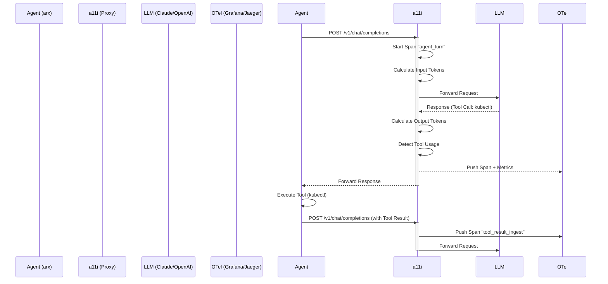

# Architecture: a11i (Analyzabiliti)

## 1. The Instrumentation Model

`a11i` operates on the concept of the **"Agent Loop Span."** Unlike a standard HTTP request which is linear, an Agent Loop is cyclic (Think -> Act -> Observe -> Think).

### 1.1 Core Metrics
`a11i` captures and exports the following custom metrics:

* **`ai.token_usage_counter`**: Total tokens (prompt vs. completion).
* **`ai.cost_estimate_counter`**: Dollar amount based on model ID (configurable rate card).
* **`ai.context_saturation_gauge`**: Percentage of context window used (e.g., 85% of 128k).
* **`ai.tool_error_rate`**: Ratio of tool calls that resulted in non-200 or stderr output.
* **`ai.loop_velocity_gauge`**: Time between agent "thoughts."

## 2. Architecture Components

`a11i` can be deployed in two modes: **Library Mode** (Python package) or **Sidecar Mode** (Reverse Proxy).

### 2.1 The Analyzer (Internal Logic)
Before creating a span, the Analyzer parses the payload:
* **Tokenizer:** Runs a local fast tokenizer to calculate `context_saturation`.
* **Tool Parser:** Detects if the model is requesting a tool call (e.g., identifying `function_call` in the JSON).
* **PII Scrubber:** Redacts sensitive data using regex rules defined in `a11i.yaml` before it hits the tracing buffer.

### 2.2 The Exporter (OTLP)
Translates internal metrics into the OpenTelemetry Protocol (OTLP) over gRPC or HTTP.
* **Traces:** Represents the Agent's "Chain of Thought" as a waterfall trace.
* **Metrics:** Aggregated counters for dashboards.
* **Logs:** Structured logs of the *decisions* made by the agent (optional).

## 3. Data Flow (Sidecar Mode)

## 4. Dashboard Concepts

`a11i` provides pre-built Grafana JSON definitions for visualizing the exported data.

### 4.1 The "Agent Health" Dashboard
* **Panel 1: "The Dementia Curve"**
    * A line graph showing Context Saturation over time.
    * *Alert:* Trigger warning when Saturation > 90%.
* **Panel 2: "Cost Burn Rate"**
    * Bar chart of $ spent per hour per Project ID.
* **Panel 3: "Tool Success Ratio"**
    * Pie chart: Successful Executions vs. Syntax Errors vs. Timeouts.

## 5. Integration Points

### 5.1 With `arx`
`arx` can be configured to route all LLM traffic through `http://localhost:11000` (the default `a11i` port). This gives instant visibility into runbook executions without modifying the runbook code.

### 5.2 With `SREcodex`
`a11i` can recognize specific function names from `SREcodex` (e.g., `get_pods`, `check_logs`) and tag traces with `skill.name`, allowing you to query: *"Show me all traces where `restart_server` was called."*
