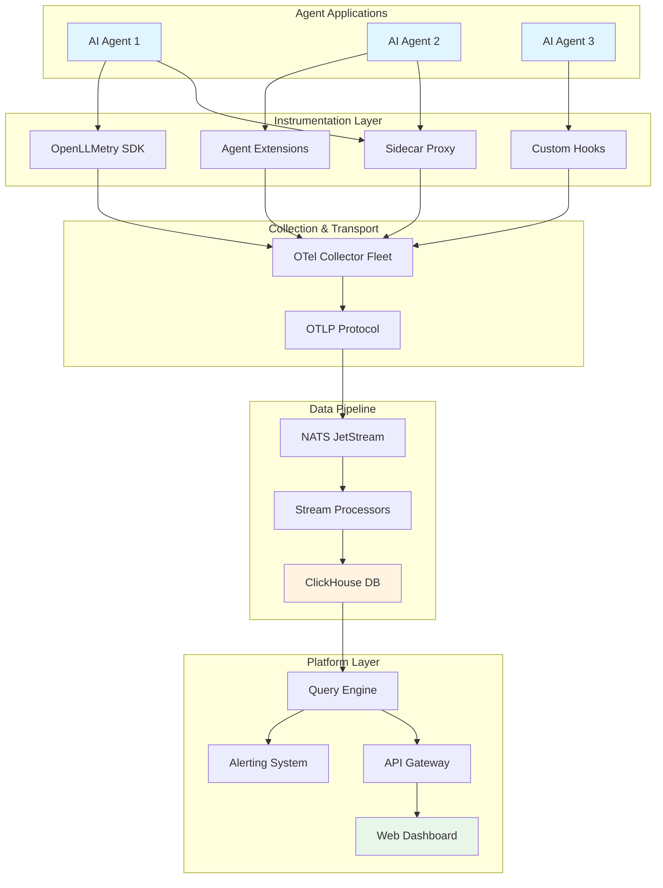

# Executive Summary: a11i (Analyzabiliti)

## Table of Contents

- [Introduction](#introduction)
- [The Problem: The AI Agent Observability Gap](#the-problem-the-ai-agent-observability-gap)
- [The Solution: Agent-Native Observability](#the-solution-agent-native-observability)
- [Core Platform Capabilities](#core-platform-capabilities)
- [Strategic Differentiators](#strategic-differentiators)
- [Market Opportunity](#market-opportunity)
- [Architecture Overview](#architecture-overview)
- [Quick Wins and Developer Experience](#quick-wins-and-developer-experience)
- [Key Takeaways](#key-takeaways)

## Introduction

**a11i (Analyzabiliti)** is an OpenTelemetry-native AI agent observability platform designed to address the operational void in monitoring autonomous AI agents. While traditional Application Performance Monitoring (APM) tools excel at tracking deterministic microservices, they fall short when applied to the probabilistic, context-driven decision-making of AI agents.

a11i moves beyond simple logging to provide metric-driven analysis of agent cognition, offering visibility into the "Chain of Thought" processes that power autonomous decision-making engines. By combining intelligent instrumentation with deep agent behavior analytics, a11i transforms AI agents from operational black boxes into observable, optimizable, and compliant systems.

### What is a11i?

- **Full Name**: Analyzabiliti (a11i follows the numeronym pattern: a + 11 letters + i)
- **Platform Type**: OpenTelemetry-native AI agent observability and monitoring platform
- **Core Mission**: Provide operational visibility into autonomous AI agents through metric-driven cognitive analysis
- **Architecture**: Hybrid instrumentation model combining intelligent sidecar proxies with context propagation SDKs

## The Problem: The AI Agent Observability Gap

### AI Agents Are Black Boxes

AI agents represent a fundamental shift from traditional software systems. They are autonomous decision-making engines that operate within a "Chain of Thought" framework, making probabilistic decisions based on context, memory, and external tool interactions. This creates unique operational challenges:

**Traditional Software vs. AI Agents:**

| Traditional Microservices | AI Agents |
|---------------------------|-----------|
| Deterministic execution paths | Probabilistic decision-making |
| Explicit error states (500 errors) | Silent divergence from intent |
| Predictable resource consumption | Variable token/context usage |
| Static code execution | Dynamic reasoning loops |
| Clear request/response boundaries | Multi-step agent workflows |

### Critical Failure Modes

AI agent failures are fundamentally different from traditional application failures:

1. **Silent Divergence from Intent**: Agents complete successfully but produce incorrect or harmful outputs
2. **Hallucinations**: Confidently incorrect information presented as fact
3. **Infinite Reasoning Loops**: Agents stuck in circular thinking patterns without explicit errors
4. **Context Saturation**: Degraded performance as context windows fill with irrelevant information
5. **Opaque Cost Attribution**: Inability to track which agent behaviors drive LLM API costs
6. **Tool Execution Fidelity**: Tools called with incorrect parameters or at inappropriate times

### Why Traditional APM Fails

Traditional monitoring tools were designed for deterministic systems with explicit success/failure states. They cannot:

- Track probabilistic reasoning quality
- Monitor context window utilization
- Attribute costs to specific agent behaviors
- Detect semantic drift in agent outputs
- Observe multi-step agent decision chains
- Correlate tool usage with agent intent

**The industry needs agent-native observability built from the ground up.**

## The Solution: Agent-Native Observability

a11i provides comprehensive observability for AI agents through a hybrid instrumentation model that captures both the infrastructure layer (LLM API calls) and the cognitive layer (agent reasoning and decision-making).

### Hybrid Instrumentation Model

**1. Intelligent Sidecar (Proxy)**
- Zero-code instrumentation option for immediate visibility
- Intercepts LLM API traffic for transparent monitoring
- Extracts tokens, costs, and response metadata
- Minimal latency overhead (<10ms p99)

**2. Context Propagation SDK (Library)**
- Deep agent behavior instrumentation
- Captures Think→Act→Observe loops
- Tracks tool execution and reasoning chains
- Correlates multi-step workflows with trace context

**3. OpenTelemetry-Native Foundation**
- Standard OTLP protocol for interoperability
- Integration with existing observability stacks
- No vendor lock-in
- Extensible with custom instrumentation

### Five Core Metrics

a11i defines and tracks five fundamental metrics for agent observability:

1. **`ai.token_usage_counter`**: Total tokens consumed (prompt + completion) per agent operation
2. **`ai.cost_estimate_counter`**: Real-time cost attribution by model, agent, and workflow
3. **`ai.context_saturation_gauge`**: Context window utilization percentage (0-100%)
4. **`ai.tool_error_rate`**: Percentage of tool executions that fail or return errors
5. **`ai.loop_velocity_gauge`**: Rate of agent reasoning iterations (detects infinite loops)

These metrics provide the foundation for understanding agent behavior, optimizing performance, and controlling costs.

## Core Platform Capabilities

### 1. Agent Cognition Visibility

Track the complete agent decision-making lifecycle:

- **Think Phase**: Monitor reasoning token usage and context consumption
- **Act Phase**: Observe tool selection, parameter generation, and execution
- **Observe Phase**: Track feedback processing and context updates

### 2. Cost Intelligence

Move beyond simple cost tracking to optimization recommendations:

- Per-agent, per-workflow, and per-user cost attribution
- Model selection recommendations based on task complexity
- Context optimization suggestions to reduce token waste
- Budget alerts and anomaly detection

### 3. Context Management

Prevent context saturation and maintain agent effectiveness:

- Real-time context window utilization monitoring
- Context pruning effectiveness analysis
- Memory system performance tracking
- Context retrieval quality metrics

### 4. Tool Execution Fidelity

Ensure agents use tools correctly and effectively:

- Tool call success/failure rates
- Parameter validation and error tracking
- Tool selection pattern analysis
- Execution latency and timeout monitoring

### 5. Compliance and Governance

Enterprise-ready features for regulated industries:

- Self-hosting options for HIPAA/SOC2 compliance
- Audit trails for all agent decisions
- PII detection and redaction capabilities
- Role-based access control for observability data

## Strategic Differentiators

a11i occupies a unique position in the AI observability market through five core differentiators:

### 1. Agent-Native Observability (Not Just LLM Tracing)

**Beyond LLM Call Logging:**
- Most competitors focus on tracing individual LLM API calls
- a11i captures the complete Think→Act→Observe agent loop
- Multi-step workflow correlation across agent interactions
- Reasoning quality metrics, not just infrastructure metrics

### 2. OpenTelemetry-Native with Excellent UX

**Standards-Based + Developer-Friendly:**
- Native OTLP protocol support prevents vendor lock-in
- Works with existing OpenTelemetry collectors and backends
- Pre-built integrations with popular agent frameworks
- One-line setup for immediate value

### 3. Context Intelligence as a Feature

**First-Class Context Window Monitoring:**
- Real-time context saturation tracking
- Context pruning strategy analysis
- Memory system effectiveness metrics
- RAG retrieval quality monitoring

### 4. Cost Optimization Intelligence

**Beyond Tracking to Recommendations:**
- Automated model selection suggestions
- Context optimization recommendations
- Budget forecasting and anomaly detection
- Cost attribution to business workflows

### 5. Compliance-Ready Self-Hosting

**Enterprise Security and Compliance:**
- HIPAA/SOC2-ready deployment options
- On-premises or VPC deployment
- Complete data sovereignty
- Audit logging and access controls

## Market Opportunity

### Market Validation

The AI observability market has seen explosive growth with over **$200M in recent funding** across competitors:

- **Arize AI**: $70M Series C (validates enterprise demand)
- **LangSmith**: Embedded in LangChain ecosystem
- **Helicone**: $3M+ for LLM proxy approach
- **Traceloop**: OpenTelemetry-native LLM tracing

This funding activity demonstrates strong enterprise demand for AI observability solutions as organizations move from AI experimentation to production deployments.

### Market Consolidation Around OpenTelemetry

The observability industry is consolidating around **OpenTelemetry as the standard**:

- Cloud providers (AWS, GCP, Azure) natively support OTLP
- Major APM vendors (Datadog, New Relic, Dynatrace) integrate with OTel
- Developers prefer open standards over proprietary formats
- Multi-cloud strategies require vendor-neutral telemetry

a11i's OpenTelemetry-native approach positions it to benefit from this standardization trend.

### Strategic Positioning

a11i occupies the intersection of three critical market dimensions:

```
Agent-Native Focus
        │
        │         ┌─────────────┐
        │         │    a11i     │
        │         │  (Sweet     │
        │         │   Spot)     │
        ├─────────┼─────────────┤
        │         │             │
        │    LangSmith     Helicone
        │    (SDK only)    (Proxy only)
        │                       │
        └───────────────────────┴──────── OTel Standard

                Developer-Friendly UX
```

**Hybrid Infrastructure Platform:**
- Combines proxy approach (like Helicone) with SDK depth (like LangSmith)
- Agent-native focus differentiates from LLM-only tracing tools
- OpenTelemetry foundation prevents vendor lock-in
- Developer experience priority drives adoption

## Architecture Overview

a11i consists of four primary layers working together to provide comprehensive agent observability:



### Layer Breakdown

**Instrumentation Layer:**
- OpenLLMetry SDK for LLM call tracking
- Agent-specific extensions for framework integration
- Custom hooks for proprietary agent systems
- Optional sidecar proxy for zero-code instrumentation

**Collection & Transport:**
- OpenTelemetry Collector fleet for data aggregation
- Standard OTLP protocol for interoperability
- Load balancing and failover capabilities

**Data Pipeline:**
- NATS JetStream for high-throughput message streaming
- Stream processors for real-time metric calculation
- ClickHouse for OLAP-optimized storage and queries

**Platform Layer:**
- Query engine for metric aggregation and analysis
- Alerting system for anomaly detection
- API gateway for external integrations
- Web dashboard for visualization and exploration

For detailed architecture documentation, see [System Architecture](../02-architecture/system-architecture.md).

## Quick Wins and Developer Experience

a11i prioritizes developer experience with multiple paths to value, from zero-code instrumentation to deep framework integration.

### Quick Wins Summary

| Approach | Time to Value | Visibility Depth | Use Case |
|----------|---------------|------------------|----------|
| **Sidecar Proxy** | 5 minutes | LLM calls only | Quick evaluation, legacy systems |
| **OpenLLMetry SDK** | 15 minutes | LLM + basic tracing | Standard LLM applications |
| **Framework Integration** | 30 minutes | Full agent lifecycle | LangChain, CrewAI, AutoGen apps |
| **Custom Instrumentation** | 2-4 hours | Complete control | Proprietary agent frameworks |

### One-Line Setup Example

```python
# Install a11i SDK
pip install a11i-sdk

# Single import for automatic instrumentation
from a11i import auto_instrument
auto_instrument()

# Your existing agent code works unchanged
from langchain import Agent
agent = Agent(...)
result = agent.run("Analyze this data")  # Automatically traced
```

### Framework-Specific Quick-Starts

Pre-built integrations for popular agent frameworks:

- **LangChain**: Automatic chain and agent tracing
- **LlamaIndex**: Query engine and retrieval monitoring
- **CrewAI**: Multi-agent workflow tracking
- **AutoGen**: Conversation and collaboration tracing
- **Semantic Kernel**: Planner and skill execution monitoring

### Zero-Code Instrumentation Option

Deploy the a11i sidecar proxy without any code changes:

```yaml
# Kubernetes sidecar injection
apiVersion: v1
kind: Pod
metadata:
  annotations:
    a11i.io/inject-proxy: "true"
spec:
  containers:
  - name: my-agent
    image: my-agent:latest
    # No code changes required
```

The proxy automatically intercepts LLM API calls and sends telemetry to the a11i platform.

## Key Takeaways

a11i (Analyzabiliti) is positioned to become the industry-standard observability platform for AI agents through:

1. **Agent-Native Design**: Built specifically for autonomous agents, not retrofitted from traditional APM tools

2. **OpenTelemetry Foundation**: Standards-based approach prevents vendor lock-in and ensures ecosystem compatibility

3. **Hybrid Instrumentation**: Combines zero-code proxy option with deep SDK integration for flexible deployment

4. **Cost Intelligence**: Moves beyond tracking to provide actionable optimization recommendations

5. **Context Awareness**: First-class support for context window management and saturation monitoring

6. **Enterprise-Ready**: Compliance-ready self-hosting options for regulated industries

7. **Developer Experience**: One-line setup and framework-specific integrations accelerate adoption

8. **Market Timing**: Positioned at the intersection of growing enterprise AI adoption and OpenTelemetry standardization

**The market opportunity is validated by $200M+ in competitor funding, and a11i's unique positioning as an agent-native, OTel-standard, developer-friendly platform creates a defensible competitive moat.**

---

**Related Documentation:**
- [System Architecture](../02-architecture/system-architecture.md) - Detailed technical architecture
- [Instrumentation Overview](../03-instrumentation/instrumentation-overview.md) - Instrumentation strategies
- [Core Metrics](../04-metrics/core-metrics.md) - Metric definitions and semantics
- [Market Positioning](./market-positioning.md) - Competitive analysis and differentiation

---

*Document Status: Draft | Last Updated: 2025-11-26 | Maintained by: a11i Documentation Team*
