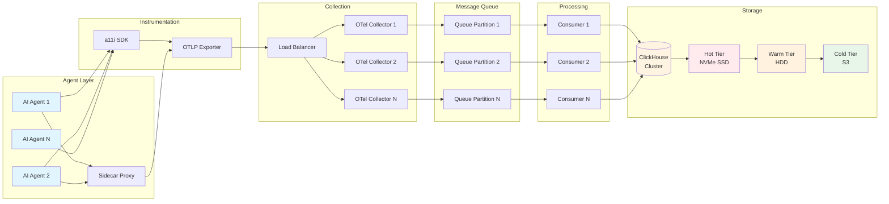

# Data Pipeline Architecture

## Table of Contents

- [Introduction](#introduction)
- [Ingestion Flow Overview](#ingestion-flow-overview)
- [Message Queue Architecture](#message-queue-architecture)
  - [NATS JetStream vs Apache Kafka](#nats-jetstream-vs-apache-kafka)
  - [Queue Selection Guidance](#queue-selection-guidance)
- [ClickHouse Storage Layer](#clickhouse-storage-layer)
  - [Schema Design](#schema-design)
  - [Partitioning Strategy](#partitioning-strategy)
  - [Indexing and Query Optimization](#indexing-and-query-optimization)
- [Tiered Storage Strategy](#tiered-storage-strategy)
  - [Storage Tier Definitions](#storage-tier-definitions)
  - [Retention Policies](#retention-policies)
  - [Cost Optimization](#cost-optimization)
- [Sampling Strategies](#sampling-strategies)
  - [Head-Based Sampling](#head-based-sampling)
  - [Tail-Based Sampling](#tail-based-sampling-recommended)
  - [Sampling Configuration](#sampling-configuration)
- [Backpressure Handling](#backpressure-handling)
- [OpenTelemetry Collector Configuration](#opentelemetry-collector-configuration)
- [Production Benchmarks](#production-benchmarks)
- [Key Takeaways](#key-takeaways)

## Introduction

The a11i data pipeline is designed to handle high-throughput telemetry data from distributed AI agent systems with minimal latency overhead while maintaining data fidelity for critical traces. The pipeline architecture balances three competing concerns:

1. **Performance**: Sub-millisecond latency impact on agent operations
2. **Cost Efficiency**: Intelligent sampling and tiered storage reduce infrastructure costs by 70%+
3. **Data Fidelity**: Complete retention of error traces, anomalies, and critical workflows

This document provides comprehensive guidance on the data pipeline architecture, from OTLP ingestion through long-term storage and retention policies.

## Ingestion Flow Overview

The a11i data pipeline follows a five-stage ingestion flow designed for high throughput and resilience:



### Pipeline Stages

**Stage 1: Emission**
- AI agents and sidecar proxies emit OTLP telemetry data
- Data transmitted over gRPC (preferred) or HTTP protocols
- Automatic retry and buffering at the client level

**Stage 2: Collection**
- OpenTelemetry Collector fleet receives telemetry
- Load balancer distributes traffic across collector instances
- Collectors perform batching, sampling, and enrichment

**Stage 3: Queueing**
- Processed data sent to message queue (NATS JetStream or Kafka)
- Queue provides decoupling between collection and storage
- Enables backpressure handling and replay capabilities

**Stage 4: Consumption**
- Consumer workers read from queue partitions
- Transform OTLP data into ClickHouse-optimized format
- Batch inserts for maximum write throughput

**Stage 5: Storage**
- Data written to ClickHouse hot tier (NVMe SSD)
- Automatic migration to warm tier (HDD) after 24-72 hours
- Long-term aggregates moved to cold tier (S3) for compliance retention

## Message Queue Architecture

The message queue layer is critical for decoupling data collection from storage, enabling backpressure handling, and providing replay capabilities for data recovery scenarios.

### NATS JetStream vs Apache Kafka

a11i supports two message queue backends optimized for different deployment scenarios:

#### NATS JetStream (Recommended for Kubernetes)

**Architecture:**
- Lightweight, cloud-native message streaming
- Built-in persistence without JVM overhead
- Native Kubernetes integration with Helm charts
- Horizontal scaling via NATS Super-Cluster

**Performance Characteristics:**
- **Latency**: <1ms p99 for message delivery
- **Throughput**: Suitable for <100K requests/second
- **Memory**: ~50MB base + ~10MB per 1M messages
- **CPU**: Low overhead, suitable for sidecar deployment

**Best For:**
- Kubernetes-native deployments
- Moderate throughput requirements (<100K req/sec)
- Organizations prioritizing operational simplicity
- Multi-cloud or edge deployments

**Example Configuration:**
```yaml
# NATS JetStream stream configuration
apiVersion: jetstream.nats.io/v1beta2
kind: Stream
metadata:
  name: a11i-traces
spec:
  name: a11i-traces
  subjects:
    - traces.agent.*
    - traces.llm.*
  storage: file
  retention: limits
  maxAge: 168h  # 7 days retention in queue
  maxMsgs: 100000000
  maxBytes: 1TB
  replicas: 3
  discard: old
```

#### Apache Kafka (Enterprise Scale)

**Architecture:**
- Industry-standard distributed streaming platform
- JVM-based with significant operational complexity
- Requires ZooKeeper or KRaft for cluster coordination
- Rich ecosystem (Kafka Connect, KSQL, Schema Registry)

**Performance Characteristics:**
- **Latency**: 2-10ms p99 for message delivery
- **Throughput**: >100K requests/second, tested to millions/sec
- **Memory**: 6-8GB JVM heap recommended per broker
- **CPU**: Higher overhead, dedicated instances recommended

**Best For:**
- Enterprise-scale deployments (>100K req/sec)
- Organizations with existing Kafka expertise
- Use cases requiring Kafka Connect ecosystem
- Stream processing with KSQL or Kafka Streams

**Example Configuration:**
```properties
# Kafka topic configuration
num.partitions=32
replication.factor=3
retention.ms=604800000  # 7 days
compression.type=zstd
min.insync.replicas=2
log.segment.bytes=1073741824  # 1GB segments
log.retention.check.interval.ms=300000
```

### Queue Comparison Matrix

| Feature | NATS JetStream | Apache Kafka |
|---------|----------------|--------------|
| **Latency (p99)** | <1ms | 2-10ms |
| **Throughput** | Moderate (<100K/sec) | Very High (>100K/sec) |
| **Operational Complexity** | Low | High |
| **Memory Footprint** | Lightweight (~50MB base) | Heavy (6-8GB JVM heap) |
| **Persistence** | Built-in file storage | Requires configuration |
| **Kubernetes Native** | ✅ Yes | ⚠️ Requires tuning |
| **Message Replay** | ✅ Yes | ✅ Yes |
| **Multi-Tenancy** | ✅ Account isolation | ⚠️ Manual topic design |
| **Ecosystem** | Growing | Mature (Connect, KSQL) |
| **Best For** | Cloud-native, K8s | Enterprise scale |
| **Operational Cost** | Lower | Higher |

### Queue Selection Guidance

**Choose NATS JetStream when:**
- Deploying in Kubernetes environment
- Throughput requirements <100K requests/second
- Operational simplicity is priority
- Team lacks Kafka expertise
- Multi-cloud or edge deployment scenarios

**Choose Apache Kafka when:**
- Throughput requirements >100K requests/second
- Existing Kafka infrastructure and expertise
- Need for Kafka Connect ecosystem integrations
- Stream processing with KSQL/Kafka Streams
- Enterprise-scale with dedicated operations team

**Hybrid Approach:**
Start with NATS JetStream for faster time-to-value, migrate to Kafka when scale demands it. The abstraction layer in a11i consumers allows queue backend changes without application code modifications.

## ClickHouse Storage Layer

ClickHouse serves as the primary OLAP database for a11i telemetry data, providing columnar storage optimized for analytical queries over billions of trace spans.

### Schema Design

The core `agent_traces` table captures comprehensive telemetry for AI agent operations:

```sql
CREATE TABLE agent_traces (
    -- Multi-tenancy and trace identifiers
    tenant_id LowCardinality(String),
    trace_id FixedString(32),
    span_id FixedString(16),
    parent_span_id Nullable(FixedString(16)),

    -- Agent-specific identifiers
    agent_name LowCardinality(String),
    agent_id String,
    conversation_id String,
    loop_iteration UInt16,
    loop_phase Enum8('think' = 1, 'act' = 2, 'observe' = 3),

    -- LLM provider and model information
    model LowCardinality(String),
    provider LowCardinality(String),
    input_tokens UInt32,
    output_tokens UInt32,
    cost_usd Decimal64(8),

    -- Timing and performance metrics
    start_time DateTime64(3),
    end_time DateTime64(3),
    duration_ms UInt32,
    ttft_ms Nullable(UInt32),  -- Time to first token

    -- Agent behavior metrics
    context_saturation Float32,
    tool_calls Array(String),
    error_type Nullable(LowCardinality(String)),

    -- Flexible attribute storage for custom fields
    attributes Map(String, String)
)
ENGINE = MergeTree()
PARTITION BY (tenant_id, toYYYYMM(start_time))
ORDER BY (tenant_id, trace_id, start_time)
TTL start_time + INTERVAL 30 DAY TO VOLUME 'warm',
    start_time + INTERVAL 180 DAY TO VOLUME 'cold'
SETTINGS index_granularity = 8192;
```

### Schema Design Rationale

**LowCardinality Optimization:**
- `tenant_id`, `agent_name`, `model`, `provider`: Typically <1000 unique values
- LowCardinality creates a dictionary, reducing storage by 10-30x
- Faster query performance for GROUP BY and WHERE clauses

**Fixed-Length Strings:**
- `trace_id` (32 bytes): UUID without hyphens (128-bit)
- `span_id` (16 bytes): 64-bit span identifier
- Fixed-length strings enable faster comparisons and sorting

**Data Type Precision:**
- `DateTime64(3)`: Millisecond precision for timing data
- `Decimal64(8)`: 8 decimal places for precise cost tracking
- `UInt32`: Sufficient for token counts and duration milliseconds

**Flexible Attributes:**
- `Map(String, String)`: Stores arbitrary key-value pairs
- Enables custom instrumentation without schema changes
- Query performance degrades with large maps (keep <50 keys)

### Partitioning Strategy

```sql
PARTITION BY (tenant_id, toYYYYMM(start_time))
```

**Multi-Tenant Isolation:**
- Each tenant gets separate partitions
- Enables per-tenant data lifecycle management
- Improves query performance by partition pruning

**Monthly Time Partitions:**
- Aligns with typical billing cycles
- Enables efficient data deletion by dropping old partitions
- Optimal partition size: 10-100GB per partition

**Partition Lifecycle Example:**
```sql
-- View current partitions
SELECT
    partition,
    rows,
    bytes_on_disk,
    formatReadableSize(bytes_on_disk) AS size
FROM system.parts
WHERE table = 'agent_traces'
  AND active
ORDER BY partition DESC
LIMIT 20;

-- Drop old partition (instant operation)
ALTER TABLE agent_traces DROP PARTITION ('tenant-abc', '202401');
```

### Indexing and Query Optimization

**Primary Key (Sorting Key):**
```sql
ORDER BY (tenant_id, trace_id, start_time)
```

The sorting key determines physical data layout on disk:
- Queries filtering by `tenant_id` benefit from partition pruning
- Trace reconstruction queries (`WHERE trace_id = ?`) are highly efficient
- Time-range queries benefit from chronological ordering within traces

**Secondary Indexes:**
```sql
-- Bloom filter index for high-cardinality fields
ALTER TABLE agent_traces
ADD INDEX idx_conversation_id conversation_id
TYPE bloom_filter GRANULARITY 4;

-- MinMax index for numeric ranges
ALTER TABLE agent_traces
ADD INDEX idx_cost cost_usd
TYPE minmax GRANULARITY 4;

-- Set index for array membership queries
ALTER TABLE agent_traces
ADD INDEX idx_tool_calls tool_calls
TYPE set(100) GRANULARITY 4;
```

**Query Performance Best Practices:**
1. Always filter by `tenant_id` first (partition pruning)
2. Include time range filters to limit data scan
3. Use `PREWHERE` for heavy filtering operations
4. Avoid `SELECT *` - specify only needed columns
5. Leverage materialized views for common aggregations

## Tiered Storage Strategy

a11i implements a three-tier storage strategy that reduces costs by 70%+ while maintaining instant access to critical debugging data.

### Storage Tier Definitions

| Tier | Retention | Storage Medium | Data Retained | Cost/TB/month | Query Latency |
|------|-----------|----------------|---------------|---------------|---------------|
| **Hot** | 24-72 hours | NVMe SSD | Full traces with prompts/completions | $100-200 | <10ms |
| **Warm** | 7-90 days | Standard HDD or SSD | Traces + metrics, downsampled successful traces | $20-50 | 50-200ms |
| **Cold** | 1+ years | S3/Object Storage | Aggregated metrics only | $2-21 | 1-5 seconds |

### Retention Policies

**Hot Tier (0-72 hours):**
- **Data**: Full-fidelity traces including complete prompts and LLM completions
- **Purpose**: Instant debugging and real-time monitoring
- **Query Pattern**: Recent trace lookup, active incident investigation
- **Compression**: LZ4 (fast compression/decompression)

**Warm Tier (3 days - 90 days):**
- **Data**:
  - 100% retention of error traces and anomalies
  - 10-20% sampling of successful traces
  - Full metric data (tokens, cost, duration)
  - Redacted/truncated prompts/completions (PII removed)
- **Purpose**: Historical analysis, trend identification, cost attribution
- **Query Pattern**: Weekly reports, cost analytics, performance trends
- **Compression**: ZSTD (high compression ratio)

**Cold Tier (90 days - 1+ years):**
- **Data**:
  - Pre-aggregated metrics only (daily rollups)
  - Cost summaries by agent/tenant/model
  - Error rate and anomaly counts
  - No individual trace data retained
- **Purpose**: Compliance retention, long-term trend analysis
- **Query Pattern**: Annual reviews, audit trails, capacity planning
- **Compression**: ZSTD level 9 (maximum compression)

### TTL Configuration

ClickHouse automatically moves data between tiers based on TTL rules:

```sql
-- Defined in table schema
TTL start_time + INTERVAL 30 DAY TO VOLUME 'warm',
    start_time + INTERVAL 180 DAY TO VOLUME 'cold'

-- Volume definitions in ClickHouse config.xml
<storage_configuration>
    <disks>
        <hot>
            <type>local</type>
            <path>/var/lib/clickhouse/hot/</path>
        </hot>
        <warm>
            <type>local</type>
            <path>/var/lib/clickhouse/warm/</path>
        </warm>
        <cold>
            <type>s3</type>
            <endpoint>https://s3.amazonaws.com/a11i-cold-tier/</endpoint>
            <access_key_id>...</access_key_id>
            <secret_access_key>...</secret_access_key>
        </cold>
    </disks>
    <policies>
        <tiered>
            <volumes>
                <hot>
                    <disk>hot</disk>
                </hot>
                <warm>
                    <disk>warm</disk>
                </warm>
                <cold>
                    <disk>cold</disk>
                </cold>
            </volumes>
        </tiered>
    </policies>
</storage_configuration>
```

### Cost Optimization

**Example Cost Calculation (1TB ingested/day):**

| Tier | Data Volume | Storage Cost | Total Monthly Cost |
|------|-------------|--------------|-------------------|
| Hot (3 days) | 3 TB | $150/TB | $450 |
| Warm (87 days, 20% sampled) | 17.4 TB | $35/TB | $609 |
| Cold (275 days, aggregates only) | 5 TB | $10/TB | $50 |
| **Total** | **25.4 TB** | - | **$1,109/month** |

**Without tiering (hot storage only):**
- 365 TB × $150/TB = **$54,750/month**

**Cost Reduction: 98% ($53,641/month savings)**

This dramatic cost reduction makes long-term retention economically feasible while maintaining instant access to recent debugging data.

## Sampling Strategies

Intelligent sampling is critical for managing data volume while preserving visibility into critical events. a11i supports both head-based and tail-based sampling strategies.

### Head-Based Sampling

**Definition:** Sampling decision made at trace creation time based on probabilistic rules.

**Advantages:**
- Simple to implement and reason about
- Low CPU/memory overhead
- Predictable data volume reduction

**Disadvantages:**
- May miss important traces (errors, anomalies)
- Cannot make intelligent decisions based on trace outcome
- Fixed sampling rate requires manual tuning

**Configuration:**
```yaml
processors:
  probabilistic_sampler:
    sampling_percentage: 10  # Keep 10% of all traces
    hash_seed: 22  # Consistent hashing across collectors
```

**Use Case:** Baseline volume control when combined with tail-based sampling for critical events.

### Tail-Based Sampling (Recommended)

**Definition:** Sampling decision made after trace completes, allowing intelligent selection based on trace characteristics.

**Advantages:**
- Captures 100% of errors and anomalies
- Intelligent selection of representative successful traces
- Configurable policies based on business logic
- Significantly better signal-to-noise ratio

**Disadvantages:**
- Higher CPU/memory overhead (must buffer traces)
- Requires coordination across distributed collectors
- Configurable decision wait time adds latency to data availability

### Sampling Configuration

**Production-Grade Tail Sampling Policy:**

```yaml
processors:
  tail_sampling:
    # Wait 30 seconds for all spans in trace to arrive
    decision_wait: 30s

    # Buffer up to 50,000 traces in memory
    num_traces: 50000

    # Expected number of new traces per second
    expected_new_traces_per_sec: 1000

    # Sampling policies (evaluated in order)
    policies:
      # Policy 1: Always keep error traces
      - name: errors-always
        type: status_code
        status_code:
          status_codes: [ERROR]

      # Policy 2: Always keep slow traces (>5 seconds)
      - name: slow-traces
        type: latency
        latency:
          threshold_ms: 5000

      # Policy 3: Keep traces with high loop iterations (possible infinite loops)
      - name: long-agent-loops
        type: numeric_attribute
        numeric_attribute:
          key: a11i.agent.loop_iteration
          min_value: 5
          invert_match: false

      # Policy 4: Keep traces with high token usage (context saturation)
      - name: high-token-usage
        type: numeric_attribute
        numeric_attribute:
          key: a11i.llm.total_tokens
          min_value: 50000

      # Policy 5: Keep traces with high cost (>$1.00)
      - name: expensive-traces
        type: numeric_attribute
        numeric_attribute:
          key: a11i.llm.cost_usd
          min_value: 1.0

      # Policy 6: Keep traces with tool errors
      - name: tool-errors
        type: string_attribute
        string_attribute:
          key: a11i.tool.error
          enabled_regex_matching: true
          values:
            - ".*error.*"
            - ".*timeout.*"
            - ".*failed.*"

      # Policy 7: Rate-limit sampling for specific high-volume agents
      - name: rate-limit-chatbot
        type: and
        and:
          and_sub_policy:
            - name: is-chatbot-agent
              type: string_attribute
              string_attribute:
                key: agent.name
                values: ["chatbot"]
            - name: sample-10-percent
              type: probabilistic
              probabilistic:
                sampling_percentage: 10

      # Policy 8: Baseline probabilistic sampling for all other traces
      - name: probabilistic-baseline
        type: probabilistic
        probabilistic:
          sampling_percentage: 10
```

**Sampling Policy Breakdown:**

1. **Error Traces**: 100% retention ensures all failures are captured
2. **Latency Anomalies**: Traces exceeding P99 threshold (5s) are retained
3. **Agent Loop Detection**: Long iteration counts indicate potential infinite loops
4. **Token Saturation**: High token usage indicates context window issues
5. **Cost Anomalies**: Expensive traces retained for cost attribution analysis
6. **Tool Failures**: Critical for debugging agent-tool integration issues
7. **Rate Limiting**: Per-agent sampling prevents high-volume agents from overwhelming storage
8. **Baseline Sampling**: 10% of remaining traces provides representative sample

**Expected Data Reduction:**
- Assume 100K traces/second incoming
- ~2% are errors or anomalies (2K traces) → 100% kept
- ~5% trigger specialized policies (5K traces) → 100% kept
- ~93% are normal successful traces (93K traces) → 10% kept (9.3K traces)
- **Total kept**: 2K + 5K + 9.3K = **16.3K traces/second**
- **Reduction**: 83.7% volume reduction while keeping all critical traces

## Backpressure Handling

The a11i data pipeline is designed to be **loss-tolerant** - telemetry data is important but should never block agent operations. Backpressure handling ensures graceful degradation under load.

### Buffering Strategy

**Layer 1: Agent SDK Buffer**
```python
# a11i SDK configuration
from a11i import configure

configure(
    buffer_max_size=1000,  # Buffer up to 1000 spans
    buffer_timeout_ms=5000,  # Flush every 5 seconds
    drop_on_queue_full=True,  # Drop oldest if buffer fills
    enable_local_fallback=True  # Write to local disk on export failure
)
```

**Layer 2: OTel Collector Buffer**
```yaml
exporters:
  otlp:
    endpoint: nats://nats-jetstream:4222
    sending_queue:
      enabled: true
      num_consumers: 10
      queue_size: 5000
    retry_on_failure:
      enabled: true
      initial_interval: 1s
      max_interval: 30s
      max_elapsed_time: 5m
```

**Layer 3: Message Queue Persistence**
- NATS JetStream: File-backed persistence with configurable limits
- Kafka: Log-based persistence with retention policies
- Queue acts as buffer between collection and storage layers

**Layer 4: ClickHouse Async Inserts**
```sql
-- Enable async inserts for higher throughput
SET async_insert = 1;
SET wait_for_async_insert = 0;
SET async_insert_max_data_size = 10485760;  -- 10MB
SET async_insert_busy_timeout_ms = 1000;  -- 1 second
```

### Circuit Breaker Pattern

**Automatic Degradation:**
```yaml
processors:
  circuit_breaker:
    # Open circuit if error rate exceeds threshold
    error_percentage_threshold: 50

    # Require minimum request volume before opening
    minimum_requests: 100

    # Wait 30s before attempting to close circuit
    wait_duration_in_open_state: 30s

    # Test with limited traffic when half-open
    permitted_requests_in_half_open_state: 10
```

**Behavior:**
- **Closed**: Normal operation, all data exported
- **Open**: Export failures detected, data buffered locally or dropped
- **Half-Open**: Testing if downstream recovered, limited traffic allowed

### Drop Policies

**Priority-Based Dropping:**
When buffers fill, drop data in this order:
1. Drop verbose debug traces (lowest priority)
2. Drop successful traces beyond baseline sample rate
3. Drop metrics data (can be aggregated later)
4. **Never drop**: Error traces, anomalies, critical agent events

**Monitoring Backpressure:**
```sql
-- Query for dropped spans by reason
SELECT
    toStartOfHour(timestamp) AS hour,
    drop_reason,
    count() AS dropped_spans,
    sum(estimated_bytes) AS dropped_bytes
FROM telemetry_drops
WHERE timestamp > now() - INTERVAL 24 HOUR
GROUP BY hour, drop_reason
ORDER BY hour DESC, dropped_spans DESC;
```

## OpenTelemetry Collector Configuration

**Complete Production Configuration:**

```yaml
# otel-collector-config.yaml
receivers:
  otlp:
    protocols:
      grpc:
        endpoint: 0.0.0.0:4317
        max_recv_msg_size_mib: 32
        keepalive:
          server_parameters:
            max_connection_age: 60s
            max_connection_age_grace: 10s
      http:
        endpoint: 0.0.0.0:4318
        cors:
          allowed_origins:
            - "https://*.a11i.io"
          allowed_headers:
            - "*"

processors:
  # Batch spans for efficient transport
  batch:
    timeout: 5s
    send_batch_size: 200
    send_batch_max_size: 500

  # Redact PII from trace data
  transform:
    trace_statements:
      - context: span
        statements:
          # Redact common PII patterns in attributes
          - replace_pattern(attributes["http.url"], "email=([^&]+)", "email=REDACTED")
          - replace_pattern(attributes["db.statement"], "ssn='([^']+)'", "ssn='REDACTED'")
          - replace_pattern(attributes["a11i.prompt"], "\\b\\d{3}-\\d{2}-\\d{4}\\b", "XXX-XX-XXXX")

  # Add resource attributes
  resource:
    attributes:
      - key: deployment.environment
        value: production
        action: upsert
      - key: service.namespace
        value: a11i
        action: upsert

  # Tail-based sampling (see detailed config above)
  tail_sampling:
    decision_wait: 30s
    num_traces: 50000
    expected_new_traces_per_sec: 1000
    policies:
      # ... (policies from sampling section)

  # Memory limiter to prevent OOM
  memory_limiter:
    check_interval: 1s
    limit_mib: 2048
    spike_limit_mib: 512

exporters:
  # Export to NATS JetStream
  nats:
    endpoint: nats://nats-jetstream.a11i.svc.cluster.local:4222
    subject: traces.agent
    tls:
      insecure: false
      cert_file: /etc/otel/certs/client.crt
      key_file: /etc/otel/certs/client.key
      ca_file: /etc/otel/certs/ca.crt

  # Export to ClickHouse (alternative direct export)
  clickhouse:
    endpoint: tcp://clickhouse.a11i.svc.cluster.local:9000
    database: a11i
    table: agent_traces
    ttl: 720h  # 30 days
    compress: lz4
    async_insert: true
    create_schema: true

  # Debug exporter for development
  logging:
    loglevel: info
    sampling_initial: 5
    sampling_thereafter: 200

extensions:
  health_check:
    endpoint: 0.0.0.0:13133
  pprof:
    endpoint: 0.0.0.0:1777
  zpages:
    endpoint: 0.0.0.0:55679

service:
  extensions: [health_check, pprof, zpages]

  pipelines:
    traces:
      receivers: [otlp]
      processors: [memory_limiter, batch, resource, transform, tail_sampling]
      exporters: [nats, clickhouse, logging]

  telemetry:
    logs:
      level: info
    metrics:
      level: detailed
      address: 0.0.0.0:8888
```

## Production Benchmarks

Real-world performance data from production deployments validates a11i's architectural decisions.

### Industry Benchmarks

**Resmo (Identity Security):**
- **Volume**: 300 million spans/day
- **Infrastructure**: Single c7g.xlarge instance (4 vCPU, 8GB RAM)
- **Storage**: 275 GiB on disk = 3.40 TiB uncompressed
- **Compression**: 92% compression ratio with ZSTD
- **Cost**: ~$150/month in infrastructure

**Character.AI (Conversational AI):**
- **Volume**: 450 petabytes logs/month
- **Scale**: Billions of user conversations
- **Challenge**: Context window tracking across long conversations
- **Architecture**: Multi-region ClickHouse clusters with S3 tiering

**Cloudflare LogHouse:**
- **Volume**: 100+ petabytes total
- **Row Count**: 500+ trillion rows
- **Query Performance**: Sub-second queries on billions of rows
- **Use Case**: Internet traffic analytics and threat detection

### a11i Target Performance

**MVP Phase (Months 1-6):**
- **Throughput**: 10K spans/second
- **Storage**: 1 TB/day ingested
- **Infrastructure**: 3-node ClickHouse cluster (8 vCPU, 32GB RAM each)
- **Query Latency**: <100ms for p95 analytical queries
- **Cost**: ~$500/month infrastructure + $200/month storage

**Growth Phase (Months 6-12):**
- **Throughput**: 100K spans/second
- **Storage**: 10 TB/day ingested
- **Infrastructure**: 6-node ClickHouse cluster (16 vCPU, 64GB RAM each)
- **Query Latency**: <200ms for p95 analytical queries
- **Cost**: ~$3,000/month infrastructure + $1,500/month storage

**Scale Phase (Year 2+):**
- **Throughput**: 500K+ spans/second
- **Storage**: 50+ TB/day ingested
- **Infrastructure**: 20+ node ClickHouse cluster with tiered storage
- **Query Latency**: <500ms for p95 analytical queries
- **Cost**: ~$15,000/month infrastructure + $5,000/month storage

### Performance Optimization Tips

**ClickHouse Query Optimization:**
```sql
-- Bad: Full table scan
SELECT count(*) FROM agent_traces WHERE cost_usd > 1.0;

-- Good: Partition pruning + time filter
SELECT count(*) FROM agent_traces
WHERE tenant_id = 'acme-corp'
  AND start_time >= now() - INTERVAL 7 DAY
  AND cost_usd > 1.0;

-- Better: Materialized view with pre-aggregation
CREATE MATERIALIZED VIEW high_cost_traces_mv
ENGINE = SummingMergeTree()
PARTITION BY toYYYYMM(day)
ORDER BY (tenant_id, day)
AS SELECT
    tenant_id,
    toDate(start_time) AS day,
    count() AS trace_count,
    sum(cost_usd) AS total_cost
FROM agent_traces
WHERE cost_usd > 1.0
GROUP BY tenant_id, day;
```

**Collector Scaling:**
- 1 collector instance per 10K spans/second
- Use horizontal pod autoscaling (HPA) in Kubernetes
- Monitor collector CPU and memory usage
- Scale out before hitting 70% resource utilization

**Message Queue Scaling:**
- NATS JetStream: Add cluster nodes at 50K msgs/sec
- Kafka: Increase partition count for parallel consumption
- Monitor consumer lag as scaling indicator

## Key Takeaways

The a11i data pipeline architecture provides a production-ready foundation for high-scale AI agent observability:

### Architecture Highlights

1. **Five-Stage Pipeline**: Agent emission → OTel collection → Message queue → Consumer processing → ClickHouse storage

2. **Queue Flexibility**: Choose NATS JetStream (K8s-native, <100K req/sec) or Kafka (enterprise scale, >100K req/sec)

3. **Columnar Storage**: ClickHouse provides 92% compression and sub-second queries on billions of spans

4. **Tiered Storage**: 70%+ cost reduction through hot/warm/cold tiers while maintaining debug access

5. **Intelligent Sampling**: Tail-based sampling retains 100% of errors while reducing baseline volume by 80%+

6. **Backpressure Handling**: Loss-tolerant design ensures telemetry never blocks agent operations

### Design Principles

- **Performance First**: <10ms p99 latency impact on agent operations
- **Cost Efficiency**: Intelligent sampling and tiering reduce costs by 70%+
- **Data Fidelity**: 100% retention of critical traces (errors, anomalies, high-cost)
- **Operational Simplicity**: Standard OTLP protocol, minimal operational overhead
- **Scalability**: Proven architecture handles 100K+ spans/second

### Implementation Recommendations

**For MVPs and Startups:**
- Start with NATS JetStream for simplicity
- Use 3-node ClickHouse cluster (8 vCPU, 32GB RAM)
- Enable tail-based sampling from day one
- Hot tier only (7-30 days retention) to minimize complexity

**For Enterprise Deployments:**
- Consider Kafka if throughput >100K req/sec
- Deploy multi-region ClickHouse clusters for HA
- Implement full hot/warm/cold tiering
- Add compliance features (PII redaction, audit logging)

**For SaaS Platforms:**
- Multi-tenant ClickHouse clusters with partition isolation
- Per-tenant sampling policies and retention
- S3 cold tier for compliance (7+ years)
- Automated cost attribution and billing integration

---

**Related Documentation:**
- [System Architecture](./system-architecture.md) - Overall platform architecture
- [Executive Summary](../01-overview/executive-summary.md) - Platform overview and vision
- [Instrumentation Overview](../03-instrumentation/instrumentation-overview.md) - SDK and proxy instrumentation
- [Scalability Guide](../05-deployment/scalability.md) - Scaling strategies and capacity planning

---

*Document Status: Draft | Last Updated: 2025-11-26 | Maintained by: a11i Documentation Team*
