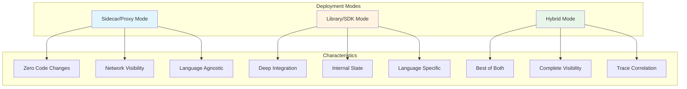
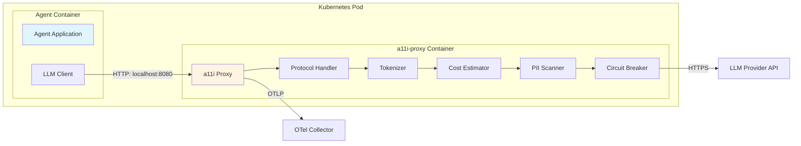
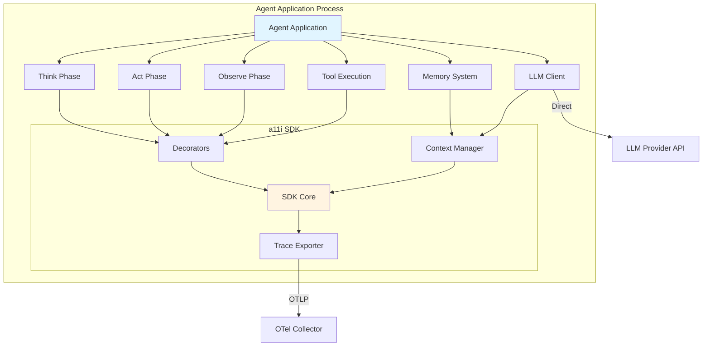
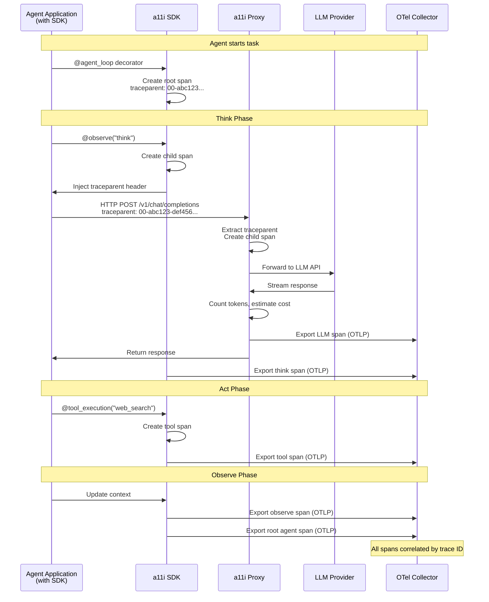
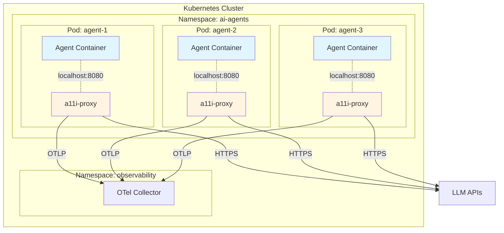
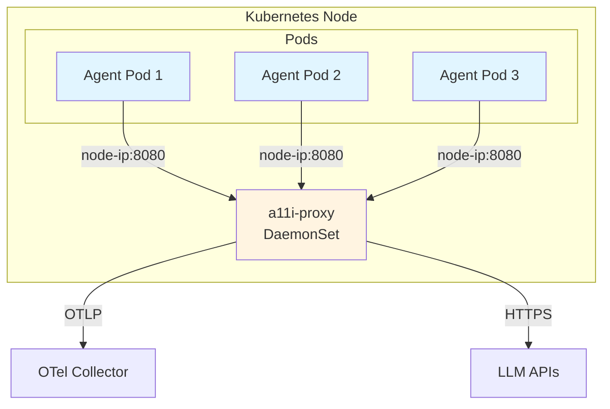
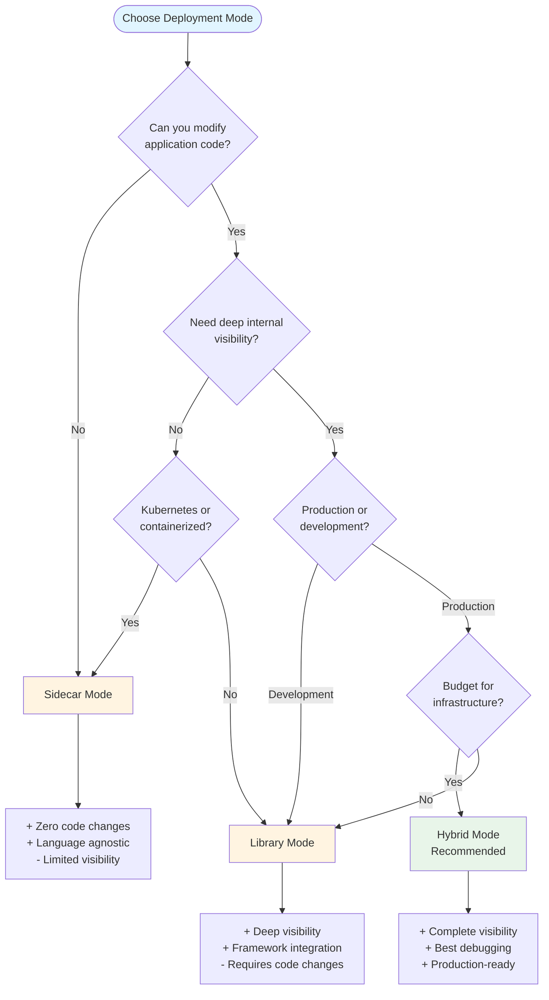
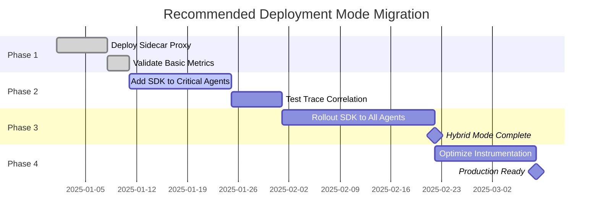

# Deployment Modes: a11i Instrumentation Strategies

## Table of Contents

- [Introduction](#introduction)
- [Deployment Mode Overview](#deployment-mode-overview)
- [Mode 1: Sidecar (Proxy) Mode](#mode-1-sidecar-proxy-mode)
- [Mode 2: Library (SDK) Mode](#mode-2-library-sdk-mode)
- [Mode 3: Hybrid Mode (Recommended)](#mode-3-hybrid-mode-recommended)
- [Deployment Topologies](#deployment-topologies)
- [Mode Comparison](#mode-comparison)
- [Decision Guide](#decision-guide)
- [Configuration Examples](#configuration-examples)
- [Key Takeaways](#key-takeaways)

## Introduction

a11i provides three primary deployment modes to accommodate different operational requirements, development workflows, and infrastructure constraints. Each mode offers different trade-offs between visibility depth, implementation complexity, and operational overhead.

The choice of deployment mode depends on several factors:
- **Existing infrastructure** (Kubernetes, serverless, VMs)
- **Development stage** (prototyping vs. production)
- **Required visibility depth** (network-level vs. application-internal)
- **Code modification constraints** (legacy systems vs. greenfield)
- **Language and framework** (Python, Node.js, Java, etc.)

This document provides comprehensive guidance on selecting and implementing the appropriate deployment mode for your AI agent observability needs.

### Design Philosophy

a11i's deployment strategy follows three core principles:

1. **Flexibility**: Support zero-code instrumentation and deep integration paths
2. **Interoperability**: Use OpenTelemetry standards for vendor-neutral telemetry
3. **Pragmatism**: Provide hybrid approaches that combine the best of multiple modes

## Deployment Mode Overview

a11i supports three deployment modes that can be used independently or in combination:



### Quick Comparison

| Mode | Code Changes | Visibility | Language Support | Complexity |
|------|--------------|------------|------------------|------------|
| **Sidecar** | None | Network-level | All | Medium |
| **Library** | Required | Deep | Python/Node.js | Low |
| **Hybrid** | Minimal | Complete | Python/Node.js | Medium |

## Mode 1: Sidecar (Proxy) Mode

### Architecture Overview

In Sidecar (Proxy) Mode, the a11i-proxy container runs in the same Pod as your agent application container, communicating over localhost. This provides transparent instrumentation without any code changes to your agent application.



### Key Responsibilities

The a11i-proxy sidecar performs several critical functions:

#### 1. Traffic Interception
- Listens on local port (default: `localhost:8080`)
- Receives all LLM API requests from agent application
- Forwards requests to actual LLM provider APIs
- Returns responses to agent application

#### 2. Protocol Normalization
- **OpenAI SSE (Server-Sent Events)**: Streaming chat completions
- **Anthropic Streaming**: Claude API message streams
- **Google Gemini**: Streaming and batch requests
- **Azure OpenAI**: Microsoft-specific endpoints
- **Custom Providers**: Extensible plugin architecture

#### 3. Real-Time Metrics Collection
- **Token Counting**: Runs local tokenizers (tiktoken, SentencePiece) on request/response
- **Cost Estimation**: Applies pricing tables for accurate cost attribution
- **PII Detection**: Scans for sensitive data patterns (SSN, credit cards, emails)
- **Quality Metrics**: Response length, latency, error rates

#### 4. Resilience Patterns
- **Circuit Breakers**: Prevent cascading failures when LLM APIs are degraded
- **Retry Logic**: Configurable retry policies with exponential backoff
- **Timeout Management**: Prevent hanging requests from blocking agents
- **Fallback Routing**: Route to alternative models when primary is unavailable

### Advantages

1. **Zero Code Changes**: Deploy without modifying agent application code
2. **Language Agnostic**: Works with any language that makes HTTP requests
3. **Network-Level Visibility**: Captures all LLM API traffic automatically
4. **Centralized Configuration**: Update instrumentation without redeploying agents
5. **Security Boundary**: Enforce PII redaction and compliance policies at network layer
6. **Minimal Latency**: Sub-millisecond overhead for localhost communication

### Limitations

1. **Opaque to Internal State**: Cannot see agent reasoning before API calls
2. **No Framework Integration**: Misses framework-specific context (LangChain chains, etc.)
3. **Limited Memory Visibility**: Cannot track agent memory or context management
4. **Tool Execution Gaps**: Only sees LLM calls, not tool invocations
5. **Debugging Complexity**: Harder to trace multi-step agent logic

### Use Cases

**Best For:**
- **Production Monitoring**: Minimal risk deployment for existing systems
- **Legacy Systems**: Applications that cannot be modified
- **Multi-Language Environments**: Heterogeneous agent infrastructure
- **Compliance Requirements**: Mandatory PII redaction or audit logging
- **Quick Evaluation**: Rapid proof-of-value without code changes

**Not Recommended For:**
- **Development and Debugging**: Limited visibility into agent internals
- **Custom Agent Frameworks**: Proprietary logic not visible at network layer
- **Serverless Deployments**: No sidecar support in Lambda/Cloud Functions

### Configuration Example (Kubernetes)

```yaml
apiVersion: apps/v1
kind: Deployment
metadata:
  name: research-agent
  namespace: ai-agents
spec:
  replicas: 3
  selector:
    matchLabels:
      app: research-agent
  template:
    metadata:
      labels:
        app: research-agent
      annotations:
        a11i.io/inject-proxy: "true"  # Automatic sidecar injection
        a11i.io/proxy-port: "8080"
        a11i.io/enable-pii-detection: "true"
    spec:
      containers:
      # Agent application container
      - name: agent
        image: mycompany/research-agent:v1.2.3
        env:
        # Point all LLM API calls to proxy
        - name: OPENAI_BASE_URL
          value: "http://localhost:8080/v1"
        - name: ANTHROPIC_BASE_URL
          value: "http://localhost:8080/v1/anthropic"
        ports:
        - containerPort: 8000
          name: http
        resources:
          requests:
            memory: "512Mi"
            cpu: "250m"
          limits:
            memory: "1Gi"
            cpu: "500m"

      # a11i sidecar proxy (injected automatically)
      - name: a11i-proxy
        image: a11i/proxy:v0.3.0
        ports:
        - containerPort: 8080
          name: proxy
        - containerPort: 9090
          name: metrics
        env:
        - name: A11I_PROXY_PORT
          value: "8080"
        - name: A11I_METRICS_PORT
          value: "9090"
        - name: A11I_PII_DETECTION
          value: "true"
        - name: A11I_PII_REDACTION
          value: "hash"  # Options: hash, mask, remove
        - name: OTEL_EXPORTER_OTLP_ENDPOINT
          value: "http://otel-collector.observability:4317"
        - name: OTEL_SERVICE_NAME
          value: "research-agent"
        resources:
          requests:
            memory: "128Mi"
            cpu: "100m"
          limits:
            memory: "256Mi"
            cpu: "200m"
        livenessProbe:
          httpGet:
            path: /health
            port: 9090
          initialDelaySeconds: 10
          periodSeconds: 30
        readinessProbe:
          httpGet:
            path: /ready
            port: 9090
          initialDelaySeconds: 5
          periodSeconds: 10
```

### Advanced Configuration

**Custom Provider Configuration:**

```yaml
# ConfigMap for a11i-proxy
apiVersion: v1
kind: ConfigMap
metadata:
  name: a11i-proxy-config
  namespace: ai-agents
data:
  providers.yaml: |
    providers:
      - name: openai
        base_url: https://api.openai.com/v1
        models:
          - name: gpt-4-turbo
            pricing:
              prompt_tokens: 0.00001  # $0.01 per 1K tokens
              completion_tokens: 0.00003  # $0.03 per 1K tokens
          - name: gpt-3.5-turbo
            pricing:
              prompt_tokens: 0.0000005
              completion_tokens: 0.0000015

      - name: anthropic
        base_url: https://api.anthropic.com/v1
        models:
          - name: claude-3-opus
            pricing:
              prompt_tokens: 0.000015
              completion_tokens: 0.000075
          - name: claude-3-sonnet
            pricing:
              prompt_tokens: 0.000003
              completion_tokens: 0.000015

      - name: custom-provider
        base_url: https://custom-llm.internal.company.com
        auth_header: X-API-Key
        timeout_seconds: 60
        retry_config:
          max_attempts: 3
          backoff_multiplier: 2
          max_backoff_seconds: 30
```

## Mode 2: Library (SDK) Mode

### Architecture Overview

In Library (SDK) Mode, the a11i SDK is embedded directly into your agent application. This provides deep visibility into internal agent state, reasoning processes, and multi-step workflows.



### Key Features

#### 1. Function-Level Instrumentation

Use decorators to automatically instrument agent functions:

```python
from a11i import observe, agent_loop, tool_execution

@observe(name="semantic_search")
async def search_knowledge_base(query: str) -> list[str]:
    """Search knowledge base for relevant documents"""
    # Automatically creates span with:
    # - Function name, parameters, return value
    # - Execution time, memory usage
    # - Custom attributes
    results = await vector_store.search(query, top_k=5)
    return results

@tool_execution(name="web_search", category="research")
async def search_web(query: str) -> dict:
    """Execute web search and return results"""
    # Automatically tracked as tool execution:
    # - Tool name, input parameters
    # - Success/failure status
    # - Response metadata
    response = await search_api.search(query)
    return response.json()

@agent_loop(name="research_agent", max_iterations=10)
async def research_workflow(question: str):
    """Main agent reasoning loop"""
    # Automatically creates agent loop span:
    # - Iteration count tracking
    # - Loop velocity calculation
    # - Context saturation monitoring

    context = []
    for iteration in range(10):
        # Think
        thought = await think(question, context)

        # Act
        action = await decide_action(thought)
        result = await execute_action(action)

        # Observe
        context.append(result)

        if is_complete(result):
            break

    return generate_answer(context)
```

#### 2. Agent Internal Reasoning Capture

Track the complete Think→Act→Observe cycle:

```python
from a11i import AgentContext, track_reasoning

async def agent_step(state: AgentState):
    with AgentContext(phase="think"):
        # Capture reasoning tokens and context
        thought = await llm.think(
            prompt=build_prompt(state),
            max_tokens=500
        )
        # Automatically tracked:
        # - ai.token_usage_counter (prompt + completion)
        # - ai.context_saturation_gauge
        # - Phase latency

    with AgentContext(phase="act"):
        # Track tool selection and execution
        action = parse_action(thought)
        result = await execute_tool(action.tool, action.params)
        # Automatically tracked:
        # - ai.tool_error_rate
        # - Tool execution latency
        # - Parameter validation

    with AgentContext(phase="observe"):
        # Track context updates
        new_state = update_state(state, result)
        # Automatically tracked:
        # - Memory operations
        # - Context window changes
        # - State size metrics

    return new_state
```

#### 3. W3C Trace Context Injection

Automatically inject trace context into HTTP requests:

```python
from a11i import traced_http_client

# Trace context automatically propagated
client = traced_http_client()

# Each request includes traceparent header
response = await client.post(
    "https://api.openai.com/v1/chat/completions",
    json={"model": "gpt-4", "messages": messages}
)
# Response span correlated with parent agent trace
```

#### 4. Framework Integration

Pre-built integrations with popular agent frameworks:

**LangChain Integration:**

```python
from a11i.integrations import instrument_langchain
from langchain.agents import AgentExecutor
from langchain.chains import LLMChain

# Automatic instrumentation of all LangChain components
instrument_langchain()

# Your existing code works unchanged
agent = AgentExecutor.from_agent_and_tools(
    agent=agent_type,
    tools=tools,
    verbose=True
)

# Automatically tracked:
# - Chain execution spans
# - Tool invocations
# - LLM calls with token counts
result = agent.run("What is the weather in San Francisco?")
```

**LlamaIndex Integration:**

```python
from a11i.integrations import instrument_llamaindex
from llama_index import VectorStoreIndex, ServiceContext

# Enable automatic tracing
instrument_llamaindex()

# Existing code automatically instrumented
index = VectorStoreIndex.from_documents(documents)
query_engine = index.as_query_engine()

# Automatically tracked:
# - Retrieval operations
# - Reranking steps
# - LLM synthesis
response = query_engine.query("Explain quantum computing")
```

### Advantages

1. **Deep Context**: Visibility into agent internal state and reasoning
2. **Framework Integration**: Automatic instrumentation of LangChain, LlamaIndex, etc.
3. **Custom Metrics**: Emit business-specific metrics and attributes
4. **Fine-Grained Control**: Instrument exactly what matters
5. **Memory Tracking**: Monitor context window management and memory operations
6. **Tool Execution Visibility**: Track all tool calls, not just LLM calls

### Limitations

1. **Code Changes Required**: Must modify application to add SDK
2. **Language-Specific**: Currently Python and Node.js (Java, Go planned)
3. **Dependency Management**: Add SDK to requirements/package.json
4. **Framework Coupling**: May require updates when frameworks change
5. **Learning Curve**: Developers must understand instrumentation patterns

### Use Cases

**Best For:**
- **Development and Debugging**: Maximum visibility during development
- **Custom Agent Frameworks**: Proprietary agent logic instrumentation
- **Deep Performance Analysis**: Detailed profiling of agent internals
- **Context Optimization**: Understanding memory and context usage
- **Research and Experimentation**: Analyzing agent reasoning patterns

**Not Recommended For:**
- **Legacy Systems**: Applications that cannot be modified
- **Multi-Language Environments**: Requires language-specific SDKs
- **Minimal Dependencies**: Environments with strict dependency constraints

### Configuration Example (Python)

**Installation:**

```bash
# Install a11i SDK
pip install a11i-sdk

# Optional: Install framework integrations
pip install a11i-sdk[langchain]
pip install a11i-sdk[llamaindex]
pip install a11i-sdk[crewai]
```

**Basic Configuration:**

```python
# app.py
from a11i import configure, auto_instrument
import os

# Configure a11i SDK
configure(
    service_name="research-agent",
    service_version="1.2.3",
    environment="production",

    # OTLP exporter configuration
    otlp_endpoint="http://otel-collector.observability:4317",
    otlp_protocol="grpc",  # or "http"

    # Sampling configuration
    sample_rate=1.0,  # 100% sampling in production

    # Custom attributes
    deployment_region="us-west-2",
    team="ai-research",
    cost_center="engineering"
)

# Automatic instrumentation of popular libraries
auto_instrument(
    instrument_openai=True,
    instrument_anthropic=True,
    instrument_httpx=True,
    instrument_requests=True
)

# Your application code
from langchain.agents import AgentExecutor

agent = AgentExecutor.from_agent_and_tools(...)
result = agent.run("Research topic")  # Automatically traced
```

**Advanced Configuration:**

```python
from a11i import configure, SpanProcessor, Sampler

# Custom span processor for PII redaction
class PIIRedactionProcessor(SpanProcessor):
    def on_start(self, span, parent_context):
        pass

    def on_end(self, span):
        # Redact PII from span attributes
        if "user.email" in span.attributes:
            span.attributes["user.email"] = "***REDACTED***"
        if "llm.prompt" in span.attributes:
            span.attributes["llm.prompt"] = redact_pii(
                span.attributes["llm.prompt"]
            )

# Custom sampler for cost control
class CostBasedSampler(Sampler):
    def should_sample(self, context, trace_id, name, attributes):
        # Sample 100% of expensive operations
        if attributes.get("ai.estimated_cost", 0) > 0.10:
            return True
        # Sample 10% of cheap operations
        return random.random() < 0.1

configure(
    service_name="research-agent",
    span_processors=[PIIRedactionProcessor()],
    sampler=CostBasedSampler(),

    # Resource attributes
    resource_attributes={
        "service.namespace": "ai-agents",
        "cloud.provider": "aws",
        "cloud.region": "us-west-2",
        "deployment.environment": "production"
    }
)
```

## Mode 3: Hybrid Mode (Recommended)

### Architecture Overview

Hybrid Mode combines the SDK for internal state visibility with the Proxy for network-level observability. This provides complete end-to-end tracing with seamless correlation via W3C trace context headers.



### How It Works

1. **SDK starts root span** when agent initiates task
2. **SDK creates child spans** for Think/Act/Observe phases
3. **SDK injects traceparent header** into HTTP requests to LLM APIs
4. **Proxy reads header** and creates child span linked to agent trace
5. **End-to-end visualization** of complete agent workflow in a11i dashboard

### Trace Correlation Example

**Complete Trace Hierarchy:**

```
Root Span: research_agent.workflow
├─ Span: think (SDK)
│  ├─ Span: build_prompt (SDK)
│  └─ Span: llm.chat_completion (Proxy)
│     └─ HTTP Request Metrics (Proxy)
├─ Span: act (SDK)
│  ├─ Span: tool.web_search (SDK)
│  └─ Span: tool.parse_results (SDK)
└─ Span: observe (SDK)
   └─ Span: update_context (SDK)
```

All spans share the same **trace ID**, enabling:
- End-to-end latency analysis
- Cost attribution by workflow
- Error propagation tracking
- Context saturation correlation

### Advantages

1. **Complete Visibility**: Internal state + network-level metrics
2. **Trace Correlation**: Seamless linking via W3C headers
3. **Flexibility**: Use what you need (SDK for critical paths, proxy for everything else)
4. **Gradual Migration**: Start with proxy, add SDK incrementally
5. **Best Debugging Experience**: Full context for troubleshooting
6. **Production-Ready**: Minimal overhead, maximum insight

### Implementation Strategy

**Phase 1: Deploy Proxy (Week 1)**
```yaml
# Quick win: zero-code instrumentation
annotations:
  a11i.io/inject-proxy: "true"
```

**Phase 2: Add SDK for Critical Paths (Week 2-3)**
```python
# Instrument key agent functions
from a11i import observe, agent_loop

@agent_loop(name="research_agent")
async def main_workflow(query: str):
    # Critical paths get deep visibility
    pass
```

**Phase 3: Framework Integration (Week 4)**
```python
# Enable automatic framework instrumentation
from a11i.integrations import instrument_langchain
instrument_langchain()
```

### Configuration Example

**Kubernetes Deployment with Hybrid Mode:**

```yaml
apiVersion: apps/v1
kind: Deployment
metadata:
  name: research-agent-hybrid
  namespace: ai-agents
spec:
  template:
    metadata:
      annotations:
        a11i.io/inject-proxy: "true"
    spec:
      containers:
      - name: agent
        image: mycompany/research-agent:v2.0.0
        env:
        # SDK configuration
        - name: A11I_SERVICE_NAME
          value: "research-agent"
        - name: A11I_OTLP_ENDPOINT
          value: "http://otel-collector.observability:4317"
        - name: A11I_TRACE_PROPAGATION
          value: "w3c"  # Enable W3C traceparent headers

        # Route LLM calls through proxy
        - name: OPENAI_BASE_URL
          value: "http://localhost:8080/v1"
        - name: ANTHROPIC_BASE_URL
          value: "http://localhost:8080/v1/anthropic"

        # Proxy reads traceparent headers
        - name: A11I_PROXY_TRACE_CORRELATION
          value: "true"

      # Sidecar proxy (auto-injected)
      - name: a11i-proxy
        image: a11i/proxy:v0.3.0
        env:
        - name: A11I_TRACE_CORRELATION
          value: "true"  # Read traceparent headers
        - name: OTEL_EXPORTER_OTLP_ENDPOINT
          value: "http://otel-collector.observability:4317"
```

**Application Code:**

```python
# app.py - Hybrid instrumentation
from a11i import configure, auto_instrument, observe, agent_loop

# Configure SDK
configure(
    service_name="research-agent",
    otlp_endpoint="http://otel-collector.observability:4317",
    propagators=["w3c"],  # Enable W3C trace context

    # SDK will inject traceparent into HTTP requests
    inject_trace_context=True
)

# Auto-instrument HTTP libraries
auto_instrument(
    instrument_openai=True,
    instrument_httpx=True
)

# Deep instrumentation of critical paths
@agent_loop(name="research_workflow", max_iterations=10)
async def research_workflow(query: str):
    """Main agent loop with full observability"""

    @observe(name="think")
    async def think_phase(context: list):
        # SDK creates span, injects traceparent
        response = await openai.chat.completions.create(
            model="gpt-4-turbo",
            messages=build_messages(query, context)
        )
        # Proxy receives request with traceparent header
        # Proxy creates child span linked to this span
        return response.choices[0].message.content

    @observe(name="act")
    async def act_phase(thought: str):
        # Tool execution tracked by SDK
        action = parse_action(thought)
        result = await execute_tool(action)
        return result

    @observe(name="observe")
    async def observe_phase(context: list, result: dict):
        # Context management tracked by SDK
        updated_context = prune_context(context + [result])
        return updated_context

    # Execute agent loop
    context = []
    for iteration in range(10):
        thought = await think_phase(context)
        result = await act_phase(thought)
        context = await observe_phase(context, result)

        if is_complete(result):
            break

    return generate_answer(context)
```

## Deployment Topologies

Beyond the three instrumentation modes, a11i supports various deployment topologies to match your infrastructure:

### Kubernetes Sidecar

**Architecture:**
- a11i-proxy as sidecar container in same Pod
- Localhost communication (highest security)
- Per-pod isolation
- Automatic injection via admission webhook



**Pros:**
- Highest security (no network exposure)
- Lowest latency (<1ms)
- Pod-level isolation
- Simple networking

**Cons:**
- Resource overhead per pod
- More complex pod specs

### DaemonSet / Node Agent

**Architecture:**
- One a11i-proxy per Kubernetes node
- All pods on node share proxy
- Network communication required



**Pros:**
- Reduced resource overhead
- Centralized node-level config
- Easier updates

**Cons:**
- Network latency (higher than localhost)
- Shared resource contention
- More complex service discovery

**Configuration:**

```yaml
apiVersion: apps/v1
kind: DaemonSet
metadata:
  name: a11i-proxy
  namespace: observability
spec:
  selector:
    matchLabels:
      app: a11i-proxy
  template:
    metadata:
      labels:
        app: a11i-proxy
    spec:
      hostNetwork: true  # Use host network
      containers:
      - name: proxy
        image: a11i/proxy:v0.3.0
        ports:
        - containerPort: 8080
          hostPort: 8080  # Bind to node port
        env:
        - name: A11I_PROXY_PORT
          value: "8080"
        - name: OTEL_EXPORTER_OTLP_ENDPOINT
          value: "http://otel-collector.observability:4317"

---
# Agent pods reference node IP
apiVersion: apps/v1
kind: Deployment
metadata:
  name: agent
spec:
  template:
    spec:
      containers:
      - name: agent
        env:
        - name: OPENAI_BASE_URL
          value: "http://$(NODE_IP):8080/v1"
        - name: NODE_IP
          valueFrom:
            fieldRef:
              fieldPath: status.hostIP
```

### Serverless (Lambda, Cloud Functions)

**Architecture:**
- Library-only mode (no sidecar support)
- Direct OTLP export to collector
- Cold start considerations

```mermaid
graph LR
    L[Lambda Function<br/>with a11i SDK]
    C[AWS OTel Lambda Layer]
    O[OTel Collector<br/>(AWS Distro)]
    B[Backend<br/>(CloudWatch/X-Ray)]

    L -->|Embedded SDK| C
    C -->|OTLP| O
    O -->|Protocol| B

    style L fill:#e1f5ff
    style C fill:#fff4e1
```

**Configuration:**

```python
# lambda_function.py
from a11i import configure, auto_instrument
import os

# Configure for Lambda
configure(
    service_name=os.environ["AWS_LAMBDA_FUNCTION_NAME"],
    service_version=os.environ["AWS_LAMBDA_FUNCTION_VERSION"],

    # Use AWS OTel Lambda Layer collector
    otlp_endpoint="localhost:4317",

    # Minimize cold start impact
    batch_span_processor=True,
    export_timeout_millis=500
)

auto_instrument()

def lambda_handler(event, context):
    # Your agent code here
    result = research_agent(event["query"])
    return {"statusCode": 200, "body": result}
```

**Lambda Layer Setup:**

```yaml
# serverless.yml
service: research-agent

provider:
  name: aws
  runtime: python3.11

  # Environment variables
  environment:
    A11I_SERVICE_NAME: research-agent
    A11I_OTLP_ENDPOINT: localhost:4317

functions:
  research:
    handler: lambda_function.lambda_handler
    layers:
      # AWS OTel Lambda Layer
      - arn:aws:lambda:us-west-2:901920570463:layer:aws-otel-python-amd64-ver-1-20-0:1

    environment:
      AWS_LAMBDA_EXEC_WRAPPER: /opt/otel-instrument

plugins:
  - serverless-python-requirements
```

### Docker Compose (Local Development)

**Architecture:**
- Full local observability stack
- Multi-container orchestration
- Development and testing

```yaml
# docker-compose.yml
version: '3.8'

services:
  # Agent application
  agent:
    build: ./agent
    environment:
      - OPENAI_BASE_URL=http://a11i-proxy:8080/v1
      - A11I_SERVICE_NAME=research-agent
      - A11I_OTLP_ENDPOINT=http://otel-collector:4317
    depends_on:
      - a11i-proxy
      - otel-collector
    ports:
      - "8000:8000"

  # a11i proxy
  a11i-proxy:
    image: a11i/proxy:latest
    environment:
      - A11I_PROXY_PORT=8080
      - OTEL_EXPORTER_OTLP_ENDPOINT=http://otel-collector:4317
      - OTEL_SERVICE_NAME=a11i-proxy
    ports:
      - "8080:8080"
      - "9090:9090"  # Metrics
    depends_on:
      - otel-collector

  # OpenTelemetry Collector
  otel-collector:
    image: otel/opentelemetry-collector-contrib:latest
    command: ["--config=/etc/otel-collector-config.yaml"]
    volumes:
      - ./otel-collector-config.yaml:/etc/otel-collector-config.yaml
    ports:
      - "4317:4317"  # OTLP gRPC
      - "4318:4318"  # OTLP HTTP
      - "8888:8888"  # Prometheus metrics
    depends_on:
      - jaeger
      - prometheus

  # Jaeger for trace visualization
  jaeger:
    image: jaegertracing/all-in-one:latest
    ports:
      - "16686:16686"  # UI
      - "14250:14250"  # gRPC

  # Prometheus for metrics
  prometheus:
    image: prom/prometheus:latest
    volumes:
      - ./prometheus.yml:/etc/prometheus/prometheus.yml
    ports:
      - "9091:9090"

  # Grafana for dashboards
  grafana:
    image: grafana/grafana:latest
    environment:
      - GF_AUTH_ANONYMOUS_ENABLED=true
      - GF_AUTH_ANONYMOUS_ORG_ROLE=Admin
    volumes:
      - ./grafana-dashboards:/etc/grafana/provisioning/dashboards
    ports:
      - "3000:3000"
    depends_on:
      - prometheus
      - jaeger

networks:
  default:
    name: a11i-network
```

## Mode Comparison

### Detailed Comparison Table

| Aspect | Sidecar (Proxy) | Library (SDK) | Hybrid |
|--------|-----------------|---------------|--------|
| **Implementation** |
| Code Changes | None | Required | Minimal |
| Setup Time | 5-15 minutes | 15-30 minutes | 30-60 minutes |
| Complexity | Medium | Low | Medium |
| Language Support | All | Python, Node.js | Python, Node.js |
| **Visibility** |
| LLM API Calls | ✅ Full | ✅ Full | ✅ Full |
| Token Counting | ✅ Automatic | ✅ Automatic | ✅ Automatic |
| Cost Attribution | ✅ Per-request | ✅ Per-workflow | ✅ Complete |
| Internal Reasoning | ❌ Limited | ✅ Deep | ✅ Deep |
| Tool Execution | ⚠️ LLM-based only | ✅ All tools | ✅ All tools |
| Memory/Context | ❌ Opaque | ✅ Tracked | ✅ Tracked |
| Framework Integration | ❌ No | ✅ Yes | ✅ Yes |
| **Operations** |
| Infrastructure Changes | Required | None | Required |
| Resource Overhead | Medium | Low | Medium |
| Latency Impact | <1ms (localhost) | <0.1ms | <1ms |
| Deployment Model | K8s, VMs | All platforms | K8s, VMs |
| **Features** |
| PII Detection | ✅ Network-level | ⚠️ Manual | ✅ Both layers |
| Circuit Breakers | ✅ Built-in | ❌ Manual | ✅ Built-in |
| Retry Logic | ✅ Automatic | ❌ Manual | ✅ Automatic |
| Custom Metrics | ⚠️ Limited | ✅ Flexible | ✅ Flexible |
| Trace Correlation | ⚠️ Request-level | ✅ Full hierarchy | ✅ End-to-end |
| **Debugging** |
| Production Debugging | ⚠️ Limited context | ✅ Full context | ✅ Complete |
| Development Debugging | ✅ Good | ✅ Excellent | ✅ Excellent |
| Error Attribution | ⚠️ Network errors | ✅ All errors | ✅ All errors |
| **Compliance** |
| HIPAA/SOC2 | ✅ Network enforcement | ⚠️ App-level | ✅ Multi-layer |
| Audit Trails | ✅ All requests | ⚠️ Instrumented only | ✅ Complete |
| Data Sovereignty | ✅ Self-hosted | ✅ Self-hosted | ✅ Self-hosted |

### Performance Comparison

| Metric | Sidecar | Library | Hybrid |
|--------|---------|---------|--------|
| Latency (p50) | +0.5ms | +0.05ms | +0.6ms |
| Latency (p99) | +2ms | +0.2ms | +2.5ms |
| Memory Overhead | 128MB per pod | 10MB per process | 138MB per pod |
| CPU Overhead | 0.1 vCPU | 0.01 vCPU | 0.11 vCPU |
| Network Bandwidth | Low | Minimal | Low |

### Cost Comparison

**Monthly Cost for 1000 Requests/Day:**

| Mode | Infrastructure | Ingress/Egress | Total |
|------|----------------|----------------|-------|
| Sidecar | $15 (proxy containers) | $5 | $20 |
| Library | $0 (in-process) | $3 | $3 |
| Hybrid | $15 (proxy containers) | $7 | $22 |

*Costs are estimates based on AWS pricing for c5.large instances and data transfer*

## Decision Guide

### Decision Flowchart



### Decision Matrix

Use this matrix to select the appropriate deployment mode:

| Your Situation | Recommended Mode | Rationale |
|----------------|------------------|-----------|
| **Legacy system, no code changes allowed** | Sidecar | Zero code changes, immediate value |
| **Greenfield development, Python/Node.js** | Library → Hybrid | Start with SDK, add proxy for production |
| **Multi-language environment** | Sidecar | Language-agnostic instrumentation |
| **Kubernetes production deployment** | Hybrid | Complete visibility with trace correlation |
| **Serverless (Lambda, Cloud Functions)** | Library | No sidecar support in serverless |
| **Compliance requirements (HIPAA, SOC2)** | Sidecar or Hybrid | Network-level PII redaction |
| **Development and debugging** | Library or Hybrid | Maximum internal visibility |
| **Cost optimization focus** | Library | No infrastructure overhead |
| **Quick evaluation/POC** | Sidecar | Fastest time to value |
| **Custom agent framework** | Library | Deep integration required |

### Migration Path

**Recommended approach for production systems:**



**Week 1-2: Sidecar Mode**
- Deploy a11i-proxy as sidecar to all agent pods
- Configure environment variables to route LLM calls through proxy
- Validate basic metrics: token counts, costs, latency
- Quick win with zero code changes

**Week 3-4: Add SDK to Critical Paths**
- Install a11i SDK in Python/Node.js agents
- Instrument main agent loop with `@agent_loop` decorator
- Add `@observe` decorators to Think/Act/Observe functions
- Test trace correlation between SDK and proxy spans

**Week 5-7: Full Hybrid Rollout**
- Roll out SDK instrumentation to all agents
- Enable framework integrations (LangChain, LlamaIndex)
- Validate end-to-end trace correlation
- Tune sampling and export configurations

**Week 8+: Optimization**
- Fine-tune instrumentation based on production usage
- Add custom metrics for business KPIs
- Optimize span sampling to control costs
- Implement advanced features (PII redaction, anomaly detection)

## Configuration Examples

### Environment Variables Reference

**Sidecar Proxy Configuration:**

```bash
# Proxy server configuration
A11I_PROXY_PORT=8080
A11I_METRICS_PORT=9090
A11I_HEALTH_PORT=9091

# OpenTelemetry export
OTEL_EXPORTER_OTLP_ENDPOINT=http://otel-collector:4317
OTEL_EXPORTER_OTLP_PROTOCOL=grpc  # or http
OTEL_SERVICE_NAME=a11i-proxy
OTEL_RESOURCE_ATTRIBUTES=deployment.environment=production

# PII detection and redaction
A11I_PII_DETECTION=true
A11I_PII_REDACTION=hash  # Options: hash, mask, remove, none
A11I_PII_PATTERNS=ssn,credit_card,email,phone

# Resilience patterns
A11I_CIRCUIT_BREAKER_ENABLED=true
A11I_CIRCUIT_BREAKER_THRESHOLD=0.5  # 50% error rate
A11I_CIRCUIT_BREAKER_TIMEOUT=30s
A11I_RETRY_MAX_ATTEMPTS=3
A11I_RETRY_BACKOFF_MULTIPLIER=2

# Cost tracking
A11I_COST_TRACKING_ENABLED=true
A11I_COST_PRICING_FILE=/etc/a11i/pricing.yaml

# Trace correlation
A11I_TRACE_CORRELATION=true
A11I_TRACE_PROPAGATORS=w3c,b3  # W3C and B3 propagation
```

**Library SDK Configuration:**

```bash
# Service identification
A11I_SERVICE_NAME=research-agent
A11I_SERVICE_VERSION=1.2.3
A11I_SERVICE_NAMESPACE=ai-agents
A11I_DEPLOYMENT_ENVIRONMENT=production

# OpenTelemetry export
A11I_OTLP_ENDPOINT=http://otel-collector:4317
A11I_OTLP_PROTOCOL=grpc
A11I_OTLP_HEADERS=api-key=secret123

# Instrumentation
A11I_AUTO_INSTRUMENT=true
A11I_INSTRUMENT_OPENAI=true
A11I_INSTRUMENT_ANTHROPIC=true
A11I_INSTRUMENT_HTTPX=true
A11I_INSTRUMENT_LANGCHAIN=true

# Sampling
A11I_SAMPLE_RATE=1.0  # 100% sampling
A11I_SAMPLER_TYPE=probabilistic  # or always_on, always_off

# Batch processing
A11I_BATCH_SPAN_PROCESSOR=true
A11I_BATCH_TIMEOUT_MILLIS=5000
A11I_BATCH_MAX_QUEUE_SIZE=2048
A11I_BATCH_MAX_EXPORT_SIZE=512

# Resource attributes
A11I_RESOURCE_ATTRIBUTES=cloud.provider=aws,cloud.region=us-west-2
```

### Complete Hybrid Configuration

**kubernetes-deployment.yaml:**

```yaml
apiVersion: v1
kind: Namespace
metadata:
  name: ai-agents
  labels:
    a11i.io/instrumented: "true"

---
apiVersion: v1
kind: ConfigMap
metadata:
  name: a11i-config
  namespace: ai-agents
data:
  # Shared configuration for all agents
  A11I_OTLP_ENDPOINT: "http://otel-collector.observability:4317"
  A11I_DEPLOYMENT_ENVIRONMENT: "production"
  A11I_TRACE_PROPAGATORS: "w3c"

  # Pricing configuration
  pricing.yaml: |
    providers:
      - name: openai
        models:
          - name: gpt-4-turbo
            pricing:
              prompt_tokens: 0.00001
              completion_tokens: 0.00003
          - name: gpt-3.5-turbo
            pricing:
              prompt_tokens: 0.0000005
              completion_tokens: 0.0000015

---
apiVersion: apps/v1
kind: Deployment
metadata:
  name: research-agent
  namespace: ai-agents
spec:
  replicas: 3
  selector:
    matchLabels:
      app: research-agent
  template:
    metadata:
      labels:
        app: research-agent
        a11i.io/instrumented: "true"
      annotations:
        a11i.io/inject-proxy: "true"
        a11i.io/proxy-version: "v0.3.0"
    spec:
      serviceAccountName: research-agent

      # Init container to validate configuration
      initContainers:
      - name: config-validator
        image: a11i/config-validator:latest
        envFrom:
        - configMapRef:
            name: a11i-config

      containers:
      # Main agent application with SDK
      - name: agent
        image: mycompany/research-agent:v2.0.0
        ports:
        - containerPort: 8000
          name: http
          protocol: TCP

        env:
        # Service identification
        - name: A11I_SERVICE_NAME
          value: "research-agent"
        - name: A11I_SERVICE_VERSION
          value: "2.0.0"

        # Load shared config
        - name: A11I_OTLP_ENDPOINT
          valueFrom:
            configMapKeyRef:
              name: a11i-config
              key: A11I_OTLP_ENDPOINT

        # Route LLM calls through proxy
        - name: OPENAI_BASE_URL
          value: "http://localhost:8080/v1"
        - name: ANTHROPIC_BASE_URL
          value: "http://localhost:8080/v1/anthropic"

        # Enable trace correlation
        - name: A11I_TRACE_CORRELATION
          value: "true"
        - name: A11I_INJECT_TRACE_CONTEXT
          value: "true"

        # Framework-specific settings
        - name: LANGCHAIN_TRACING_V2
          value: "false"  # Use a11i instead
        - name: LANGCHAIN_CALLBACKS
          value: "a11i"

        resources:
          requests:
            memory: "512Mi"
            cpu: "250m"
          limits:
            memory: "1Gi"
            cpu: "500m"

        livenessProbe:
          httpGet:
            path: /health
            port: 8000
          initialDelaySeconds: 30
          periodSeconds: 30

        readinessProbe:
          httpGet:
            path: /ready
            port: 8000
          initialDelaySeconds: 10
          periodSeconds: 10

      # a11i sidecar proxy
      - name: a11i-proxy
        image: a11i/proxy:v0.3.0
        ports:
        - containerPort: 8080
          name: proxy
          protocol: TCP
        - containerPort: 9090
          name: metrics
          protocol: TCP

        env:
        # Proxy configuration
        - name: A11I_PROXY_PORT
          value: "8080"
        - name: A11I_METRICS_PORT
          value: "9090"

        # Load shared config
        - name: OTEL_EXPORTER_OTLP_ENDPOINT
          valueFrom:
            configMapKeyRef:
              name: a11i-config
              key: A11I_OTLP_ENDPOINT

        # Service name for proxy telemetry
        - name: OTEL_SERVICE_NAME
          value: "research-agent-proxy"

        # Enable trace correlation
        - name: A11I_TRACE_CORRELATION
          value: "true"

        # PII detection
        - name: A11I_PII_DETECTION
          value: "true"
        - name: A11I_PII_REDACTION
          value: "hash"

        # Resilience patterns
        - name: A11I_CIRCUIT_BREAKER_ENABLED
          value: "true"
        - name: A11I_RETRY_MAX_ATTEMPTS
          value: "3"

        # Load pricing configuration
        volumeMounts:
        - name: config
          mountPath: /etc/a11i
          readOnly: true

        resources:
          requests:
            memory: "128Mi"
            cpu: "100m"
          limits:
            memory: "256Mi"
            cpu: "200m"

        livenessProbe:
          httpGet:
            path: /health
            port: 9090
          initialDelaySeconds: 10
          periodSeconds: 30

        readinessProbe:
          httpGet:
            path: /ready
            port: 9090
          initialDelaySeconds: 5
          periodSeconds: 10

      volumes:
      - name: config
        configMap:
          name: a11i-config
          items:
          - key: pricing.yaml
            path: pricing.yaml

---
apiVersion: v1
kind: Service
metadata:
  name: research-agent
  namespace: ai-agents
spec:
  selector:
    app: research-agent
  ports:
  - name: http
    port: 80
    targetPort: 8000
    protocol: TCP
  type: ClusterIP

---
apiVersion: v1
kind: ServiceAccount
metadata:
  name: research-agent
  namespace: ai-agents

---
apiVersion: rbac.authorization.k8s.io/v1
kind: Role
metadata:
  name: research-agent
  namespace: ai-agents
rules:
- apiGroups: [""]
  resources: ["configmaps", "secrets"]
  verbs: ["get", "list"]

---
apiVersion: rbac.authorization.k8s.io/v1
kind: RoleBinding
metadata:
  name: research-agent
  namespace: ai-agents
roleRef:
  apiGroup: rbac.authorization.k8s.io
  kind: Role
  name: research-agent
subjects:
- kind: ServiceAccount
  name: research-agent
  namespace: ai-agents
```

## Key Takeaways

### Summary

a11i provides three flexible deployment modes to match your operational requirements:

1. **Sidecar (Proxy) Mode**: Zero-code instrumentation for immediate visibility
   - Best for: Legacy systems, quick evaluation, multi-language environments
   - Trade-off: Network-level visibility only, no internal agent state

2. **Library (SDK) Mode**: Deep integration for complete observability
   - Best for: Development, custom frameworks, maximum visibility
   - Trade-off: Requires code changes, language-specific

3. **Hybrid Mode** (Recommended): Best of both worlds
   - Best for: Production deployments, complete end-to-end tracing
   - Trade-off: More complex setup, infrastructure requirements

### Decision Criteria

**Choose Sidecar Mode when:**
- Code changes are not allowed or too risky
- You need language-agnostic instrumentation
- You want immediate value with minimal effort
- Compliance requires network-level enforcement

**Choose Library Mode when:**
- You need deep visibility into agent internals
- You're developing custom agent frameworks
- You want framework-specific integrations
- Infrastructure overhead must be minimized

**Choose Hybrid Mode when:**
- You need complete end-to-end visibility
- You're deploying to production
- You want the best debugging experience
- You can invest in proper setup and configuration

### Implementation Recommendations

1. **Start with Sidecar**: Get immediate value with zero code changes
2. **Add SDK Incrementally**: Instrument critical paths first
3. **Validate Trace Correlation**: Ensure W3C headers are propagated correctly
4. **Optimize Over Time**: Tune sampling and instrumentation based on production data
5. **Monitor Overhead**: Track latency and resource consumption

### Production Checklist

Before deploying to production, ensure:

- [ ] Sidecar proxy configured with proper resource limits
- [ ] SDK installed with batch span processor enabled
- [ ] Trace correlation validated end-to-end
- [ ] PII detection and redaction configured
- [ ] Circuit breakers and retry logic enabled
- [ ] OTLP endpoint accessible from all pods
- [ ] Sampling rate tuned for cost/visibility balance
- [ ] Health checks and monitoring configured
- [ ] Runbooks created for common issues
- [ ] Team trained on a11i platform usage

---

**Next Steps:**
- Review [System Architecture](./system-architecture.md) for detailed technical design
- See [Instrumentation Overview](../03-instrumentation/instrumentation-overview.md) for SDK usage
- Check [Kubernetes Deployment Guide](../05-deployment/kubernetes-deployment.md) for production setup
- Read [Core Metrics](../04-metrics/core-metrics.md) for metric definitions

---

*Document Status: Draft | Last Updated: 2025-11-26 | Maintained by: a11i Documentation Team*
