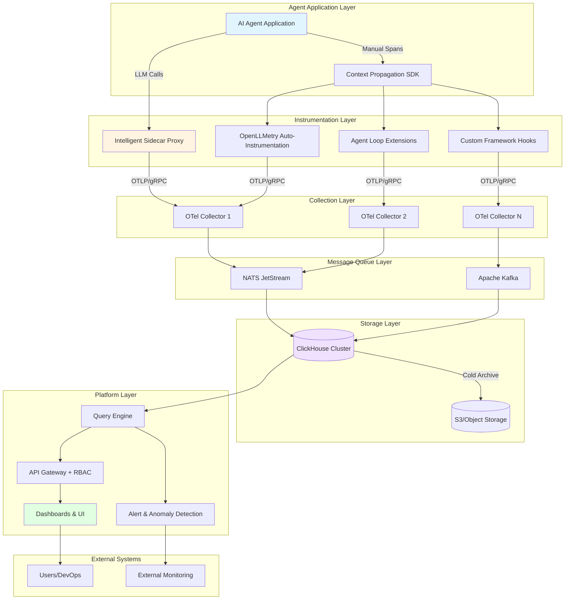
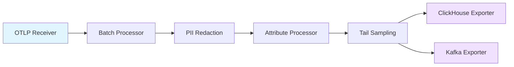
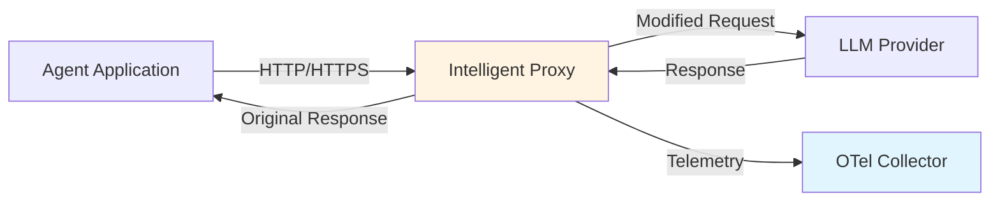
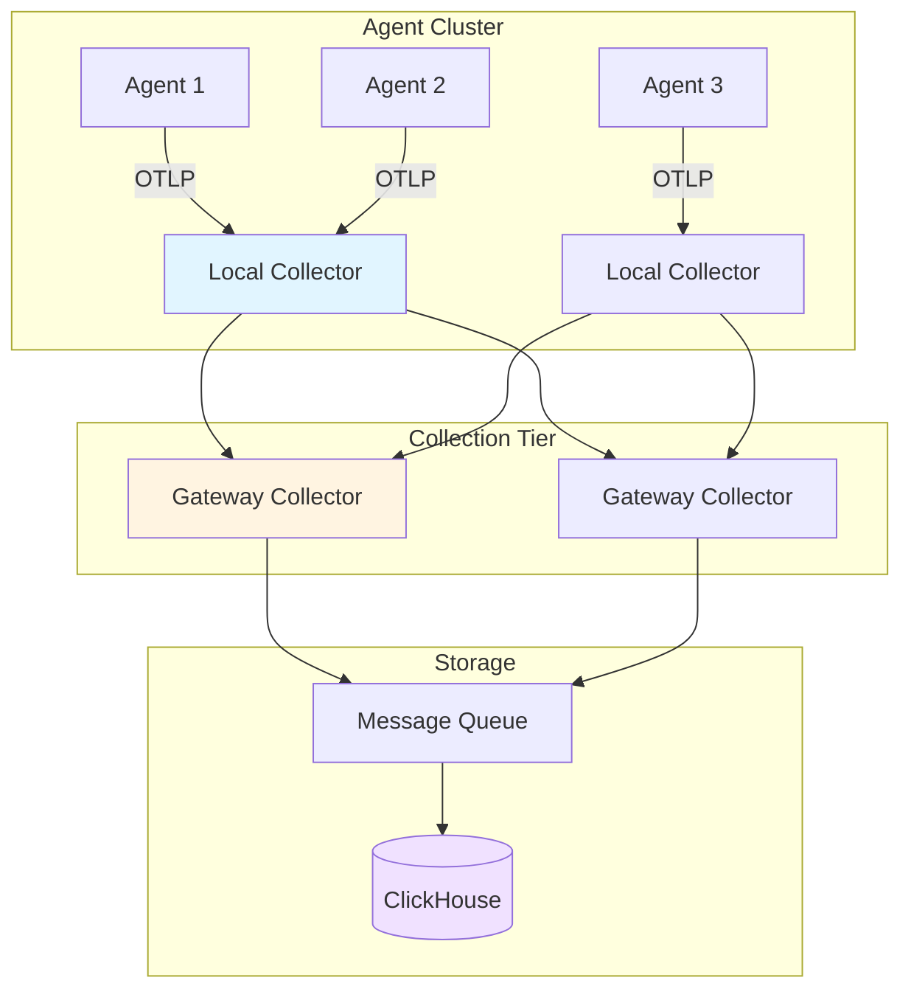
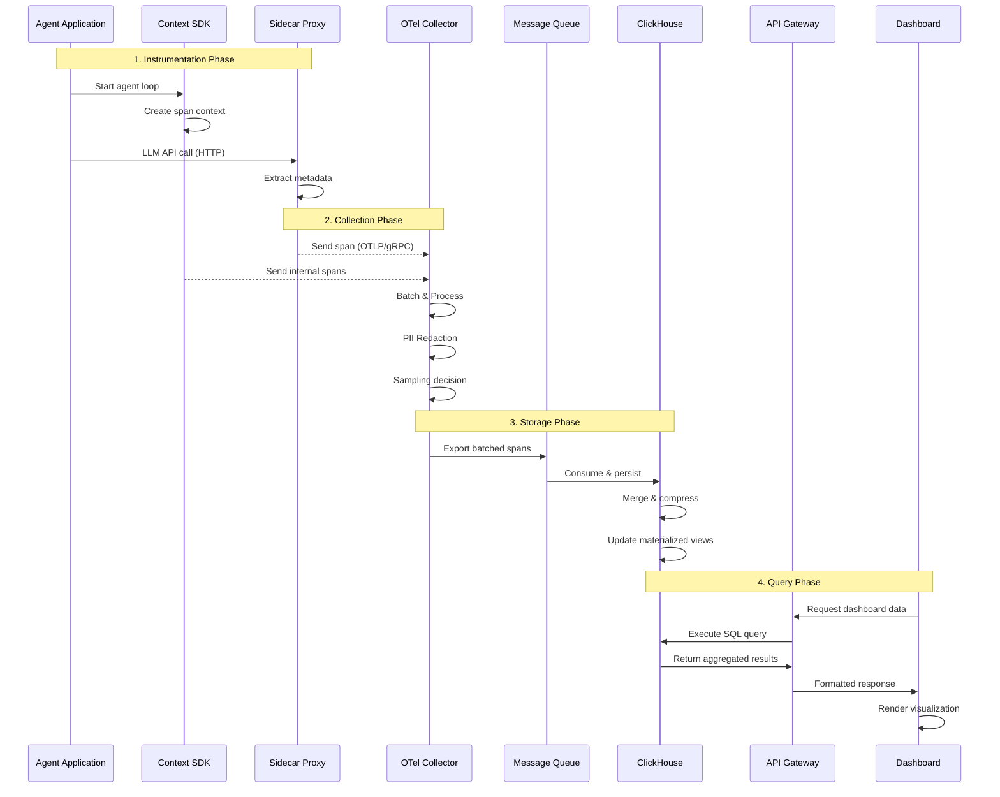
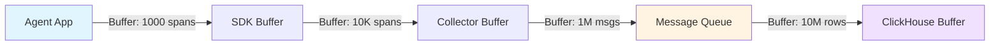
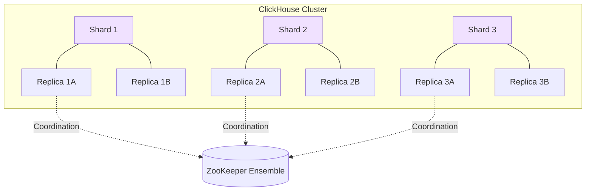

# System Architecture

## Table of Contents

1. [Architecture Overview](#architecture-overview)
2. [High-Level Architecture](#high-level-architecture)
3. [Architecture Layers](#architecture-layers)
   - [Instrumentation Layer](#instrumentation-layer)
   - [Collection Layer](#collection-layer)
   - [Storage Layer](#storage-layer)
   - [Platform Layer](#platform-layer)
4. [Core Components](#core-components)
   - [Proxy/Gateway Component](#proxygateway-component)
   - [OTel Collector](#otel-collector)
   - [Message Queue System](#message-queue-system)
   - [Storage Engine](#storage-engine)
   - [Query Engine](#query-engine)
   - [API Gateway](#api-gateway)
5. [Data Flow Architecture](#data-flow-architecture)
6. [Component Interaction Patterns](#component-interaction-patterns)
7. [Scalability Architecture](#scalability-architecture)
8. [Deployment Topologies](#deployment-topologies)
9. [Key Takeaways](#key-takeaways)

## Architecture Overview

The a11i observability platform is built on a **Hybrid Instrumentation Model** that provides comprehensive visibility into AI agent systems through two synchronized components:

1. **Intelligent Sidecar (Proxy Mode)** - Captures external behavior, particularly LLM API calls, through transparent traffic interception
2. **Context Propagation SDK (Library Mode)** - Instruments internal cognition including agent planning, reasoning, memory retrieval, and decision-making

This hybrid approach ensures complete observability across both the external communication layer and internal agent processing, enabling deep insights into agent behavior, performance, and costs.

### Design Principles

- **Asynchronous Operations**: Never block agent execution paths
- **Graceful Degradation**: System continues functioning even when observability components fail
- **Horizontal Scalability**: All components designed for distributed deployment
- **Data Sovereignty**: Support for multi-tenant isolation and compliance requirements
- **Open Standards**: Built on OpenTelemetry and CNCF technologies

## High-Level Architecture

The following diagram illustrates the complete system architecture from instrumentation through storage and visualization:



## Architecture Layers

The a11i platform is organized into four distinct architectural layers, each with specific responsibilities and components.

### Instrumentation Layer

The instrumentation layer captures telemetry data from AI agent applications through multiple mechanisms:

**Components:**

- **OpenLLMetry**: Automatic instrumentation for LLM provider libraries (OpenAI, Anthropic, Bedrock, etc.)
- **Agent Extensions**: Custom instrumentation for agent framework loops (LangChain, CrewAI, AutoGPT, etc.)
- **Custom Hooks**: Manual instrumentation points for framework-specific behaviors
- **Intelligent Sidecar Proxy**: Transparent reverse proxy for LLM traffic interception

**Capabilities:**

- Auto-instrumentation with zero code changes (proxy mode)
- Manual span creation for custom agent logic (SDK mode)
- Framework adapters (e.g., LangChain CallbackHandler)
- Context propagation across distributed agent components
- Attribute enrichment and semantic conventions

**Key Features:**

- **Low Overhead**: <5ms latency added per instrumented call
- **Non-Invasive**: Gracefully degrades if telemetry pipeline fails
- **Comprehensive**: Captures both LLM interactions and internal agent reasoning
- **Standards-Based**: Uses OpenTelemetry semantic conventions

### Collection Layer

The collection layer receives, processes, and routes telemetry data from instrumented applications:

**Components:**

- **OTel Collector Fleet**: Horizontally scalable CNCF collectors
- **Receivers**: OTLP (gRPC and HTTP), Prometheus, Jaeger
- **Processors**: Batch, PII redaction, sampling, attribute manipulation
- **Exporters**: ClickHouse, Kafka, NATS, S3

**Processing Pipeline:**



**Key Capabilities:**

- **Batching**: Aggregates spans for efficient transmission (default: 8192 spans or 200ms)
- **PII Redaction**: Removes sensitive data from prompts and completions
- **Sampling**: Head-based and tail-based sampling strategies
- **Enrichment**: Adds cluster metadata, environment tags, and custom attributes
- **Protocol Translation**: Normalizes data across different LLM providers

### Storage Layer

The storage layer provides tiered persistence optimized for different query patterns and retention requirements:

**Storage Tiers:**

1. **Hot Storage (ClickHouse)**: 7-30 days, sub-second query latency
2. **Warm Storage (ClickHouse)**: 30-90 days, second-range query latency
3. **Cold Storage (S3/Object Storage)**: 90+ days, archival access

**ClickHouse Architecture:**

- **Columnar Compression**: 10x-20x compression ratios for trace data
- **Distributed Tables**: Sharding across multiple nodes for scalability
- **MergeTree Engine**: Optimized for time-series data with efficient merges
- **Materialized Views**: Pre-aggregated metrics for dashboard performance

**Message Queue Integration:**

- **NATS JetStream**: Cloud-native deployments with <1ms latency
- **Apache Kafka**: Enterprise scale supporting >100K requests/second
- **Decoupling**: Separates ingestion from storage for resilience
- **Buffer Management**: Absorbs traffic spikes and handles backpressure

**Performance Characteristics:**

- **Ingestion Rate**: 300M spans/day on single ClickHouse instance
- **Query Performance**: P95 < 500ms for trace reconstruction
- **Retention**: Configurable per-tenant with automatic TTL management
- **Compression**: ~20x reduction for typical LLM trace payloads

### Platform Layer

The platform layer provides user-facing APIs, dashboards, and operational capabilities:

**Components:**

- **Query Engine**: SQL-based trace querying and aggregation
- **API Gateway**: REST and GraphQL APIs with RBAC enforcement
- **Alert Engine**: Real-time anomaly detection and threshold alerts
- **Dashboard System**: Pre-built visualizations and custom dashboards

**Key Features:**

- **Trace Reconstruction**: Rebuilds complete agent execution traces
- **Cost Analytics**: Aggregates costs across models, teams, and projects
- **Anomaly Detection**: ML-based detection of unusual patterns
- **Multi-Tenancy**: Tenant isolation with separate data namespaces
- **RBAC**: Fine-grained access control for teams and resources

## Core Components

### Proxy/Gateway Component

The Intelligent Sidecar Proxy operates as a transparent reverse proxy between agent applications and LLM providers:

**Architecture:**



**Capabilities:**

- **Traffic Interception**: Transparent proxy on localhost port
- **Protocol Normalization**: Unified handling of OpenAI, Anthropic, Bedrock APIs
- **Real-Time Metrics**: Token counting, latency, cost calculation
- **Resilience Patterns**: Circuit breakers, retry logic, timeout management
- **Header Injection**: W3C Trace Context propagation

**Configuration Example:**

```yaml
proxy:
  listen_address: "127.0.0.1:8080"
  upstream_providers:
    - name: "openai"
      base_url: "https://api.openai.com/v1"
      timeout: "60s"
    - name: "anthropic"
      base_url: "https://api.anthropic.com/v1"
      timeout: "90s"

  telemetry:
    exporter: "otlp"
    endpoint: "collector.a11i.svc.cluster.local:4317"

  resilience:
    circuit_breaker:
      failure_threshold: 5
      timeout: "30s"
    retry:
      max_attempts: 3
      backoff: "exponential"
```

**Performance Impact:**

- **Latency Overhead**: <2ms P99
- **CPU Usage**: <5% additional overhead
- **Memory**: ~50MB base + 1MB per concurrent request

### OTel Collector

The OpenTelemetry Collector is the core data processing component:

**Deployment Architecture:**



**Processor Pipeline:**

1. **Batch Processor**: Aggregates spans for efficient export
2. **PII Redaction Processor**: Removes sensitive data patterns
3. **Attribute Processor**: Adds environment and cluster metadata
4. **Resource Detection**: Auto-detects cloud provider and Kubernetes info
5. **Tail Sampling**: Intelligent sampling based on error rates and latency

**Configuration Highlights:**

```yaml
processors:
  batch:
    timeout: 200ms
    send_batch_size: 8192
    send_batch_max_size: 16384

  pii_redaction:
    patterns:
      - regex: '\b\d{3}-\d{2}-\d{4}\b'  # SSN
      - regex: '\b[A-Za-z0-9._%+-]+@[A-Za-z0-9.-]+\.[A-Z|a-z]{2,}\b'  # Email
      - field: 'llm.prompt'
        redact_patterns: ['password', 'api_key', 'secret']

  attributes:
    actions:
      - key: environment
        value: production
        action: insert
      - key: cluster.name
        from_attribute: k8s.cluster.name
        action: upsert

  tail_sampling:
    decision_wait: 10s
    num_traces: 100000
    policies:
      - name: error-traces
        type: status_code
        status_code: {status_codes: [ERROR]}
      - name: high-latency
        type: latency
        latency: {threshold_ms: 5000}
      - name: probabilistic
        type: probabilistic
        probabilistic: {sampling_percentage: 10}
```

### Message Queue System

The message queue provides buffering and decoupling between collection and storage:

**NATS JetStream (Cloud-Native Deployments):**

```yaml
jetstream:
  streams:
    - name: "a11i-traces"
      subjects: ["telemetry.traces.*"]
      retention: "limits"
      max_age: "24h"
      max_bytes: "100GB"
      storage: "file"
      replicas: 3

    - name: "a11i-metrics"
      subjects: ["telemetry.metrics.*"]
      retention: "limits"
      max_age: "7d"
      max_bytes: "50GB"
      storage: "file"
      replicas: 3
```

**Kafka (Enterprise Deployments):**

```yaml
kafka:
  topics:
    - name: "a11i-traces"
      partitions: 12
      replication_factor: 3
      retention_ms: 86400000  # 24 hours
      compression_type: "lz4"

  consumer_groups:
    - name: "clickhouse-exporter"
      topics: ["a11i-traces"]
      max_poll_records: 500
      fetch_min_bytes: 1048576  # 1MB
```

**Comparison:**

| Feature | NATS JetStream | Apache Kafka |
|---------|---------------|--------------|
| Latency | <1ms P99 | 5-10ms P99 |
| Throughput | 10M msgs/sec | 100M msgs/sec |
| Operational Complexity | Low | High |
| Storage | File-based | Log segments |
| Best For | Cloud-native, moderate scale | Enterprise, high scale |

### Storage Engine

ClickHouse provides the primary storage and query engine:

**Table Schema:**

```sql
CREATE TABLE a11i.traces (
    trace_id String,
    span_id String,
    parent_span_id String,
    span_name String,
    span_kind String,
    start_time DateTime64(9),
    end_time DateTime64(9),
    duration_ns UInt64,

    -- Agent attributes
    agent_name String,
    agent_framework String,
    agent_loop_iteration UInt32,

    -- LLM attributes
    llm_provider String,
    llm_model String,
    llm_prompt_tokens UInt32,
    llm_completion_tokens UInt32,
    llm_total_tokens UInt32,
    llm_cost_usd Float64,

    -- Status
    status_code String,
    status_message String,

    -- Attributes (flexible)
    attributes Map(String, String),

    -- Metadata
    tenant_id String,
    environment String,

    INDEX idx_trace_id trace_id TYPE bloom_filter GRANULARITY 1,
    INDEX idx_agent agent_name TYPE set(100) GRANULARITY 1,
    INDEX idx_model llm_model TYPE set(50) GRANULARITY 1
)
ENGINE = MergeTree()
PARTITION BY toYYYYMMDD(start_time)
ORDER BY (tenant_id, start_time, trace_id, span_id)
TTL start_time + INTERVAL 30 DAY;
```

**Materialized Views for Performance:**

```sql
-- Pre-aggregated metrics for dashboards
CREATE MATERIALIZED VIEW a11i.hourly_metrics
ENGINE = SummingMergeTree()
PARTITION BY toYYYYMMDD(hour)
ORDER BY (tenant_id, hour, agent_name, llm_model)
AS SELECT
    tenant_id,
    toStartOfHour(start_time) AS hour,
    agent_name,
    llm_model,
    count() AS request_count,
    sum(llm_total_tokens) AS total_tokens,
    sum(llm_cost_usd) AS total_cost,
    avg(duration_ns) AS avg_duration_ns,
    quantile(0.95)(duration_ns) AS p95_duration_ns,
    countIf(status_code = 'ERROR') AS error_count
FROM a11i.traces
GROUP BY tenant_id, hour, agent_name, llm_model;
```

### Query Engine

The query engine provides high-level abstractions over ClickHouse:

**Trace Reconstruction:**

```python
async def get_trace(trace_id: str, tenant_id: str) -> Trace:
    """Reconstruct complete trace with all spans."""
    query = """
        SELECT *
        FROM a11i.traces
        WHERE trace_id = %(trace_id)s
          AND tenant_id = %(tenant_id)s
        ORDER BY start_time ASC
    """

    spans = await clickhouse.execute(
        query,
        params={"trace_id": trace_id, "tenant_id": tenant_id}
    )

    return reconstruct_trace_tree(spans)
```

**Cost Analytics:**

```python
async def get_cost_breakdown(
    tenant_id: str,
    start_time: datetime,
    end_time: datetime,
    group_by: List[str]
) -> List[CostBreakdown]:
    """Get cost breakdown by specified dimensions."""
    group_clause = ", ".join(group_by)

    query = f"""
        SELECT
            {group_clause},
            sum(llm_cost_usd) AS total_cost,
            sum(llm_total_tokens) AS total_tokens,
            count() AS request_count
        FROM a11i.traces
        WHERE tenant_id = %(tenant_id)s
          AND start_time BETWEEN %(start_time)s AND %(end_time)s
        GROUP BY {group_clause}
        ORDER BY total_cost DESC
    """

    return await clickhouse.execute(query, params={
        "tenant_id": tenant_id,
        "start_time": start_time,
        "end_time": end_time
    })
```

### API Gateway

The API Gateway provides secure, versioned access to platform capabilities:

**REST API Structure:**

```
/api/v1
├── /traces
│   ├── GET /{trace_id}              # Get single trace
│   ├── POST /search                 # Search traces
│   └── GET /{trace_id}/flamegraph   # Generate flamegraph
├── /metrics
│   ├── GET /cost                    # Cost metrics
│   ├── GET /performance             # Performance metrics
│   └── GET /usage                   # Token usage metrics
├── /alerts
│   ├── GET /                        # List alerts
│   ├── POST /                       # Create alert
│   └── GET /{alert_id}/history      # Alert history
└── /dashboards
    ├── GET /                        # List dashboards
    ├── POST /                       # Create dashboard
    └── GET /{dashboard_id}          # Get dashboard
```

**Authentication & Authorization:**

```yaml
rbac:
  roles:
    - name: "viewer"
      permissions:
        - "traces:read"
        - "metrics:read"
        - "dashboards:read"

    - name: "developer"
      permissions:
        - "traces:read"
        - "traces:search"
        - "metrics:read"
        - "dashboards:read"
        - "dashboards:create"

    - name: "admin"
      permissions:
        - "traces:*"
        - "metrics:*"
        - "dashboards:*"
        - "alerts:*"
        - "settings:*"
```

## Data Flow Architecture

The complete data flow from agent application to dashboard visualization:



**Data Flow Steps:**

1. **Instrumentation Phase** (0-5ms overhead)
   - Agent makes LLM call through proxy or SDK
   - Context propagation headers injected
   - Span created with trace_id and parent_span_id
   - Attributes captured (model, tokens, prompt length)

2. **Collection Phase** (10-200ms buffering)
   - Spans sent asynchronously via OTLP
   - Collector receives and queues spans
   - Batch processor aggregates up to 8192 spans
   - PII redaction removes sensitive data
   - Sampling decision made (if configured)

3. **Storage Phase** (100-500ms persistence)
   - Spans exported to message queue
   - Queue buffers for resilience
   - Consumer writes to ClickHouse
   - Automatic partitioning by date
   - Materialized views updated incrementally

4. **Query Phase** (<500ms P95)
   - API receives dashboard request
   - SQL query executed on ClickHouse
   - Results aggregated and formatted
   - Response cached for repeated queries
   - UI renders visualization

## Component Interaction Patterns

### Asynchronous Communication

All inter-component communication is asynchronous to prevent blocking agent execution:

```python
# SDK example - fire and forget
async def send_span_async(span: Span):
    """Send span without blocking agent execution."""
    try:
        await asyncio.wait_for(
            exporter.export([span]),
            timeout=1.0
        )
    except asyncio.TimeoutError:
        logger.warning("Span export timeout, dropping span")
    except Exception as e:
        logger.error(f"Span export failed: {e}")
```

### Circuit Breaker Pattern

Prevents cascading failures when downstream services are unhealthy:

```python
class CircuitBreaker:
    def __init__(self, failure_threshold: int, timeout: float):
        self.failure_threshold = failure_threshold
        self.timeout = timeout
        self.failures = 0
        self.state = "CLOSED"  # CLOSED, OPEN, HALF_OPEN
        self.opened_at = None

    async def call(self, func, *args, **kwargs):
        if self.state == "OPEN":
            if time.time() - self.opened_at > self.timeout:
                self.state = "HALF_OPEN"
            else:
                raise CircuitBreakerOpenError()

        try:
            result = await func(*args, **kwargs)
            if self.state == "HALF_OPEN":
                self.state = "CLOSED"
                self.failures = 0
            return result
        except Exception as e:
            self.failures += 1
            if self.failures >= self.failure_threshold:
                self.state = "OPEN"
                self.opened_at = time.time()
            raise
```

### Context Propagation

W3C Trace Context ensures distributed tracing across components:

```
traceparent: 00-{trace_id}-{parent_span_id}-{flags}
tracestate: a11i=tenant:{tenant_id};env:{environment}

Example:
traceparent: 00-4bf92f3577b34da6a3ce929d0e0e4736-00f067aa0ba902b7-01
tracestate: a11i=tenant:acme-corp;env:production
```

### Buffering and Backpressure

Each layer implements buffering to handle traffic spikes:



## Scalability Architecture

### Horizontal Scaling Strategy

Every component supports horizontal scaling:

**OTel Collector Scaling:**

```yaml
apiVersion: apps/v1
kind: Deployment
metadata:
  name: otel-collector
spec:
  replicas: 10  # Scale based on load
  strategy:
    type: RollingUpdate
    rollingUpdate:
      maxSurge: 2
      maxUnavailable: 1
  template:
    spec:
      containers:
      - name: otel-collector
        resources:
          requests:
            cpu: "500m"
            memory: "512Mi"
          limits:
            cpu: "2000m"
            memory: "2Gi"

      # HorizontalPodAutoscaler
      hpa:
        minReplicas: 5
        maxReplicas: 50
        metrics:
        - type: Resource
          resource:
            name: cpu
            target:
              type: Utilization
              averageUtilization: 70
```

**ClickHouse Distributed Architecture:**



**Sharding Strategy:**

```sql
-- Distributed table with tenant-based sharding
CREATE TABLE a11i.traces_distributed AS a11i.traces
ENGINE = Distributed(
    'a11i_cluster',
    'a11i',
    'traces',
    cityHash64(tenant_id)  -- Shard by tenant
);
```

### Performance Benchmarks

**Ingestion Performance:**

| Component | Throughput | Latency P95 | CPU/Memory |
|-----------|-----------|-------------|------------|
| Sidecar Proxy | 10K req/sec | <2ms | 5% CPU, 50MB |
| OTel Collector | 100K spans/sec | <10ms | 1 CPU, 512MB |
| NATS JetStream | 10M msgs/sec | <1ms | 2 CPU, 1GB |
| ClickHouse Ingestion | 300M spans/day | <100ms | 8 CPU, 32GB |

**Query Performance:**

| Query Type | P50 | P95 | P99 |
|------------|-----|-----|-----|
| Single trace lookup | 50ms | 200ms | 500ms |
| Cost aggregation (1 day) | 100ms | 500ms | 1s |
| Cost aggregation (30 days) | 500ms | 2s | 5s |
| Full-text search | 200ms | 1s | 3s |

### Tiered Retention Strategy

```yaml
retention:
  hot_tier:
    duration: "7d"
    storage: "ClickHouse SSD"
    query_latency: "<500ms P95"

  warm_tier:
    duration: "30d"
    storage: "ClickHouse HDD"
    query_latency: "<2s P95"

  cold_tier:
    duration: "365d"
    storage: "S3/GCS"
    query_latency: "<30s P95"
```

## Deployment Topologies

### Small Deployment (Startup/Development)

Single-node deployment suitable for <1M spans/day:

```yaml
components:
  - otel-collector: 1 instance (2 CPU, 4GB RAM)
  - nats-jetstream: 1 instance (1 CPU, 2GB RAM)
  - clickhouse: 1 instance (4 CPU, 16GB RAM)
  - api-gateway: 1 instance (1 CPU, 2GB RAM)

total_resources:
  cpu: 8 cores
  memory: 24GB
  storage: 500GB SSD
```

### Medium Deployment (Scale-up)

Multi-node deployment for <100M spans/day:

```yaml
components:
  - otel-collector: 5 instances (10 CPU, 20GB RAM total)
  - nats-jetstream: 3 instances (3 CPU, 6GB RAM total)
  - clickhouse: 3 shards × 2 replicas (48 CPU, 192GB RAM total)
  - api-gateway: 3 instances (3 CPU, 6GB RAM total)

total_resources:
  cpu: 64 cores
  memory: 224GB
  storage: 5TB SSD
```

### Large Deployment (Enterprise)

Distributed deployment for >100M spans/day:

```yaml
components:
  - otel-collector: 50 instances (100 CPU, 200GB RAM total)
  - kafka: 9 brokers (36 CPU, 144GB RAM total)
  - clickhouse: 12 shards × 3 replicas (288 CPU, 1.5TB RAM total)
  - api-gateway: 10 instances (20 CPU, 40GB RAM total)

total_resources:
  cpu: 444 cores
  memory: 1.9TB
  storage: 100TB SSD + 500TB HDD
```

## Key Takeaways

> **Critical Architecture Decisions**
>
> 1. **Hybrid Instrumentation**: Combining proxy-based (zero-code) and SDK-based (deep visibility) instrumentation provides comprehensive observability without sacrificing ease of adoption.
>
> 2. **Async Everywhere**: Asynchronous data flow at every layer ensures observability never blocks agent execution, maintaining production performance.
>
> 3. **Tiered Storage**: Hot/warm/cold storage strategy balances query performance with cost-efficiency for long-term retention.
>
> 4. **Queue-Based Buffering**: Message queues between collection and storage provide resilience against traffic spikes and downstream failures.
>
> 5. **OpenTelemetry Foundation**: Building on CNCF OpenTelemetry ensures vendor neutrality, community support, and future extensibility.
>
> 6. **ClickHouse Optimization**: Columnar storage with aggressive compression provides 10-20x storage efficiency while maintaining sub-second query performance.
>
> 7. **Horizontal Scalability**: Stateless collectors and distributed storage enable scaling from startup to enterprise workloads.

**Related Documentation:**
- [Data Pipeline Architecture](/home/becker/projects/a11i/docs/02-architecture/data-pipeline.md)
- [Hybrid Instrumentation Model](/home/becker/projects/a11i/docs/02-architecture/hybrid-instrumentation.md)
- [Proxy Gateway Component](/home/becker/projects/a11i/docs/03-components/proxy-gateway.md)
- [OTel Collector Configuration](/home/becker/projects/a11i/docs/03-components/otel-collector.md)
- [Storage Layer Design](/home/becker/projects/a11i/docs/03-components/storage-layer.md)
