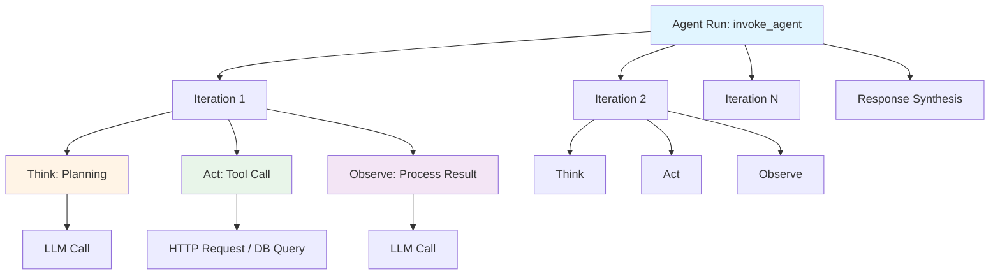
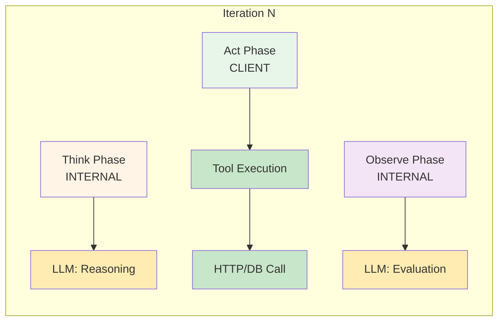

# Span Hierarchy and Agent Loop Tracing

## Table of Contents

1. [Overview](#overview)
2. [The Think-Act-Observe Pattern](#the-think-act-observe-pattern)
3. [Span Structure](#span-structure)
4. [Recommended Agent Loop Hierarchy](#recommended-agent-loop-hierarchy)
5. [Visual Trace Representation](#visual-trace-representation)
6. [Example Trace Tree](#example-trace-tree)
7. [Nested Spans for Tools](#nested-spans-for-tools)
8. [Multi-Turn Conversation Modeling](#multi-turn-conversation-modeling)
9. [Sub-Agent Spawning Patterns](#sub-agent-spawning-patterns)
10. [Key Attributes Reference](#key-attributes-reference)
11. [Implementation Examples](#implementation-examples)
12. [Best Practices](#best-practices)

## Overview

The a11i platform uses OpenTelemetry to create detailed traces of agent execution. Understanding the hierarchical structure of spans is critical for:

- **Debugging agent behavior**: Trace exactly what the agent thought, planned, and executed
- **Performance optimization**: Identify bottlenecks in tool calls, LLM requests, or iteration loops
- **Cost analysis**: Track token usage and API calls across agent lifecycles
- **Observability**: Monitor agent health, error rates, and execution patterns

This document defines the standard span hierarchy for AI agent traces, ensuring consistency across all a11i implementations.

## The Think-Act-Observe Pattern

AI agents operate in iterative loops following a fundamental pattern:

### 1. Think Phase
The agent reasons about the current state and plans the next action. This typically involves:
- Analyzing the current context and conversation history
- Evaluating available tools and their applicability
- Determining the best course of action
- Planning the execution strategy

**Span Characteristics:**
- Operation: `chat` (reasoning/planning)
- Span Kind: `INTERNAL`
- Contains LLM calls for reasoning

### 2. Act Phase
The agent executes the planned action. This may include:
- Invoking external tools (web search, database queries, APIs)
- Performing computations
- Updating internal state
- Making external API calls

**Span Characteristics:**
- Operation: `execute_tool`
- Span Kind: `CLIENT` (for tool invocations)
- Contains tool-specific spans and network requests

### 3. Observe Phase
The agent processes results and updates its state. This involves:
- Analyzing tool outputs or action results
- Updating context with new information
- Deciding whether to continue or complete the task
- Planning the next iteration

**Span Characteristics:**
- Operation: `chat` (result processing)
- Span Kind: `INTERNAL`
- Contains LLM calls for evaluation

This pattern repeats until the goal is achieved or maximum iterations are reached.

## Span Structure

The a11i platform uses OpenTelemetry Span Kinds to categorize different types of operations:

| Span Name | OTel Span Kind | Description | Key Attributes |
|-----------|----------------|-------------|----------------|
| **Agent Run** | `INTERNAL` | Root span for entire task/session | `a11i.agent.id`<br>`a11i.agent.name`<br>`a11i.session.id`<br>`a11i.user.id` |
| **Think / Plan** | `INTERNAL` | Internal reasoning step | `a11i.agent.loop_iteration`<br>`a11i.agent.loop_phase: "think"`<br>`gen_ai.prompt.tokens` |
| **Tool Execution** | `CLIENT` | Tool invocation (network/external) | `a11i.tool.name`<br>`a11i.tool.category`<br>`db.statement` (if DB)<br>`http.url` (if HTTP) |
| **LLM Request** | `CLIENT` | Network call to model provider | `gen_ai.system`<br>`gen_ai.request.model`<br>`gen_ai.usage.*`<br>`server.address` |
| **Observe** | `INTERNAL` | Result processing and state update | `a11i.agent.loop_phase: "observe"`<br>`a11i.context.saturation` |

### Span Kind Guidelines

- **INTERNAL**: Used for spans representing internal operations (thinking, planning, observing)
- **CLIENT**: Used for outbound requests (LLM calls, tool invocations, HTTP requests)
- **SERVER**: Used for incoming requests (if agent exposes API)
- **PRODUCER/CONSUMER**: Used for asynchronous messaging between agents

## Recommended Agent Loop Hierarchy

The standard hierarchy for agent execution follows this pattern:

```
[Root Span: invoke_agent {agent_name}]
├── [Loop Iteration 1]
│   ├── [think: chat - reasoning/planning]
│   │   └── [LLM Call: reasoning]
│   │       └── gen_ai.input.messages, gen_ai.output.messages
│   ├── [act: execute_tool {tool_name}]
│   │   ├── Tool-specific spans
│   │   └── HTTP/DB calls
│   └── [observe: chat - process results]
│       └── [LLM Call: evaluation]
│           └── Updated context, next action decision
├── [Loop Iteration 2]
│   ├── [think: chat - refine approach]
│   │   └── [LLM Call]
│   ├── [act: execute_tool {different_tool}]
│   │   └── [Tool spans]
│   └── [observe: chat - evaluate]
│       └── [LLM Call]
├── [Loop Iteration N]
│   └── ...
└── [Final: response_synthesis]
    └── [LLM Call: generate final response]
        └── Final output to user
```

### Hierarchy Principles

1. **Root Span**: Always represents the complete agent invocation
2. **Iteration Grouping**: Each loop iteration is a logical span grouping
3. **Phase Separation**: Think, Act, and Observe are distinct child spans
4. **LLM Nesting**: LLM calls are always children of their operational context
5. **Tool Isolation**: Each tool call has its own span tree

## Visual Trace Representation

### High-Level Flow Diagram



### Detailed Iteration Structure



## Example Trace Tree

Here's a complete example of how a research agent's trace would be structured:

```
TraceID: abc123def456
SpanID: root-001
├── AgentRun: "ResearchAgent" (root span)
│   ├── span.kind: INTERNAL
│   ├── duration: 45000ms
│   ├── attributes:
│   │   ├── a11i.agent.name: "research_assistant"
│   │   ├── a11i.agent.id: "agent-research-001"
│   │   ├── a11i.session.id: "sess-001"
│   │   ├── a11i.user.id: "user-xyz"
│   │   ├── gen_ai.operation.name: "invoke_agent"
│   │   └── a11i.agent.max_iterations: 10
│   │
│   ├── Iteration_1 (child span)
│   │   ├── span.id: iter-001
│   │   ├── parent.span.id: root-001
│   │   ├── duration: 15000ms
│   │   ├── attributes:
│   │   │   ├── a11i.agent.loop_iteration: 1
│   │   │   └── a11i.context.tokens_remaining: 120000
│   │   │
│   │   ├── Think: "plan_search_strategy" (child span)
│   │   │   ├── span.id: think-001
│   │   │   ├── parent.span.id: iter-001
│   │   │   ├── span.kind: INTERNAL
│   │   │   ├── duration: 3500ms
│   │   │   ├── attributes:
│   │   │   │   ├── a11i.agent.loop_phase: "think"
│   │   │   │   ├── gen_ai.operation.name: "chat"
│   │   │   │   └── a11i.thought.type: "planning"
│   │   │   │
│   │   │   └── LLM_Call: "reasoning" (child span)
│   │   │       ├── span.id: llm-001
│   │   │       ├── parent.span.id: think-001
│   │   │       ├── span.kind: CLIENT
│   │   │       ├── duration: 3200ms
│   │   │       ├── attributes:
│   │   │       │   ├── gen_ai.system: "openai"
│   │   │       │   ├── gen_ai.request.model: "gpt-4o"
│   │   │       │   ├── gen_ai.response.model: "gpt-4o-2024-08-06"
│   │   │       │   ├── gen_ai.usage.input_tokens: 500
│   │   │       │   ├── gen_ai.usage.output_tokens: 150
│   │   │       │   ├── gen_ai.usage.total_tokens: 650
│   │   │       │   ├── server.address: "api.openai.com"
│   │   │       │   └── gen_ai.response.finish_reasons: ["stop"]
│   │   │       └── events:
│   │   │           └── gen_ai.choice (gen_ai.prompt, gen_ai.completion)
│   │   │
│   │   ├── Act: "execute_tool" (child span)
│   │   │   ├── span.id: act-001
│   │   │   ├── parent.span.id: iter-001
│   │   │   ├── span.kind: CLIENT
│   │   │   ├── duration: 8000ms
│   │   │   ├── attributes:
│   │   │   │   ├── a11i.agent.loop_phase: "act"
│   │   │   │   ├── a11i.tool.name: "web_search"
│   │   │   │   └── a11i.tool.category: "retrieval"
│   │   │   │
│   │   │   └── Tool_WebSearch (child span)
│   │   │       ├── span.id: tool-001
│   │   │       ├── parent.span.id: act-001
│   │   │       ├── span.kind: CLIENT
│   │   │       ├── duration: 7800ms
│   │   │       ├── attributes:
│   │   │       │   ├── http.request.method: "POST"
│   │   │       │   ├── http.url: "https://api.search.com/v1/query"
│   │   │       │   ├── http.status_code: 200
│   │   │       │   ├── http.response.body.size: 45632
│   │   │       │   └── a11i.tool.results_count: 10
│   │   │       └── events:
│   │   │           ├── request_sent (http.request.body)
│   │   │           └── response_received (http.response.body)
│   │   │
│   │   └── Observe: "process_results" (child span)
│   │       ├── span.id: observe-001
│   │       ├── parent.span.id: iter-001
│   │       ├── span.kind: INTERNAL
│   │       ├── duration: 3500ms
│   │       ├── attributes:
│   │       │   ├── a11i.agent.loop_phase: "observe"
│   │       │   ├── gen_ai.operation.name: "chat"
│   │       │   ├── a11i.context.saturation: 0.15
│   │       │   └── a11i.observation.type: "result_processing"
│   │       │
│   │       └── LLM_Call: "process_search_results" (child span)
│   │           ├── span.id: llm-002
│   │           ├── parent.span.id: observe-001
│   │           ├── span.kind: CLIENT
│   │           ├── duration: 3200ms
│   │           ├── attributes:
│   │           │   ├── gen_ai.system: "openai"
│   │           │   ├── gen_ai.request.model: "gpt-4o"
│   │           │   ├── gen_ai.usage.input_tokens: 8500
│   │           │   ├── gen_ai.usage.output_tokens: 200
│   │           │   └── a11i.context.tokens_remaining: 111300
│   │           └── events:
│   │               └── gen_ai.choice (analysis decision)
│   │
│   ├── Iteration_2 (child span)
│   │   ├── span.id: iter-002
│   │   ├── parent.span.id: root-001
│   │   ├── duration: 18000ms
│   │   ├── attributes:
│   │   │   ├── a11i.agent.loop_iteration: 2
│   │   │   └── a11i.context.saturation: 0.28
│   │   │
│   │   ├── Think: "analyze_findings" (child span)
│   │   │   └── [LLM call for deeper analysis]
│   │   │
│   │   ├── Act: "database_query" (child span)
│   │   │   └── [Database tool execution]
│   │   │
│   │   └── Observe: "evaluate_data" (child span)
│   │       └── [LLM call for evaluation]
│   │
│   ├── Iteration_3 (child span)
│   │   ├── span.id: iter-003
│   │   ├── duration: 12000ms
│   │   └── [Think, Act, Observe cycle]
│   │
│   └── FinalResponse: "response_synthesis" (child span)
│       ├── span.id: final-001
│       ├── parent.span.id: root-001
│       ├── span.kind: INTERNAL
│       ├── duration: 4000ms
│       ├── attributes:
│       │   ├── gen_ai.operation.name: "chat"
│       │   ├── a11i.response.type: "synthesis"
│       │   └── a11i.agent.iterations_completed: 3
│       │
│       └── LLM_Call: "generate_final_response" (child span)
│           ├── span.id: llm-final
│           ├── span.kind: CLIENT
│           ├── duration: 3800ms
│           ├── attributes:
│           │   ├── gen_ai.usage.input_tokens: 15000
│           │   ├── gen_ai.usage.output_tokens: 800
│           │   └── a11i.response.word_count: 625
│           └── events:
│               └── gen_ai.completion (final user response)
```

## Nested Spans for Tools

Tools can have their own complex span hierarchies. Here's an example of a database query tool:

### Database Query Tool

```
Tool_Execution: "database_query"
├── span.kind: CLIENT
├── duration: 250ms
├── attributes:
│   ├── a11i.tool.name: "database_query"
│   ├── a11i.tool.category: "data_retrieval"
│   └── a11i.tool.version: "1.2.0"
│
├── SQL_Parse (child span)
│   ├── span.kind: INTERNAL
│   ├── duration: 5ms
│   ├── attributes:
│   │   ├── db.operation: "parse"
│   │   └── db.query.complexity: "simple"
│
├── Query_Execute (child span)
│   ├── span.kind: CLIENT
│   ├── duration: 200ms
│   ├── attributes:
│   │   ├── db.system: "postgresql"
│   │   ├── db.name: "production"
│   │   ├── db.statement: "SELECT * FROM users WHERE created_at > $1"
│   │   ├── db.operation: "select"
│   │   ├── server.address: "db.example.com"
│   │   ├── server.port: 5432
│   │   └── db.rows_affected: 42
│   └── events:
│       ├── query_start
│       └── query_complete (rows_returned: 42)
│
└── Result_Format (child span)
    ├── span.kind: INTERNAL
    ├── duration: 45ms
    ├── attributes:
    │   ├── a11i.tool.output_format: "json"
    │   └── a11i.tool.output_size_bytes: 8192
```

### API Call Tool

```
Tool_Execution: "api_call"
├── span.kind: CLIENT
├── duration: 1500ms
├── attributes:
│   ├── a11i.tool.name: "weather_api"
│   ├── a11i.tool.category: "external_api"
│   └── http.url: "https://api.weather.com/v3/forecast"
│
├── Request_Prepare (child span)
│   ├── span.kind: INTERNAL
│   ├── duration: 10ms
│   ├── attributes:
│   │   ├── http.request.method: "GET"
│   │   └── http.request.header.authorization: "[REDACTED]"
│
├── HTTP_Call (child span)
│   ├── span.kind: CLIENT
│   ├── duration: 1400ms
│   ├── attributes:
│   │   ├── http.request.method: "GET"
│   │   ├── http.status_code: 200
│   │   ├── http.response_content_length: 2048
│   │   ├── server.address: "api.weather.com"
│   │   ├── network.protocol.name: "https"
│   │   └── http.response.header.ratelimit_remaining: "95"
│   └── events:
│       ├── dns_resolution (duration: 50ms)
│       ├── tcp_connection (duration: 100ms)
│       ├── tls_handshake (duration: 200ms)
│       └── response_received (status: 200)
│
└── Response_Parse (child span)
    ├── span.kind: INTERNAL
    ├── duration: 90ms
    ├── attributes:
    │   ├── a11i.tool.parse_format: "json"
    │   └── a11i.tool.parsed_fields: 15
```

## Multi-Turn Conversation Modeling

Conversations spanning multiple user turns require special trace organization:

### Conversation-Level Trace

```
Conversation: "customer_support_session" (root span)
├── span.kind: INTERNAL
├── duration: 180000ms (3 minutes)
├── attributes:
│   ├── a11i.conversation.id: "conv-xyz-789"
│   ├── a11i.conversation.turn_count: 5
│   ├── a11i.user.id: "user-abc-123"
│   ├── a11i.agent.name: "support_assistant"
│   └── a11i.conversation.total_tokens: 45000
│
├── Turn_1: "initial_inquiry" (child span)
│   ├── span.id: turn-001
│   ├── duration: 25000ms
│   ├── attributes:
│   │   ├── a11i.conversation.turn_index: 1
│   │   ├── a11i.user.message.length: 150
│   │   └── a11i.user.message.hash: "sha256:abc..."
│   │
│   └── AgentRun: "process_inquiry" (child span)
│       ├── span.id: agent-run-001
│       ├── duration: 24000ms
│       └── [Complete agent loop hierarchy]
│           ├── Iteration_1
│           │   ├── Think
│           │   ├── Act: search_knowledge_base
│           │   └── Observe
│           └── FinalResponse
│
├── Turn_2: "clarification_question" (child span)
│   ├── span.id: turn-002
│   ├── duration: 18000ms
│   ├── attributes:
│   │   ├── a11i.conversation.turn_index: 2
│   │   ├── a11i.context.saturation: 0.35
│   │   └── a11i.conversation.reference_turn: 1
│   │
│   └── AgentRun: "handle_clarification" (child span)
│       └── [Agent processing]
│
├── Turn_3: "user_provides_details" (child span)
│   ├── span.id: turn-003
│   ├── duration: 45000ms
│   └── AgentRun: "deep_analysis" (child span)
│       ├── Iteration_1
│       │   ├── Think
│       │   ├── Act: api_call
│       │   └── Observe
│       ├── Iteration_2
│       │   ├── Think
│       │   ├── Act: database_query
│       │   └── Observe
│       └── FinalResponse
│
├── Turn_4: "solution_proposal" (child span)
│   └── [Agent run]
│
└── Turn_5: "confirmation" (child span)
    └── [Agent run]
```

### Cross-Turn Context

Use span links to connect related turns:

```python
# Turn 3 references information from Turn 1
with tracer.start_as_current_span(
    "turn_3",
    links=[
        trace.Link(turn_1_context, attributes={"reference.type": "context_continuation"})
    ],
    attributes={
        "a11i.conversation.turn_index": 3,
        "a11i.conversation.references_turn": 1
    }
)
```

## Sub-Agent Spawning Patterns

When one agent spawns another agent, use span links to maintain trace relationships:

### Parent Agent Creates Sub-Agent

```python
from opentelemetry import trace
from opentelemetry.trace import Link

# Agent A spawns Agent B
with tracer.start_as_current_span("agent_a.orchestration") as parent_span:
    # Record intent to spawn sub-agent
    parent_span.add_event(
        "spawning_sub_agent",
        attributes={
            "sub_agent.name": "agent_b",
            "sub_agent.task": "data_analysis",
            "spawn.reason": "specialized_capability_required"
        }
    )

    # Get current span context for propagation
    parent_context = trace.get_current_span().get_span_context()

    # Agent B receives context via link
    with tracer.start_as_current_span(
        "agent_b.task_execution",
        links=[Link(parent_context, attributes={"spawned_by": "agent_a"})],
        attributes={
            "a11i.agent.name": "agent_b",
            "a11i.agent.role": "data_analyst",
            "a11i.agent.parent": "agent_a",
            "a11i.spawn.type": "delegated_task"
        }
    ) as child_span:
        # Agent B execution
        result = await agent_b.execute_task()
        child_span.set_attribute("a11i.task.result_size", len(result))

    # Parent agent continues after B completes
    parent_span.add_event(
        "sub_agent_completed",
        attributes={
            "sub_agent.name": "agent_b",
            "sub_agent.duration_ms": 15000,
            "sub_agent.success": True
        }
    )
```

### Trace Structure for Agent Spawning

```
Agent_A (trace-001, root-span-a)
├── Planning (span-a1)
├── SpawnSubAgent (event)
│   └── attributes:
│       ├── sub_agent.name: "agent_b"
│       └── spawn.reason: "specialized_capability"
├── Wait_For_SubAgent (span-a2)
│   └── attributes:
│       └── a11i.blocking.wait_for: "agent_b"
└── Process_Results (span-a3)
    └── SubAgentCompleted (event)

Agent_B (trace-002, root-span-b, linked to root-span-a)
├── links:
│   └── Link(trace-001, span-id: root-span-a)
│       └── attributes:
│           ├── spawned_by: "agent_a"
│           └── relationship: "parent_child"
├── Initialization (span-b1)
│   └── attributes:
│       ├── a11i.agent.parent: "agent_a"
│       └── a11i.spawn.type: "delegated_task"
├── Processing (span-b2)
│   ├── Iteration_1
│   └── Iteration_2
└── Return_Result (span-b3)
    └── attributes:
        └── a11i.result.returned_to: "agent_a"
```

### Parallel Sub-Agent Execution

When spawning multiple agents in parallel:

```
Agent_Orchestrator (trace-orchestrator)
├── Plan_Parallel_Execution (span)
├── Spawn_Agent_1 (event)
├── Spawn_Agent_2 (event)
├── Spawn_Agent_3 (event)
├── Await_All_Results (span)
│   └── attributes:
│       ├── a11i.parallel.count: 3
│       └── a11i.parallel.timeout_ms: 30000
└── Aggregate_Results (span)

Agent_1 (trace-001, linked to orchestrator)
└── [execution spans]

Agent_2 (trace-002, linked to orchestrator)
└── [execution spans]

Agent_3 (trace-003, linked to orchestrator)
└── [execution spans]
```

## Key Attributes Reference

### Required Attributes for Every Agent Span

```yaml
# OpenTelemetry Standard Attributes
gen_ai.operation.name: "invoke_agent" | "chat" | "execute_tool"
gen_ai.system: "openai" | "anthropic" | "aws.bedrock" | "azure_openai"
gen_ai.request.model: "gpt-4o" | "claude-3-5-sonnet-20241022"
gen_ai.response.model: "gpt-4o-2024-08-06"
gen_ai.usage.input_tokens: 1500
gen_ai.usage.output_tokens: 300
gen_ai.usage.total_tokens: 1800

# a11i Platform Extensions
a11i.agent.name: "research_assistant"
a11i.agent.id: "agent-research-001"
a11i.agent.version: "1.2.0"
a11i.agent.loop_iteration: 3
a11i.agent.loop_phase: "think" | "act" | "observe"
a11i.agent.max_iterations: 10

# Context Management
a11i.context.saturation: 0.72  # (current_tokens / max_tokens)
a11i.context.tokens_remaining: 35840
a11i.context.window_size: 128000
a11i.context.priority_items: 5

# Tool Attributes
a11i.tool.name: "web_search" | "database_query" | "api_call"
a11i.tool.category: "retrieval" | "api" | "computation" | "memory"
a11i.tool.version: "2.1.0"
a11i.tool.results_count: 10
a11i.tool.execution_time_ms: 1500

# Session and User
a11i.session.id: "sess-abc-123"
a11i.user.id: "user-xyz-789"
a11i.conversation.id: "conv-001"
a11i.conversation.turn_index: 3
```

### Phase-Specific Attributes

**Think Phase:**
```yaml
a11i.agent.loop_phase: "think"
a11i.thought.type: "planning" | "reasoning" | "reflection"
a11i.thought.confidence: 0.85
gen_ai.operation.name: "chat"
```

**Act Phase:**
```yaml
a11i.agent.loop_phase: "act"
a11i.action.type: "tool_call" | "api_request" | "computation"
a11i.tool.name: "web_search"
a11i.tool.parameters: "{\"query\": \"...\"}"
```

**Observe Phase:**
```yaml
a11i.agent.loop_phase: "observe"
a11i.observation.type: "result_processing" | "error_handling" | "completion_check"
a11i.observation.decision: "continue" | "complete" | "retry"
a11i.context.saturation: 0.45
```

## Implementation Examples

### Python Implementation with OpenTelemetry

```python
from opentelemetry import trace
from opentelemetry.trace import Status, StatusCode
from opentelemetry.trace.propagation.tracecontext import TraceContextTextMapPropagator
import asyncio

# Initialize tracer
tracer = trace.get_tracer("a11i.agent", version="1.0.0")

class ThinkActObserveAgent:
    def __init__(self, name: str, max_iterations: int = 10):
        self.name = name
        self.max_iterations = max_iterations
        self.current_iteration = 0
        self.context_tokens = 0
        self.max_context_tokens = 128000

    async def run(self, user_query: str, session_id: str, user_id: str):
        """Main agent execution with complete tracing."""

        with tracer.start_as_current_span(
            "invoke_agent",
            kind=trace.SpanKind.INTERNAL,
            attributes={
                "a11i.agent.name": self.name,
                "a11i.agent.max_iterations": self.max_iterations,
                "a11i.session.id": session_id,
                "a11i.user.id": user_id,
                "gen_ai.operation.name": "invoke_agent",
            }
        ) as root_span:

            try:
                # Record user query as event (content redacted)
                root_span.add_event(
                    "user_query_received",
                    attributes={
                        "query.length": len(user_query),
                        "query.hash": self._hash_content(user_query)
                    }
                )

                result = await self._execute_loop(user_query)

                # Mark successful completion
                root_span.set_status(Status(StatusCode.OK))
                root_span.set_attribute("a11i.agent.iterations_completed", self.current_iteration)
                root_span.set_attribute("a11i.agent.success", True)

                return result

            except Exception as e:
                # Record error
                root_span.record_exception(e)
                root_span.set_status(Status(StatusCode.ERROR, str(e)))
                root_span.set_attribute("a11i.agent.error_type", type(e).__name__)
                raise

    async def _execute_loop(self, query: str):
        """Execute the Think-Act-Observe loop."""

        while not self._is_complete() and self.current_iteration < self.max_iterations:
            self.current_iteration += 1

            with tracer.start_as_current_span(
                f"iteration_{self.current_iteration}",
                kind=trace.SpanKind.INTERNAL,
                attributes={
                    "a11i.agent.loop_iteration": self.current_iteration,
                    "a11i.context.tokens_remaining": self.max_context_tokens - self.context_tokens,
                    "a11i.context.saturation": self.context_tokens / self.max_context_tokens
                }
            ):
                # Think phase
                thought = await self._think_phase()

                # Act phase
                action_result = await self._act_phase(thought)

                # Observe phase
                await self._observe_phase(action_result)

        # Final response synthesis
        return await self._synthesize_response()

    async def _think_phase(self):
        """Think phase: Planning and reasoning."""

        with tracer.start_as_current_span(
            "think",
            kind=trace.SpanKind.INTERNAL,
            attributes={
                "a11i.agent.loop_phase": "think",
                "a11i.thought.type": "planning",
                "gen_ai.operation.name": "chat"
            }
        ) as think_span:

            # Simulate LLM call for reasoning
            thought = await self._call_llm(
                operation="reasoning",
                prompt="Analyze current state and plan next action"
            )

            think_span.add_event(
                "thought_generated",
                attributes={
                    "thought.confidence": 0.85,
                    "thought.word_count": len(thought.split())
                }
            )

            return thought

    async def _act_phase(self, thought: str):
        """Act phase: Execute planned action."""

        with tracer.start_as_current_span(
            "act",
            kind=trace.SpanKind.CLIENT,
            attributes={
                "a11i.agent.loop_phase": "act",
                "a11i.action.type": "tool_call"
            }
        ) as act_span:

            # Determine which tool to use (simplified)
            tool_name = self._select_tool(thought)
            act_span.set_attribute("a11i.tool.name", tool_name)

            # Execute tool
            result = await self._execute_tool(tool_name, thought)

            act_span.set_attribute("a11i.tool.success", result is not None)

            return result

    async def _observe_phase(self, action_result):
        """Observe phase: Process results and update state."""

        with tracer.start_as_current_span(
            "observe",
            kind=trace.SpanKind.INTERNAL,
            attributes={
                "a11i.agent.loop_phase": "observe",
                "a11i.observation.type": "result_processing",
                "gen_ai.operation.name": "chat"
            }
        ) as observe_span:

            # Process results with LLM
            analysis = await self._call_llm(
                operation="evaluation",
                prompt=f"Analyze these results: {action_result}"
            )

            # Decide next action
            decision = self._make_decision(analysis)

            observe_span.set_attribute("a11i.observation.decision", decision)
            observe_span.set_attribute("a11i.context.saturation",
                                      self.context_tokens / self.max_context_tokens)

            observe_span.add_event(
                "decision_made",
                attributes={
                    "decision": decision,
                    "confidence": 0.90
                }
            )

    async def _call_llm(self, operation: str, prompt: str):
        """Make LLM API call with proper tracing."""

        with tracer.start_as_current_span(
            f"llm_call_{operation}",
            kind=trace.SpanKind.CLIENT,
            attributes={
                "gen_ai.system": "openai",
                "gen_ai.request.model": "gpt-4o",
                "gen_ai.operation.name": "chat",
                "server.address": "api.openai.com"
            }
        ) as llm_span:

            # Simulate LLM call
            input_tokens = len(prompt.split()) * 1.3  # Rough estimate
            await asyncio.sleep(0.5)  # Simulate API latency
            output_tokens = 150

            # Record token usage
            llm_span.set_attribute("gen_ai.usage.input_tokens", int(input_tokens))
            llm_span.set_attribute("gen_ai.usage.output_tokens", output_tokens)
            llm_span.set_attribute("gen_ai.usage.total_tokens", int(input_tokens + output_tokens))
            llm_span.set_attribute("gen_ai.response.model", "gpt-4o-2024-08-06")
            llm_span.set_attribute("gen_ai.response.finish_reasons", ["stop"])

            # Update context tracking
            self.context_tokens += int(input_tokens + output_tokens)

            # Record prompt and completion as events
            llm_span.add_event(
                "gen_ai.choice",
                attributes={
                    "gen_ai.prompt": "[REDACTED]",
                    "gen_ai.completion": "[REDACTED]"
                }
            )

            return f"LLM response for {operation}"

    async def _execute_tool(self, tool_name: str, context: str):
        """Execute a tool with nested span hierarchy."""

        with tracer.start_as_current_span(
            f"execute_tool_{tool_name}",
            kind=trace.SpanKind.CLIENT,
            attributes={
                "a11i.tool.name": tool_name,
                "a11i.tool.category": "retrieval",
                "a11i.tool.version": "1.0.0"
            }
        ) as tool_span:

            # Simulate tool execution
            await asyncio.sleep(0.3)

            tool_span.set_attribute("a11i.tool.results_count", 5)
            tool_span.set_attribute("a11i.tool.execution_time_ms", 300)

            return {"results": ["result1", "result2", "result3"]}

    async def _synthesize_response(self):
        """Generate final response."""

        with tracer.start_as_current_span(
            "response_synthesis",
            kind=trace.SpanKind.INTERNAL,
            attributes={
                "gen_ai.operation.name": "chat",
                "a11i.response.type": "synthesis"
            }
        ) as synthesis_span:

            response = await self._call_llm(
                operation="final_response",
                prompt="Synthesize all findings into user response"
            )

            synthesis_span.set_attribute("a11i.response.word_count", len(response.split()))
            synthesis_span.set_attribute("a11i.agent.iterations_completed", self.current_iteration)

            return response

    def _is_complete(self) -> bool:
        """Check if task is complete."""
        return self.current_iteration >= 3  # Simplified

    def _select_tool(self, thought: str) -> str:
        """Select appropriate tool based on thought."""
        return "web_search"  # Simplified

    def _make_decision(self, analysis: str) -> str:
        """Decide next action based on analysis."""
        return "continue" if self.current_iteration < 3 else "complete"

    def _hash_content(self, content: str) -> str:
        """Hash content for privacy."""
        import hashlib
        return hashlib.sha256(content.encode()).hexdigest()[:16]


# Usage example
async def main():
    agent = ThinkActObserveAgent(name="research_assistant", max_iterations=5)
    result = await agent.run(
        user_query="What are the latest developments in AI observability?",
        session_id="sess-001",
        user_id="user-abc"
    )
    print(f"Agent result: {result}")

# Run the agent
# asyncio.run(main())
```

### TypeScript/JavaScript Implementation

```typescript
import { trace, SpanKind, SpanStatusCode } from '@opentelemetry/api';

const tracer = trace.getTracer('a11i.agent', '1.0.0');

class ThinkActObserveAgent {
  private currentIteration = 0;
  private contextTokens = 0;
  private readonly maxContextTokens = 128000;

  constructor(
    private name: string,
    private maxIterations: number = 10
  ) {}

  async run(userQuery: string, sessionId: string, userId: string): Promise<string> {
    return tracer.startActiveSpan(
      'invoke_agent',
      {
        kind: SpanKind.INTERNAL,
        attributes: {
          'a11i.agent.name': this.name,
          'a11i.agent.max_iterations': this.maxIterations,
          'a11i.session.id': sessionId,
          'a11i.user.id': userId,
          'gen_ai.operation.name': 'invoke_agent',
        },
      },
      async (rootSpan) => {
        try {
          rootSpan.addEvent('user_query_received', {
            'query.length': userQuery.length,
            'query.hash': this.hashContent(userQuery),
          });

          const result = await this.executeLoop(userQuery);

          rootSpan.setStatus({ code: SpanStatusCode.OK });
          rootSpan.setAttribute('a11i.agent.iterations_completed', this.currentIteration);
          rootSpan.setAttribute('a11i.agent.success', true);

          return result;
        } catch (error) {
          rootSpan.recordException(error as Error);
          rootSpan.setStatus({
            code: SpanStatusCode.ERROR,
            message: (error as Error).message,
          });
          throw error;
        } finally {
          rootSpan.end();
        }
      }
    );
  }

  private async executeLoop(query: string): Promise<string> {
    while (!this.isComplete() && this.currentIteration < this.maxIterations) {
      this.currentIteration++;

      await tracer.startActiveSpan(
        `iteration_${this.currentIteration}`,
        {
          kind: SpanKind.INTERNAL,
          attributes: {
            'a11i.agent.loop_iteration': this.currentIteration,
            'a11i.context.tokens_remaining': this.maxContextTokens - this.contextTokens,
            'a11i.context.saturation': this.contextTokens / this.maxContextTokens,
          },
        },
        async (iterSpan) => {
          try {
            const thought = await this.thinkPhase();
            const actionResult = await this.actPhase(thought);
            await this.observePhase(actionResult);
          } finally {
            iterSpan.end();
          }
        }
      );
    }

    return this.synthesizeResponse();
  }

  private async thinkPhase(): Promise<string> {
    return tracer.startActiveSpan(
      'think',
      {
        kind: SpanKind.INTERNAL,
        attributes: {
          'a11i.agent.loop_phase': 'think',
          'a11i.thought.type': 'planning',
          'gen_ai.operation.name': 'chat',
        },
      },
      async (thinkSpan) => {
        try {
          const thought = await this.callLLM('reasoning', 'Plan next action');

          thinkSpan.addEvent('thought_generated', {
            'thought.confidence': 0.85,
            'thought.word_count': thought.split(' ').length,
          });

          return thought;
        } finally {
          thinkSpan.end();
        }
      }
    );
  }

  private async actPhase(thought: string): Promise<any> {
    return tracer.startActiveSpan(
      'act',
      {
        kind: SpanKind.CLIENT,
        attributes: {
          'a11i.agent.loop_phase': 'act',
          'a11i.action.type': 'tool_call',
        },
      },
      async (actSpan) => {
        try {
          const toolName = this.selectTool(thought);
          actSpan.setAttribute('a11i.tool.name', toolName);

          const result = await this.executeTool(toolName, thought);
          actSpan.setAttribute('a11i.tool.success', result !== null);

          return result;
        } finally {
          actSpan.end();
        }
      }
    );
  }

  private async observePhase(actionResult: any): Promise<void> {
    return tracer.startActiveSpan(
      'observe',
      {
        kind: SpanKind.INTERNAL,
        attributes: {
          'a11i.agent.loop_phase': 'observe',
          'a11i.observation.type': 'result_processing',
          'gen_ai.operation.name': 'chat',
        },
      },
      async (observeSpan) => {
        try {
          const analysis = await this.callLLM('evaluation', `Analyze: ${actionResult}`);
          const decision = this.makeDecision(analysis);

          observeSpan.setAttribute('a11i.observation.decision', decision);
          observeSpan.setAttribute('a11i.context.saturation',
            this.contextTokens / this.maxContextTokens);

          observeSpan.addEvent('decision_made', {
            decision,
            confidence: 0.90,
          });
        } finally {
          observeSpan.end();
        }
      }
    );
  }

  private async callLLM(operation: string, prompt: string): Promise<string> {
    return tracer.startActiveSpan(
      `llm_call_${operation}`,
      {
        kind: SpanKind.CLIENT,
        attributes: {
          'gen_ai.system': 'openai',
          'gen_ai.request.model': 'gpt-4o',
          'gen_ai.operation.name': 'chat',
          'server.address': 'api.openai.com',
        },
      },
      async (llmSpan) => {
        try {
          const inputTokens = Math.floor(prompt.split(' ').length * 1.3);
          await new Promise((resolve) => setTimeout(resolve, 500));
          const outputTokens = 150;

          llmSpan.setAttribute('gen_ai.usage.input_tokens', inputTokens);
          llmSpan.setAttribute('gen_ai.usage.output_tokens', outputTokens);
          llmSpan.setAttribute('gen_ai.usage.total_tokens', inputTokens + outputTokens);
          llmSpan.setAttribute('gen_ai.response.model', 'gpt-4o-2024-08-06');

          this.contextTokens += inputTokens + outputTokens;

          return `LLM response for ${operation}`;
        } finally {
          llmSpan.end();
        }
      }
    );
  }

  private async executeTool(toolName: string, context: string): Promise<any> {
    return tracer.startActiveSpan(
      `execute_tool_${toolName}`,
      {
        kind: SpanKind.CLIENT,
        attributes: {
          'a11i.tool.name': toolName,
          'a11i.tool.category': 'retrieval',
          'a11i.tool.version': '1.0.0',
        },
      },
      async (toolSpan) => {
        try {
          await new Promise((resolve) => setTimeout(resolve, 300));

          toolSpan.setAttribute('a11i.tool.results_count', 5);
          toolSpan.setAttribute('a11i.tool.execution_time_ms', 300);

          return { results: ['result1', 'result2', 'result3'] };
        } finally {
          toolSpan.end();
        }
      }
    );
  }

  private async synthesizeResponse(): Promise<string> {
    return tracer.startActiveSpan(
      'response_synthesis',
      {
        kind: SpanKind.INTERNAL,
        attributes: {
          'gen_ai.operation.name': 'chat',
          'a11i.response.type': 'synthesis',
        },
      },
      async (synthesisSpan) => {
        try {
          const response = await this.callLLM('final_response', 'Synthesize findings');

          synthesisSpan.setAttribute('a11i.response.word_count', response.split(' ').length);
          synthesisSpan.setAttribute('a11i.agent.iterations_completed', this.currentIteration);

          return response;
        } finally {
          synthesisSpan.end();
        }
      }
    );
  }

  private isComplete(): boolean {
    return this.currentIteration >= 3;
  }

  private selectTool(thought: string): string {
    return 'web_search';
  }

  private makeDecision(analysis: string): string {
    return this.currentIteration < 3 ? 'continue' : 'complete';
  }

  private hashContent(content: string): string {
    // Simplified hash (use crypto in production)
    return content.substring(0, 16);
  }
}
```

## Best Practices

### 1. Consistent Span Naming
- Use descriptive, action-oriented names: `think`, `act`, `observe`, not `step1`, `step2`
- Include context in names: `execute_tool_web_search` vs `tool`
- Use operation type prefixes: `llm_call_reasoning`, `http_request_api`

### 2. Appropriate Span Granularity
- Create spans for meaningful operations (>10ms duration)
- Don't create spans for trivial operations (string manipulation, simple calculations)
- Balance detail with overhead (aim for <1% tracing overhead)

### 3. Attribute Completeness
- Always include required attributes (`gen_ai.*`, `a11i.agent.*`)
- Add context-specific attributes for debugging
- Use consistent attribute naming across the platform

### 4. Error Handling
```python
try:
    result = await operation()
    span.set_status(Status(StatusCode.OK))
except Exception as e:
    span.record_exception(e)
    span.set_status(Status(StatusCode.ERROR, str(e)))
    span.set_attribute("error.type", type(e).__name__)
    raise
```

### 5. Privacy and Security
- Redact sensitive content in attributes and events
- Use content hashes instead of raw text
- Mark PII fields clearly: `user.email_hash` not `user.email`
- Never log API keys, passwords, or tokens

### 6. Performance Optimization
- Use sampling for high-volume operations
- Batch span creation when possible
- Minimize attribute cardinality (avoid unique IDs as values)
- Use events for detailed logging, not new spans

### 7. Span Links for Async Operations
- Use links to connect async agent spawning
- Link multi-turn conversations to original context
- Document link relationships with attributes

### 8. Testing Traces
```python
# Test that traces are created correctly
def test_agent_trace_structure():
    from opentelemetry.sdk.trace import TracerProvider
    from opentelemetry.sdk.trace.export import SimpleSpanProcessor
    from opentelemetry.sdk.trace.export.in_memory_span_exporter import InMemorySpanExporter

    exporter = InMemorySpanExporter()
    provider = TracerProvider()
    provider.add_span_processor(SimpleSpanProcessor(exporter))

    agent = ThinkActObserveAgent("test_agent")
    await agent.run("test query", "sess-1", "user-1")

    spans = exporter.get_finished_spans()

    # Verify root span
    root_span = [s for s in spans if s.name == "invoke_agent"][0]
    assert root_span.attributes["a11i.agent.name"] == "test_agent"

    # Verify think-act-observe pattern
    think_spans = [s for s in spans if "think" in s.name]
    act_spans = [s for s in spans if "act" in s.name]
    observe_spans = [s for s in spans if "observe" in s.name]

    assert len(think_spans) > 0
    assert len(act_spans) > 0
    assert len(observe_spans) > 0
```

---

> **Key Takeaways**
>
> - **Hierarchical Structure**: Agent traces follow a clear Think-Act-Observe hierarchy
> - **Span Kinds**: Use INTERNAL for reasoning, CLIENT for external calls
> - **Consistent Attributes**: Always include `a11i.agent.*`, `gen_ai.*`, and phase-specific attributes
> - **Privacy First**: Redact sensitive content, use hashes for user data
> - **Meaningful Granularity**: Create spans for operations >10ms that provide debugging value
> - **Link Related Traces**: Use span links for sub-agent spawning and multi-turn conversations
> - **Test Your Traces**: Validate span structure and attributes in tests

---

## Related Documentation

- [Semantic Conventions](./semantic-conventions.md) - Complete attribute reference
- [Context Management](./context-management.md) - Managing agent context and memory
- [Agent Patterns](./agent-patterns.md) - Common agent architectural patterns
- [Privacy and Redaction](./privacy-redaction.md) - Content redaction strategies
- [Performance Optimization](./performance-optimization.md) - Reducing tracing overhead

---

**Document Version:** 1.0.0
**Last Updated:** 2025-11-26
**Maintained By:** a11i Platform Team
