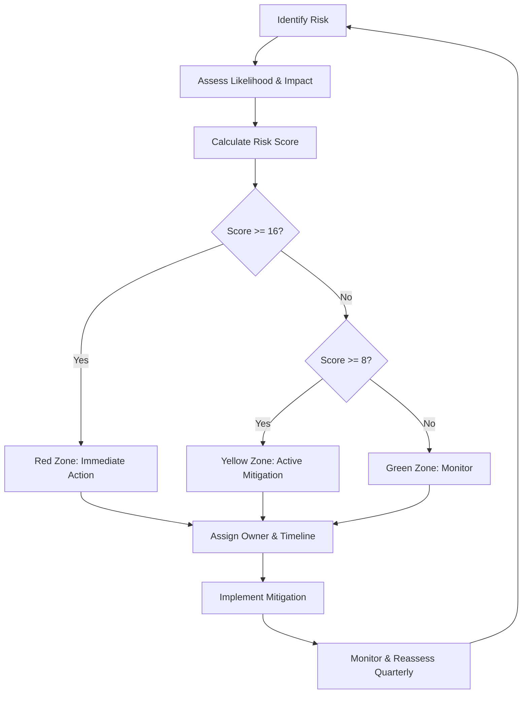

# Risk Assessment & Mitigation Strategies

## Table of Contents

- [Overview](#overview)
- [Risk Assessment Framework](#risk-assessment-framework)
- [Risk Categories](#risk-categories)
  - [Technical Risks](#technical-risks)
  - [Security Risks](#security-risks)
  - [Operational Risks](#operational-risks)
  - [Market & Business Risks](#market--business-risks)
  - [Compliance & Legal Risks](#compliance--legal-risks)
  - [Dependency & Supply Chain Risks](#dependency--supply-chain-risks)
- [Risk Matrix Summary](#risk-matrix-summary)
- [Quarterly Risk Review Process](#quarterly-risk-review-process)
- [Key Takeaways](#key-takeaways)

---

## Overview

This document provides a comprehensive risk assessment for the a11i platform, identifying potential threats to technical stability, security, operations, and business success. Each risk is evaluated on likelihood and impact, with specific mitigation strategies and ownership assignments.

**Purpose**:
- Proactively identify and manage risks before they materialize
- Assign clear ownership for risk mitigation
- Track risk status and mitigation progress
- Inform stakeholders about potential challenges

**Risk Evaluation Criteria**:

**Likelihood Scale**:
- **Critical (5)**: >50% probability within 6 months
- **High (4)**: 25-50% probability within 6 months
- **Medium (3)**: 10-25% probability within 12 months
- **Low (2)**: 5-10% probability within 12 months
- **Very Low (1)**: <5% probability within 12 months

**Impact Scale**:
- **Critical (5)**: Business-threatening, major customer loss, regulatory violation
- **High (4)**: Significant customer impact, revenue loss, reputational damage
- **Medium (3)**: Moderate customer impact, temporary service degradation
- **Low (2)**: Minor inconvenience, limited customer impact
- **Very Low (1)**: Negligible impact, internal only

**Risk Score**: Likelihood × Impact (1-25 scale)
- **Red Zone (16-25)**: Immediate action required
- **Yellow Zone (8-15)**: Active monitoring and mitigation
- **Green Zone (1-7)**: Routine monitoring

---

## Risk Assessment Framework

### Risk Management Process



### Mitigation Status Tracking

| Status | Description | Action Required |
|--------|-------------|-----------------|
| 🔴 **Not Started** | Mitigation not yet begun | Immediate action |
| 🟡 **In Progress** | Mitigation actively being implemented | Monitor progress |
| 🟢 **Mitigated** | Risk reduced to acceptable level | Ongoing monitoring |
| 🔵 **Accepted** | Risk acknowledged but not mitigated | Document rationale |

---

## Risk Categories

---

## Technical Risks

### TECH-001: OpenTelemetry Standard Changes

**Description**: OpenTelemetry semantic conventions for GenAI operations are evolving rapidly (v1.38+ as of November 2024). Breaking changes to attribute names, span structures, or protocol formats could require significant rework of instrumentation and storage schema.

**Likelihood**: Medium (3)
**Impact**: Medium (3)
**Risk Score**: 9 (Yellow Zone)
**Owner**: Platform Engineering Team

**Current Status**: 🟡 In Progress

**Specific Concerns**:
- GenAI semantic conventions still marked as "Experimental" in OTel spec
- Attribute names may change (e.g., `gen_ai.prompt.tokens` → `gen_ai.usage.input_tokens`)
- New required attributes may be added
- Legacy attributes may be deprecated

**Mitigation Strategies**:

1. **Version Pinning** (Implemented):
   - Pin OpenTelemetry SDK to specific stable versions
   - Test upgrades in staging environment before production
   - Maintain compatibility layer for at least 2 previous versions

2. **Abstraction Layer** (In Progress):
   ```python
   # Internal abstraction shields application from OTel changes
   class A11iSpanBuilder:
       def set_input_tokens(self, count: int):
           # Current OTel convention
           self.span.set_attribute("gen_ai.usage.input_tokens", count)
           # Legacy fallback for older collectors
           self.span.set_attribute("gen_ai.prompt.tokens", count)
   ```

3. **Upstream Participation** (Ongoing):
   - Actively participate in OpenTelemetry GenAI SIG meetings
   - Contribute to semantic conventions discussions
   - Early access to proposed changes via GitHub tracking

4. **Schema Versioning** (Implemented):
   - ClickHouse schema supports multiple attribute names
   - Materialized views normalize legacy and current conventions
   - Graceful degradation when unknown attributes received

**Monitoring**:
- Subscribe to OpenTelemetry changelog and breaking change announcements
- Quarterly review of GenAI semantic conventions GitHub repository
- Automated tests fail if OTel SDK upgrade breaks instrumentation

**Acceptance Criteria for Mitigation**:
- < 2 week turnaround for adapting to OTel breaking changes
- Zero customer-facing impact from OTel version upgrades

---

### TECH-002: LLM Provider API Changes

**Description**: LLM providers (OpenAI, Anthropic, Google) frequently change API schemas, deprecate endpoints, and introduce new authentication methods. Breaking changes could disrupt instrumentation for customers.

**Likelihood**: High (4)
**Impact**: Medium (3)
**Risk Score**: 12 (Yellow Zone)
**Owner**: Instrumentation Team

**Current Status**: 🟡 In Progress

**Historical Examples**:
- OpenAI GPT-4 Vision API merged into standard chat completions (Nov 2024)
- Anthropic changed streaming format from SSE to custom JSON (Aug 2024)
- Azure OpenAI requires different authentication from OpenAI (ongoing)

**Mitigation Strategies**:

1. **Provider Abstraction** (Implemented):
   ```python
   class ProviderAdapter:
       """Abstract LLM provider differences"""
       def extract_tokens(self, response) -> TokenUsage:
           if self.provider == "openai":
               return response.usage
           elif self.provider == "anthropic":
               return response.usage  # Different structure!
   ```

2. **Comprehensive Testing** (Implemented):
   - Integration tests run against live provider APIs daily
   - Automated alerts if API response schema changes detected
   - Test suite covers all supported providers (OpenAI, Anthropic, Azure, Bedrock)

3. **Graceful Degradation** (Implemented):
   - If token count unavailable, estimate from text length
   - If model name changes, log warning but continue tracing
   - Never fail instrumentation due to provider API changes

4. **Provider Changelog Monitoring** (Manual):
   - Weekly review of OpenAI, Anthropic, Google AI changelogs
   - Subscribe to provider developer newsletters
   - Participate in provider developer communities (Discord, forums)

5. **Multi-Version Support** (Planned):
   - Support last 2 major versions of each provider API
   - Automatic version detection and adapter selection

**Monitoring**:
- Daily integration test runs against live APIs
- Alerts on test failures or unexpected response schemas
- Customer reports of instrumentation failures

**Acceptance Criteria for Mitigation**:
- < 7 day adaptation to provider API breaking changes
- Graceful degradation prevents instrumentation failures

---

### TECH-003: Scalability Challenges Beyond Design Limits

**Description**: Current architecture is designed for 300M spans/day on single ClickHouse instance. Hyper-growth customers (1B+ spans/day) may exceed design limits before distributed architecture is production-ready.

**Likelihood**: Low (2)
**Impact**: High (4)
**Risk Score**: 8 (Yellow Zone)
**Owner**: Platform Architecture Team

**Current Status**: 🟢 Mitigated (via monitoring)

**Specific Scenarios**:
- Customer with 1000+ agents generating 5B spans/day
- Viral adoption causing 10x traffic spike
- Single-tenant workload overwhelming shared infrastructure

**Mitigation Strategies**:

1. **Tiered Architecture** (Designed):
   - **Tier 1**: Single ClickHouse instance (0-300M spans/day)
   - **Tier 2**: ClickHouse cluster with sharding (300M-3B spans/day)
   - **Tier 3**: Multi-region distributed architecture (3B+ spans/day)

2. **Horizontal Scaling Runbook** (Documented):
   - Pre-built Terraform modules for ClickHouse cluster deployment
   - Shard by `tenant_id` for tenant isolation
   - Documented migration procedure from single to distributed

3. **Proactive Capacity Monitoring** (Implemented):
   - Alert at 50% of design capacity (150M spans/day)
   - Weekly capacity planning reviews
   - 30-day growth trend forecasting

4. **Rate Limiting** (Implemented):
   - Per-tenant rate limits prevent runaway instrumentation
   - Configurable limits based on subscription tier
   - Graceful degradation with sampling if limits exceeded

5. **Customer Success Engagement** (Process):
   - High-volume customers (>10M spans/day) assigned CSM
   - Quarterly capacity planning calls
   - Early warning system for anticipated growth

**Capacity Thresholds**:

| Metric | Current Limit | Alert Threshold | Scale-Up Trigger |
|--------|---------------|-----------------|------------------|
| Spans/day | 300M | 150M (50%) | 240M (80%) |
| Query concurrency | 100 | 50 | 80 |
| Storage (compressed) | 10TB | 5TB | 8TB |
| NATS throughput | 10M msg/s | 5M msg/s | 8M msg/s |

**Monitoring**:
- Real-time capacity dashboards
- Automated alerts at 50% and 80% capacity
- Monthly capacity planning reports

**Acceptance Criteria for Mitigation**:
- 30-day warning before hitting capacity limits
- < 48 hour deployment time for scale-up

---

### TECH-004: Streaming Performance Degradation

**Description**: Passthrough-with-tapping pattern adds <100ns overhead per chunk in benchmarks, but production edge cases (large chunks, high concurrency, memory pressure) could degrade to measurable latency.

**Likelihood**: Low (2)
**Impact**: Medium (3)
**Risk Score**: 6 (Green Zone)
**Owner**: Performance Engineering Team

**Current Status**: 🟢 Mitigated (via monitoring)

**Specific Failure Modes**:
- Memory pressure causing GC pauses during buffering
- Large chunks (>1MB) causing memory copies to dominate
- Concurrent streams exhausting buffer pool
- PII detection regex backtracking on adversarial inputs

**Mitigation Strategies**:

1. **Performance SLOs** (Defined):
   - P50 overhead: <1ms per stream
   - P95 overhead: <5ms per stream
   - P99 overhead: <10ms per stream
   - Memory per stream: <20MB

2. **Continuous Performance Monitoring** (Implemented):
   - Real-time latency tracking per request
   - Alerts on P95 > 5ms for any customer
   - Daily performance regression tests

3. **Circuit Breakers** (Implemented):
   ```python
   if chunk_size > 1MB:
       # Skip buffering for extremely large chunks
       yield chunk  # Passthrough only
       metrics.increment("large_chunk_skipped")
   ```

4. **Resource Limits** (Implemented):
   - Max buffer size: 10,000 chunks
   - Max buffer memory: 50MB per stream
   - Max concurrent streams: 1,000 per proxy instance

5. **Performance Testing** (Ongoing):
   - Weekly load tests with 1,000 concurrent streams
   - Stress tests with adversarial inputs (1MB chunks, regex worst-case)
   - Production performance benchmarks (real customer workloads)

**Monitoring**:
- Real-time latency percentiles (P50, P95, P99)
- Memory usage per stream
- Buffer overflow events

**Acceptance Criteria for Mitigation**:
- P99 latency <10ms sustained under load
- Zero measurable TTFT impact in production

---

### TECH-005: ClickHouse Query Performance Regression

**Description**: As data volume grows and query complexity increases, ClickHouse queries may exceed P95 <500ms target, degrading dashboard responsiveness.

**Likelihood**: Medium (3)
**Impact**: Medium (3)
**Risk Score**: 9 (Yellow Zone)
**Owner**: Platform Engineering Team

**Current Status**: 🟡 In Progress

**Specific Causes**:
- High-cardinality dimensions (user_id, trace_id) without proper indexing
- Missing materialized views for common aggregations
- Suboptimal query patterns from application
- Table merges during peak traffic

**Mitigation Strategies**:

1. **Query Performance Monitoring** (Implemented):
   - All ClickHouse queries logged with execution time
   - Alerts on queries >1s
   - Weekly slow query analysis and optimization

2. **Materialized Views** (Implemented):
   ```sql
   -- Pre-aggregate cost by model for dashboards
   CREATE MATERIALIZED VIEW cost_by_model_mv
   ENGINE = SummingMergeTree()
   ORDER BY (date, model)
   AS SELECT
       toDate(timestamp) as date,
       model,
       sum(cost_usd) as total_cost
   FROM spans
   GROUP BY date, model
   ```

3. **Index Strategy** (Implemented):
   - Primary key: `(tenant_id, timestamp)`
   - Skipping index on `trace_id`, `user_id`
   - Bloom filter on `agent_id`

4. **Query Templates** (Provided):
   - Pre-optimized query patterns for common dashboards
   - Discourage unbounded full-table scans
   - Pagination with `LIMIT` and `OFFSET`

5. **Partition Management** (Automated):
   - Daily partitions with automatic TTL
   - Background merges scheduled during off-peak hours
   - Automatic partition pruning for time-range queries

**Query Performance SLOs**:

| Query Type | P50 Target | P95 Target | P99 Target |
|------------|------------|------------|------------|
| Single trace lookup | <50ms | <100ms | <200ms |
| Dashboard aggregation (24h) | <200ms | <500ms | <1s |
| Complex analytics (30d) | <2s | <5s | <10s |

**Monitoring**:
- Real-time query latency dashboards
- Slow query alerts (>1s)
- Query plan analysis for optimization opportunities

**Acceptance Criteria for Mitigation**:
- 95% of dashboard queries <500ms
- Zero customer-reported slow dashboard issues

---

## Security Risks

### SEC-001: PII Exposure via Telemetry

**Description**: Despite edge-based PII redaction, misconfigurations, bugs, or adversarial inputs could cause PII to leak into a11i backend telemetry storage.

**Likelihood**: Medium (3)
**Impact**: Critical (5)
**Risk Score**: 15 (Yellow Zone, High Priority)
**Owner**: Security & Compliance Team

**Current Status**: 🟡 In Progress

**Attack Vectors**:
- **Misconfigured redaction rules**: Customer disables PII detection
- **False negatives**: Presidio fails to detect novel PII patterns
- **Encoding attacks**: Base64-encoded PII bypasses regex patterns
- **Multimodal data**: Images or audio containing PII not scanned
- **Configuration drift**: Different PII policies across SDK and proxy

**Mitigation Strategies**:

1. **Defense in Depth** (Implemented):
   - **Layer 1**: Edge redaction (SDK/Sidecar) with Presidio
   - **Layer 2**: Backend PII scan on ingestion (paranoid mode)
   - **Layer 3**: Access controls preventing PII query even if stored
   - **Layer 4**: Audit logging of all data access

2. **Default-Strict Policies** (Implemented):
   - PII redaction enabled by default (opt-out, not opt-in)
   - Conservative confidence threshold (0.8) for detection
   - All Presidio entity types enabled by default

3. **Continuous PII Auditing** (Planned):
   ```python
   # Backend paranoid scan on sample of ingested data
   async def audit_pii_leakage():
       sample = random.sample(recent_spans, 1000)
       for span in sample:
           pii_detected = presidio_scanner.scan(span.content)
           if pii_detected:
               alert_security_team(span.tenant_id, pii_detected)
               quarantine_span(span.span_id)
   ```

4. **Encoding Attack Prevention** (Implemented):
   - Decode common encodings (Base64, URL encoding) before PII scan
   - Detect and flag suspicious encoding patterns

5. **Customer Training** (Ongoing):
   - Documentation emphasizing PII redaction importance
   - Best practices guide for configuring PII policies
   - Quarterly security webinars

6. **Incident Response Plan** (Documented):
   - Immediate quarantine of affected tenant data
   - Notification to affected customers within 72 hours (GDPR requirement)
   - Forensic analysis to identify root cause
   - Public incident postmortem (if applicable)

**Monitoring**:
- Random sampling of telemetry for PII patterns (1% sample rate)
- Alerts on PII detection in backend
- Customer reports of PII exposure

**Acceptance Criteria for Mitigation**:
- <0.01% false negative rate on structured PII (SSN, credit cards)
- Incident response <24 hours from detection to customer notification

---

### SEC-002: API Key Compromise

**Description**: Compromised a11i API keys could allow unauthorized access to customer telemetry data, exposing sensitive agent behavior, prompts, and potentially PII if redaction misconfigured.

**Likelihood**: Medium (3)
**Impact**: High (4)
**Risk Score**: 12 (Yellow Zone)
**Owner**: Security Team

**Current Status**: 🟡 In Progress

**Attack Scenarios**:
- Developer commits API key to public GitHub repository
- API key leaked via application logs or error messages
- Phishing attack targeting developer credentials
- Insider threat: Malicious employee exports API keys

**Mitigation Strategies**:

1. **API Key Rotation** (Implemented):
   - Automated quarterly rotation reminders
   - One-click rotation in UI
   - Grace period: Old key valid for 7 days after rotation

2. **Secret Scanning** (Planned):
   - GitHub Secret Scanning integration
   - Automated revocation of exposed keys
   - Email alerts to customer security contacts

3. **Scoped Permissions** (Implemented):
   - Read-only vs read-write API keys
   - Tenant-scoped keys (can't access other tenants)
   - Resource-specific keys (e.g., spans only, no billing data)

4. **Rate Limiting** (Implemented):
   - Per-API-key rate limits
   - Unusual activity detection (geographic anomalies, traffic spikes)
   - Automatic temporary suspension on suspected compromise

5. **Anomaly Detection** (Planned):
   ```python
   # Detect unusual API key usage patterns
   if api_key.requests_last_hour > 10x historical_average:
       suspend_api_key_temporarily(api_key)
       alert_security_team(api_key.tenant_id)
   ```

6. **Audit Logging** (Implemented):
   - All API calls logged with API key, IP, timestamp
   - Retention: 90 days (minimum for SOC 2)
   - Anomaly reports generated daily

**API Key Best Practices** (Documented):
- Never commit to version control
- Use environment variables or secret management (HashiCorp Vault, AWS Secrets Manager)
- Separate keys for development/staging/production
- Rotate keys quarterly at minimum

**Monitoring**:
- Real-time API key usage dashboards
- Alerts on unusual geographic access
- Customer reports of suspicious activity

**Acceptance Criteria for Mitigation**:
- <1 hour detection time for key compromise
- Automated revocation within 15 minutes of confirmed leak

---

### SEC-003: Data Breach (Backend Storage Compromise)

**Description**: Successful attack on a11i backend infrastructure (ClickHouse database, S3 backups) could expose customer telemetry data at scale.

**Likelihood**: Very Low (1)
**Impact**: Critical (5)
**Risk Score**: 5 (Green Zone, but extreme impact)
**Owner**: Security & Infrastructure Team

**Current Status**: 🟢 Mitigated (via security architecture)

**Attack Vectors**:
- SQL injection via application queries
- Unpatched vulnerabilities in ClickHouse or dependencies
- Stolen database credentials (admin access)
- Insider threat: Malicious employee with database access
- Cloud provider compromise (AWS, GCP, Azure)

**Mitigation Strategies**:

1. **Encryption** (Implemented):
   - **At Rest**: ClickHouse data encrypted with AES-256
   - **In Transit**: TLS 1.3 for all data in flight
   - **Backups**: S3 backups encrypted with customer-managed keys (CMK)

2. **Access Controls** (Implemented):
   - Least privilege: Only query service has database read access
   - No direct database access for humans (break-glass only)
   - MFA required for all administrative access
   - IP allowlisting for database connections

3. **Network Segmentation** (Implemented):
   - ClickHouse in private subnet (no internet access)
   - Application servers in DMZ
   - Separate VPC/VNet per environment (dev, staging, prod)

4. **Vulnerability Management** (Ongoing):
   - Automated dependency scanning (Dependabot, Snyk)
   - Quarterly penetration testing by external firm
   - Bug bounty program for responsible disclosure

5. **Audit Logging** (Implemented):
   - All database queries logged with user, timestamp, query
   - CloudTrail/Cloud Audit Logs for infrastructure changes
   - Immutable logs stored in separate AWS account

6. **Incident Response** (Documented):
   - Data breach runbook with step-by-step procedures
   - Customer notification templates (GDPR-compliant)
   - Forensic analysis procedures
   - Public incident disclosure policy

**Breach Impact Reduction** (Architectural):
- Edge-based PII redaction: Backend compromise doesn't expose customer PII
- Tenant isolation: Breach impact limited to compromised tenant(s)
- Encryption: Stolen data useless without decryption keys

**Monitoring**:
- Real-time intrusion detection (SIEM)
- Database access anomaly detection
- File integrity monitoring on database servers
- Security audit quarterly reviews

**Acceptance Criteria for Mitigation**:
- No critical vulnerabilities unpatched >7 days
- Penetration test findings remediated within 30 days

---

### SEC-004: Supply Chain Attack via Dependencies

**Description**: Compromised open-source dependencies (OpenTelemetry SDK, Presidio, Python/Go libraries) could inject malicious code into a11i platform.

**Likelihood**: Low (2)
**Impact**: Critical (5)
**Risk Score**: 10 (Yellow Zone)
**Owner**: Security & Engineering Team

**Current Status**: 🟡 In Progress

**Recent Examples**:
- SolarWinds supply chain attack (2020)
- PyPI package typosquatting (ongoing)
- NPM `event-stream` backdoor (2018)

**Mitigation Strategies**:

1. **Dependency Scanning** (Implemented):
   - Automated daily scans with Snyk, Dependabot
   - Alerts on known CVEs
   - Automated PR for security patches

2. **Dependency Pinning** (Implemented):
   - All dependencies pinned to specific versions
   - Hash verification on package downloads
   - No wildcard version specifiers (no `package>=1.0`)

3. **Private Package Mirror** (Planned):
   - Internal PyPI and Go module mirror
   - All packages scanned before mirroring
   - Air-gapped build environment pulls from internal mirror only

4. **Minimal Dependencies** (Policy):
   - Code review required for new dependencies
   - Prefer standard library over third-party when possible
   - Regular dependency cleanup (remove unused packages)

5. **License Compliance** (Automated):
   - Automated license scanning (FOSSA, WhiteSource)
   - Block copyleft licenses (GPL, AGPL) in production dependencies
   - Legal review for Apache, MIT, BSD dependencies

6. **Reproducible Builds** (Implemented):
   - Deterministic builds with pinned dependencies
   - Build artifact checksums verified before deployment
   - Immutable container images with digest hashes

**Dependency Approval Process**:
```
New Dependency Request
  ├─ Security scan for known CVEs
  ├─ License compatibility review
  ├─ Maintenance status check (last commit <6 months)
  ├─ Community reputation (GitHub stars, contributors)
  ├─ Code review of dependency source
  └─ Approval by security team
```

**Monitoring**:
- Daily dependency vulnerability scans
- Alerts on new CVEs for used packages
- Quarterly dependency audit

**Acceptance Criteria for Mitigation**:
- Zero high/critical CVEs in production dependencies
- < 7 days to patch critical dependency vulnerabilities

---

## Operational Risks

### OPS-001: Service Outage (Collector/Backend Unavailable)

**Description**: Outages to a11i backend services (OTel Collector, ClickHouse, NATS) could prevent telemetry ingestion, causing data loss and dashboard unavailability.

**Likelihood**: Low (2)
**Impact**: High (4)
**Risk Score**: 8 (Yellow Zone)
**Owner**: SRE Team

**Current Status**: 🟢 Mitigated (via redundancy and buffering)

**Failure Scenarios**:
- **ClickHouse node failure**: Database unavailable for writes
- **NATS queue failure**: Message queue unavailable
- **OTel Collector crash**: Cannot receive OTLP data
- **Network partition**: Connectivity loss between components
- **Cloud provider outage**: AWS/GCP/Azure regional failure

**Mitigation Strategies**:

1. **High Availability Architecture** (Implemented):
   - **Collector**: 3+ instances behind load balancer
   - **NATS**: 3-node cluster with raft consensus
   - **ClickHouse**: Replicated tables (2+ replicas)
   - **Load Balancer**: Cloud provider managed (99.99% SLA)

2. **Client-Side Buffering** (Implemented):
   ```python
   # SDK buffers telemetry if backend unavailable
   class ResilientExporter:
       def export(self, spans):
           try:
               self.otlp_exporter.export(spans)
           except ConnectionError:
               self.disk_buffer.append(spans)  # Buffer to disk
               self.retry_later()
   ```

3. **Queue Buffering** (Implemented):
   - NATS JetStream persists messages to disk
   - Retention: 24 hours of telemetry at peak load
   - Automatic replay after outage recovery

4. **Multi-Region Failover** (Planned for Enterprise):
   - Active-active deployment across 2+ regions
   - Cross-region replication with eventual consistency
   - Automatic failover via health checks

5. **Graceful Degradation** (Implemented):
   - Read-only mode: Dashboards still available during write outage
   - Cached aggregations: Pre-computed metrics survive outages
   - Static snapshots: Last known state displayed during full outage

6. **Incident Response** (Documented):
   - On-call rotation (24/7 coverage)
   - Runbooks for common failure scenarios
   - Escalation procedures for critical outages
   - Status page updates (status.a11i.dev)

**SLA Commitments**:

| Tier | Uptime Target | Monthly Downtime Budget | Incident Response |
|------|---------------|-------------------------|-------------------|
| **Free/Starter** | 99.0% | 7 hours | Best effort |
| **Professional** | 99.5% | 3.6 hours | <4 hours |
| **Enterprise** | 99.9% | 43 minutes | <1 hour |

**Monitoring**:
- Real-time uptime dashboards (Prometheus, Grafana)
- Synthetic health checks every 60 seconds
- Alerts on service degradation or failures
- Public status page (status.a11i.dev)

**Acceptance Criteria for Mitigation**:
- Meet or exceed SLA uptime targets
- <1 hour mean time to recovery (MTTR) for critical outages

---

### OPS-002: Data Loss (Telemetry Not Persisted)

**Description**: Software bugs, hardware failures, or operational errors could cause telemetry data to be dropped before persistence to ClickHouse, resulting in incomplete traces and dashboards.

**Likelihood**: Low (2)
**Impact**: High (4)
**Risk Score**: 8 (Yellow Zone)
**Owner**: SRE & Platform Engineering Team

**Current Status**: 🟡 In Progress

**Data Loss Scenarios**:
- **Buffer overflow**: Telemetry ingestion rate exceeds processing capacity
- **Disk full**: ClickHouse or NATS runs out of storage
- **Software bug**: Exporter crashes before flushing buffers
- **Operational error**: Accidental table truncation or deletion
- **Retention policy**: Data deleted before customer backup

**Mitigation Strategies**:

1. **Persistent Buffering** (Implemented):
   - NATS JetStream persists all messages to disk before ACK
   - SDK buffers to disk if network unavailable
   - OTel Collector queues spans with disk overflow

2. **Backpressure Management** (Implemented):
   - Rate limiting prevents buffer overflow
   - Sampling (adaptive, configurable) if ingestion rate excessive
   - Reject new data with 429 status if capacity exceeded

3. **Replication** (Implemented):
   - ClickHouse tables replicated across 2+ nodes
   - NATS messages replicated to 3 nodes
   - S3 backups (daily snapshots, 30-day retention)

4. **Capacity Monitoring** (Implemented):
   - Alerts on disk usage >80%
   - Automatic storage expansion in cloud environments
   - Proactive capacity planning (monthly reviews)

5. **Immutable Infrastructure** (Implemented):
   - ClickHouse truncate/delete requires manual confirmation
   - Audit logging of all destructive operations
   - Backups taken before maintenance windows

6. **Data Recovery** (Documented):
   - Point-in-time recovery from S3 backups
   - ClickHouse detached parts recovery
   - NATS message replay from persistent storage

**Data Retention Policies**:

| Tier | Hot Storage | Warm Storage | Cold Archive | Backups |
|------|-------------|--------------|--------------|---------|
| **Free** | 7 days | None | None | None |
| **Professional** | 30 days | 90 days | 1 year | 30 days |
| **Enterprise** | 90 days | 1 year | Custom | 1 year |

**Monitoring**:
- Data ingestion rate vs storage rate (should match)
- Buffer depth across all components
- Disk usage and growth trends
- Backup success/failure rates

**Acceptance Criteria for Mitigation**:
- <0.01% data loss rate
- <1 hour data recovery time (MTTR) from backups

---

### OPS-003: Operational Complexity (Team Expertise Gap)

**Description**: a11i's technology stack (Go, ClickHouse, NATS, Kubernetes) requires diverse expertise. Insufficient team knowledge or documentation could lead to operational errors, slow incident response, or inability to scale.

**Likelihood**: Medium (3)
**Impact**: Medium (3)
**Risk Score**: 9 (Yellow Zone)
**Owner**: CTO, Engineering Managers

**Current Status**: 🟡 In Progress

**Specific Challenges**:
- **ClickHouse**: Limited market expertise, specialized query optimization needed
- **NATS JetStream**: Less mature than Kafka, smaller community
- **Go**: Team primarily Python-skilled, Go learning curve
- **Kubernetes**: Complex operational model, steep learning curve
- **Observability stack**: Need to observe the observability platform (meta problem)

**Mitigation Strategies**:

1. **Comprehensive Documentation** (In Progress):
   - Runbooks for common operational tasks
   - Architecture decision records (ADRs) explaining "why"
   - Incident postmortems with lessons learned
   - Video walkthroughs for complex procedures

2. **Training & Certification** (Planned):
   - ClickHouse training for platform engineering team
   - Kubernetes CKA certification for SRE team
   - Go programming course for backend engineers
   - Quarterly internal knowledge sharing sessions

3. **Managed Services Where Possible** (Policy):
   - Use managed Kubernetes (EKS, GKE, AKS) over self-managed
   - Consider ClickHouse Cloud for larger deployments
   - Managed NATS Cloud as alternative to self-hosting

4. **Automation & Infrastructure as Code** (Implemented):
   - Terraform modules for all infrastructure
   - Helm charts for Kubernetes deployments
   - CI/CD pipelines automate deployments
   - Minimal manual operations required

5. **External Expertise** (Budget Allocated):
   - Consulting budget for ClickHouse performance optimization
   - Incident response retainer with infrastructure experts
   - Access to NATS commercial support

6. **Team Redundancy** (Policy):
   - At least 2 team members knowledgeable on each critical system
   - Cross-training between SRE and platform engineering
   - On-call rotation ensures knowledge distribution

**Knowledge Gaps Identified**:

| Technology | Current Expertise | Target Expertise | Training Plan |
|------------|-------------------|------------------|---------------|
| ClickHouse | Low (1-2 engineers) | High (4+ engineers) | Q1 2026 training program |
| Go | Medium (3 engineers) | High (6+ engineers) | Internal Go workshop |
| NATS | Low (1 engineer) | Medium (3 engineers) | Online courses + docs |
| Kubernetes | High (4 engineers) | High (maintain) | CKA certification |

**Monitoring**:
- Incident resolution time (MTTR) trends
- Escalation frequency (should decrease over time)
- Training completion rates
- Internal documentation usage metrics

**Acceptance Criteria for Mitigation**:
- <2 hour MTTR for P1 incidents (down from 4+ hours)
- No critical systems with single point of knowledge (bus factor >1)

---

## Market & Business Risks

### MKT-001: Competition from Established Observability Vendors

**Description**: Large observability vendors (Datadog, New Relic, Dynatrace) could add AI agent observability features, leveraging existing customer relationships and sales teams to outcompete a11i.

**Likelihood**: High (4)
**Impact**: High (4)
**Risk Score**: 16 (Red Zone)
**Owner**: Product & GTM Teams

**Current Status**: 🔴 Not Started (active threat)

**Competitive Threats**:
- **Datadog**: Already has APM, can add LLM tracing easily
- **New Relic**: Strong AI/ML monitoring capabilities
- **Dynatrace**: Davis AI could extend to agent observability
- **Splunk**: O11y Cloud + AI platform integration

**Competitive Advantages** (a11i):
- **Agent-native semantics**: Built for Think-Act-Observe, not retrofitted APM
- **OpenTelemetry-native**: No vendor lock-in, works with existing OTel stacks
- **Open-source core**: Community trust, self-hosting option
- **Specialized features**: Loop detection, context saturation, multi-agent correlation

**Mitigation Strategies**:

1. **Product Differentiation** (Ongoing):
   - Focus on agent-specific features competitors can't easily replicate
   - Multi-agent workflow visualization (unique)
   - Agent loop velocity monitoring (unique)
   - Framework-specific integrations (LangGraph, CrewAI)

2. **Community Building** (Planned):
   - Open-source core releases (Apache 2.0)
   - Active participation in AI agent communities (Discord, forums)
   - Content marketing (blog posts, tutorials, case studies)
   - Conference talks and workshops

3. **Speed & Innovation** (Strategy):
   - Release new features faster than enterprise vendors
   - Tight feedback loop with early customers
   - MVP-first approach (ship and iterate)

4. **Partnership Strategy** (Planned):
   - Partner with LangChain, LlamaIndex, CrewAI for tight integrations
   - Collaborate with LLM providers (OpenAI, Anthropic) for co-marketing
   - Integration marketplace for community extensions

5. **Pricing Strategy** (Competitive):
   - Undercut enterprise vendors on price (50% lower)
   - Free tier for startups and individual developers
   - Transparent pricing (no "contact sales")

**Monitoring**:
- Competitive analysis (quarterly)
- Win/loss analysis on enterprise deals
- Customer churn analysis (why did they leave?)
- Feature parity tracking

**Acceptance Criteria for Mitigation**:
- Maintain <30% price premium vs Datadog/New Relic
- Win rate >50% vs established vendors in competitive deals

---

### MKT-002: Pricing Pressure from Open-Source Alternatives

**Description**: Open-source alternatives (Langfuse, Arize Phoenix) offer free self-hosted options, creating pricing pressure on a11i's cloud and enterprise offerings.

**Likelihood**: Medium (3)
**Impact**: Medium (3)
**Risk Score**: 9 (Yellow Zone)
**Owner**: Product & Pricing Teams

**Current Status**: 🟡 In Progress

**Competitive Landscape**:
- **Langfuse**: MIT open-source, managed cloud, enterprise features
- **Arize Phoenix**: MIT open-source, commercial platform ($50K+/year)
- **OpenLLMetry**: Apache 2.0 SDK (instrumentation only, no backend)

**Mitigation Strategies**:

1. **Open-Core Value Proposition** (Defined):
   - Open-source core competitive with alternatives
   - Enterprise features justify premium pricing:
     - SSO/SAML integration
     - Advanced RBAC
     - Multi-tenancy
     - SLA guarantees
     - Enterprise support

2. **Cloud Convenience Pricing** (Implemented):
   - Managed cloud priced at operational cost + margin
   - Undercut self-hosting operational overhead
   - Free tier attracts developers

3. **Differentiated Enterprise Features** (Roadmap):
   - Features competitors don't offer:
     - Cost optimization recommendations
     - Multi-agent correlation dashboards
     - Proactive anomaly detection
     - Custom integrations and connectors

4. **Superior User Experience** (Strategy):
   - Easier setup than open-source alternatives (5 min vs 2 hours)
   - Better documentation and tutorials
   - Responsive support (vs community-only)

5. **Total Cost of Ownership Analysis** (Sales Tool):
   - Calculate TCO of self-hosting vs managed cloud
   - Factor in: Infrastructure, operations, upgrades, security
   - Show 30-50% cost savings with managed cloud

**Pricing Tiers** (Competitive Analysis):

| Offering | a11i | Langfuse | Arize Phoenix |
|----------|------|----------|---------------|
| **Open-Source** | Apache 2.0 | MIT | MIT |
| **Cloud Starter** | $500/mo | $500/mo | Free trial |
| **Cloud Pro** | $2,000/mo | $1,500/mo | N/A |
| **Enterprise** | $50K/yr | $25K-$100K/yr | $50K-$100K/yr |

**Monitoring**:
- Competitive pricing analysis (quarterly)
- Customer feedback on pricing
- Self-hosting vs cloud adoption rates

**Acceptance Criteria for Mitigation**:
- >60% of customers choose cloud over self-hosting
- <10% churn due to pricing concerns

---

### MKT-003: Slow Enterprise Adoption

**Description**: Enterprise sales cycles (6-12 months) and compliance requirements (SOC 2, ISO 27001, HIPAA) could delay revenue generation beyond runway.

**Likelihood**: Medium (3)
**Impact**: High (4)
**Risk Score**: 12 (Yellow Zone)
**Owner**: Sales & Compliance Teams

**Current Status**: 🟡 In Progress

**Enterprise Blockers**:
- **Compliance certifications**: SOC 2 Type II requires 12-month audit
- **Security reviews**: CISO approval can take 3-6 months
- **Procurement**: Enterprise buying process slow
- **Technical validation**: Proof-of-concept (POC) can take 2-3 months

**Mitigation Strategies**:

1. **Accelerated Compliance Program** (In Progress):
   - SOC 2 Type II certification target: Q2 2026 (12-month audit)
   - ISO 27001 certification target: Q4 2026
   - HIPAA compliance checklist: Q1 2026
   - Self-service security questionnaire responses

2. **SMB/Mid-Market Focus** (Strategy):
   - Target companies with 50-500 employees initially
   - Faster sales cycles (1-3 months vs 6-12)
   - Less stringent compliance requirements
   - Land-and-expand into enterprise

3. **Product-Led Growth** (Strategy):
   - Free tier drives developer adoption
   - Bottom-up adoption (developers champion internally)
   - Usage-based expansion (automatic upsell)

4. **POC Success Playbook** (Documented):
   - 30-day POC standard timeline
   - Pre-built demo environments
   - Success criteria defined upfront
   - Weekly check-ins during POC

5. **Reference Customers** (Program):
   - Early enterprise customers as references
   - Case studies and testimonials
   - Reference calls for prospects
   - Industry-specific success stories

**Sales Funnel Metrics**:

| Stage | Target Conversion | Time in Stage |
|-------|-------------------|---------------|
| Lead → Qualified | 30% | 1 week |
| Qualified → POC | 50% | 2 weeks |
| POC → Pilot | 60% | 1 month |
| Pilot → Paid | 70% | 1 month |
| **Overall** | **6.3%** | **2.5 months** |

**Monitoring**:
- Sales cycle length (days)
- Conversion rates by stage
- Reasons for lost deals
- Time to value (first insight)

**Acceptance Criteria for Mitigation**:
- Average sales cycle <90 days (SMB/mid-market)
- >3 enterprise reference customers by end of 2026

---

## Compliance & Legal Risks

### COMP-001: GDPR Violation (Data Subject Access Requests)

**Description**: Failure to respond to GDPR data subject access requests (DSARs), right to erasure requests, or data portability requests within 30-day deadline could result in fines up to 4% of global revenue or €20M.

**Likelihood**: Low (2)
**Impact**: Critical (5)
**Risk Score**: 10 (Yellow Zone)
**Owner**: Legal & Compliance Team

**Current Status**: 🟡 In Progress

**GDPR Requirements**:
- **Article 15**: Right of access (provide copy of data within 30 days)
- **Article 17**: Right to erasure ("right to be forgotten")
- **Article 20**: Right to data portability (structured, machine-readable format)
- **Article 33**: Breach notification (72 hours to supervisory authority)

**Compliance Challenges**:
- **Identifying user data**: Telemetry contains user_id but not always email
- **Data across systems**: ClickHouse, S3 backups, NATS queues, logs
- **Pseudonymized data**: Is hashed PII still "personal data"? (Yes, per GDPR)
- **Third-party processors**: OpenAI, Anthropic may have copies of prompts

**Mitigation Strategies**:

1. **DSAR Response Process** (Documented):
   ```
   1. Receive DSAR via privacy@a11i.dev
   2. Verify identity (email confirmation + ID check)
   3. Search all systems for user_id/email
   4. Export data in JSON format (GDPR Article 20)
   5. Review for third-party PII (redact if present)
   6. Deliver within 25 days (5-day buffer)
   ```

2. **Automated Data Deletion** (Implemented):
   ```sql
   -- Delete all data for tenant_id
   ALTER TABLE spans DELETE WHERE tenant_id = 'tenant-123';
   ALTER TABLE metrics DELETE WHERE tenant_id = 'tenant-123';
   -- Cascades to backups (TTL-based deletion)
   ```

3. **Data Inventory** (Maintained):
   - All systems storing personal data documented
   - Data flow diagrams showing data movement
   - Third-party processor list (sub-processors)

4. **Privacy by Design** (Implemented):
   - Edge-based PII redaction minimizes data collection
   - Pseudonymization where possible (user_id instead of email)
   - Automatic retention policies (delete after 365 days)

5. **Legal Support** (Retained):
   - GDPR-specialized law firm on retainer
   - Annual GDPR compliance audit
   - DPO (Data Protection Officer) designated

**DSAR Response SLA**:
- **Simple requests** (data export): 7 days
- **Complex requests** (multiple systems): 21 days
- **Maximum**: 30 days (GDPR requirement)

**Monitoring**:
- DSAR queue and response time tracking
- Escalation for requests >20 days old
- Quarterly compliance audits

**Acceptance Criteria for Mitigation**:
- 100% of DSARs responded to within 30 days
- Zero GDPR fines or regulatory actions

---

### COMP-002: HIPAA Violation (Protected Health Information Exposure)

**Description**: Healthcare customers using a11i for AI agents processing patient data must comply with HIPAA. PHI exposure could result in fines up to $1.5M per violation and loss of healthcare vertical.

**Likelihood**: Low (2)
**Impact**: Critical (5)
**Risk Score**: 10 (Yellow Zone)
**Owner**: Compliance & Security Teams

**Current Status**: 🟡 In Progress

**HIPAA Requirements**:
- **Privacy Rule**: Minimum necessary standard for PHI
- **Security Rule**: Administrative, physical, technical safeguards
- **Breach Notification Rule**: Notification within 60 days
- **Business Associate Agreement (BAA)**: Required for service providers

**PHI Examples in AI Agent Telemetry**:
- Patient names in prompts
- Medical record numbers (MRNs)
- Treatment details in agent reasoning traces
- Diagnosis codes in tool calls

**Mitigation Strategies**:

1. **BAA Execution** (Process Defined):
   - BAA template reviewed by legal
   - Signed before healthcare customer onboarding
   - Renews annually with HIPAA compliance attestation

2. **HIPAA-Compliant Architecture** (Implemented):
   - Edge-based PII/PHI redaction (Presidio with medical entity types)
   - Encryption at rest (AES-256) and in transit (TLS 1.3)
   - Access controls (MFA, RBAC, audit logging)
   - No PHI in backend telemetry storage

3. **Technical Safeguards** (Implemented):
   - Automatic session timeout (15 minutes)
   - Audit logging of all PHI access
   - Integrity controls (checksums, immutable logs)
   - Transmission security (TLS 1.3, certificate pinning)

4. **Administrative Safeguards** (Implemented):
   - HIPAA training for all employees (annual)
   - Designated privacy officer
   - Risk assessment (annual)
   - Incident response plan

5. **Physical Safeguards** (Cloud Provider):
   - AWS/GCP/Azure HIPAA-compliant regions
   - Physical access controls (data center security)
   - Workstation security policies

6. **Breach Notification Plan** (Documented):
   - Detect breach within 24 hours
   - Notify affected individuals within 60 days (HIPAA requirement)
   - Notify HHS if >500 individuals affected
   - Media notification if >500 individuals in same state

**HIPAA Compliance Checklist**:
- [x] BAA template finalized
- [x] Encryption at rest and in transit
- [x] Audit logging implemented
- [ ] Annual HIPAA risk assessment (scheduled Q1 2026)
- [ ] Employee HIPAA training (scheduled Q1 2026)
- [ ] Third-party security audit (scheduled Q2 2026)

**Monitoring**:
- PHI detection in backend telemetry (should be zero)
- Audit log completeness
- Employee training completion rates

**Acceptance Criteria for Mitigation**:
- Zero PHI detected in backend storage
- 100% BAA execution rate for healthcare customers
- Annual HIPAA compliance audit pass

---

## Dependency & Supply Chain Risks

### DEP-001: OpenLLMetry Project Abandonment

**Description**: a11i's instrumentation layer depends on Traceloop's OpenLLMetry. If Traceloop discontinues the project, a11i would need to fork and maintain independently.

**Likelihood**: Low (2)
**Impact**: Medium (3)
**Risk Score**: 6 (Green Zone)
**Owner**: Platform Engineering Team

**Current Status**: 🟢 Mitigated (Apache 2.0 license allows forking)

**Traceloop Context**:
- **Company**: Traceloop (YC-backed startup)
- **License**: Apache 2.0 (permissive, allows forking)
- **Community**: Active development, 2.5K+ GitHub stars
- **Alternatives**: LangSmith SDK (proprietary), OpenAI SDK (basic tracing)

**Mitigation Strategies**:

1. **Fork Readiness** (Prepared):
   - Apache 2.0 license allows unrestricted forking
   - Internal expertise on OpenLLMetry codebase (code reviews)
   - Documented build and release process

2. **Contribution Strategy** (Active):
   - Contribute bug fixes and features upstream
   - Build relationships with Traceloop team
   - Advocate for features a11i needs

3. **Abstraction Layer** (Implemented):
   ```python
   # a11i SDK abstracts OpenLLMetry internals
   from a11i.instrumentation import A11iInstrumentation

   # If OpenLLMetry abandoned, swap implementation
   instrumentation = A11iInstrumentation(provider="openllmetry")
   ```

4. **Alternative Instrumentation** (Researched):
   - Plan B: Direct OpenTelemetry SDK instrumentation
   - Plan C: Fork OpenLLMetry as `a11i-llmetry`

5. **Monitoring Project Health** (Ongoing):
   - Track OpenLLMetry GitHub activity (commits, issues, PRs)
   - Monitor Traceloop company health and funding
   - Quarterly review of alternatives

**Project Health Indicators**:

| Metric | Current | Alert Threshold |
|--------|---------|-----------------|
| Commits/month | 50+ | <10 |
| Open PRs | 15 | >50 |
| Issue response time | <3 days | >14 days |
| Last release | <1 month | >6 months |

**Monitoring**:
- Weekly GitHub activity review
- Traceloop company news monitoring
- Community sentiment tracking (Discord, forums)

**Acceptance Criteria for Mitigation**:
- <30 days to fork and release if OpenLLMetry abandoned
- Zero customer impact from project transition

---

### DEP-002: LLM Provider Service Disruption

**Description**: Outages or rate limiting from LLM providers (OpenAI, Anthropic, Google) could prevent customer AI agents from operating, indirectly impacting a11i observability value.

**Likelihood**: Medium (3)
**Impact**: Low (2)
**Risk Score**: 6 (Green Zone, but customer-facing)
**Owner**: Product Team

**Current Status**: 🟢 Mitigated (provider-agnostic design)

**Provider Outage History**:
- **OpenAI**: Multiple 1-4 hour outages (2023-2024)
- **Anthropic**: Rate limiting during demand spikes
- **Google AI**: Regional outages (rare)

**Mitigation Strategies**:

1. **Provider-Agnostic Design** (Implemented):
   - a11i instruments any LLM provider (not locked to OpenAI)
   - Observability value persists even if one provider down
   - Customers can switch providers without changing a11i

2. **Multi-Provider Recommendations** (Guidance):
   - Documentation encourages multi-provider strategies
   - Fallback configuration examples (OpenAI → Anthropic → Azure)
   - a11i dashboards show provider reliability comparison

3. **Provider Status Monitoring** (Planned):
   - Integrate provider status pages (status.openai.com, etc.)
   - Alert customers to provider outages
   - Recommend failover when provider degraded

4. **Graceful Degradation** (Implemented):
   - a11i continues collecting telemetry even if LLM providers down
   - Observability data helps debug provider issues
   - Historical data analysis unaffected by current outages

**a11i Value During Outages**:
- Detect provider outages faster (via error rate spikes)
- Analyze historical data to understand impact
- Compare providers' reliability (inform switching decisions)

**Monitoring**:
- Provider error rates across all customers
- Alerts on provider-wide outage patterns
- Integration with provider status pages

**Acceptance Criteria for Mitigation**:
- a11i operational during provider outages
- Customer value proposition maintained (historical analysis, multi-provider insights)

---

## Risk Matrix Summary

### Risk Heatmap

| Risk ID | Risk Name | Likelihood | Impact | Score | Status |
|---------|-----------|------------|--------|-------|--------|
| **TECH-001** | OpenTelemetry Standard Changes | Medium (3) | Medium (3) | 9 🟡 | In Progress |
| **TECH-002** | LLM Provider API Changes | High (4) | Medium (3) | 12 🟡 | In Progress |
| **TECH-003** | Scalability Challenges | Low (2) | High (4) | 8 🟡 | Mitigated |
| **TECH-004** | Streaming Performance Degradation | Low (2) | Medium (3) | 6 🟢 | Mitigated |
| **TECH-005** | ClickHouse Query Performance | Medium (3) | Medium (3) | 9 🟡 | In Progress |
| **SEC-001** | PII Exposure via Telemetry | Medium (3) | Critical (5) | 15 🟡 | In Progress |
| **SEC-002** | API Key Compromise | Medium (3) | High (4) | 12 🟡 | In Progress |
| **SEC-003** | Data Breach (Backend) | Very Low (1) | Critical (5) | 5 🟢 | Mitigated |
| **SEC-004** | Supply Chain Attack | Low (2) | Critical (5) | 10 🟡 | In Progress |
| **OPS-001** | Service Outage | Low (2) | High (4) | 8 🟡 | Mitigated |
| **OPS-002** | Data Loss | Low (2) | High (4) | 8 🟡 | In Progress |
| **OPS-003** | Operational Complexity | Medium (3) | Medium (3) | 9 🟡 | In Progress |
| **MKT-001** | Competition from Enterprise Vendors | High (4) | High (4) | 16 🔴 | Not Started |
| **MKT-002** | Pricing Pressure (Open-Source) | Medium (3) | Medium (3) | 9 🟡 | In Progress |
| **MKT-003** | Slow Enterprise Adoption | Medium (3) | High (4) | 12 🟡 | In Progress |
| **COMP-001** | GDPR Violation | Low (2) | Critical (5) | 10 🟡 | In Progress |
| **COMP-002** | HIPAA Violation | Low (2) | Critical (5) | 10 🟡 | In Progress |
| **DEP-001** | OpenLLMetry Abandonment | Low (2) | Medium (3) | 6 🟢 | Mitigated |
| **DEP-002** | LLM Provider Disruption | Medium (3) | Low (2) | 6 🟢 | Mitigated |

### Risk Distribution by Category

```
Technical Risks:       5 risks (avg score: 8.8)
Security Risks:        4 risks (avg score: 10.5)
Operational Risks:     3 risks (avg score: 8.3)
Market/Business Risks: 3 risks (avg score: 12.3)
Compliance Risks:      2 risks (avg score: 10.0)
Dependency Risks:      2 risks (avg score: 6.0)
```

### Priority Action Items (Red Zone)

| Risk ID | Risk Name | Next Action | Owner | Deadline |
|---------|-----------|-------------|-------|----------|
| **MKT-001** | Competition from Enterprise Vendors | Finalize product differentiation strategy | Product Team | Q1 2026 |

---

## Quarterly Risk Review Process

### Review Cadence

- **Monthly**: Review red zone risks (score ≥16)
- **Quarterly**: Review all yellow zone risks (score 8-15)
- **Semi-Annually**: Review green zone risks (score 1-7)
- **Annually**: Comprehensive risk reassessment and new risk identification

### Review Meeting Structure

1. **Risk Status Updates** (15 min)
   - Each risk owner presents current status
   - Mitigation progress since last review
   - New developments or changes

2. **Risk Reassessment** (30 min)
   - Re-evaluate likelihood and impact
   - Adjust risk scores based on new information
   - Reclassify risks (red/yellow/green)

3. **New Risk Identification** (15 min)
   - Brainstorm potential new risks
   - Assign preliminary likelihood/impact
   - Assign owners for assessment

4. **Action Planning** (30 min)
   - Define specific mitigation actions
   - Assign owners and deadlines
   - Allocate resources (budget, personnel)

### Stakeholder Communication

- **Board of Directors**: Quarterly summary of red/yellow risks
- **Executive Team**: Monthly review of all active risks
- **Engineering Team**: Relevant technical/operational risks in weekly standups
- **Customers**: Public transparency on security/compliance risks (when appropriate)

---

## Key Takeaways

> **Critical Risk Management Principles**
>
> **Highest Priority Risks (Red Zone)**:
> - **MKT-001**: Competition from enterprise vendors (score: 16)
>   - Immediate action: Finalize product differentiation strategy
>   - Competitive moat: Agent-native semantics, open-source core, specialized features
>
> **High-Priority Risks (Yellow Zone, Score ≥12)**:
> - **SEC-001**: PII exposure via telemetry (score: 15) - Edge-based redaction + backend paranoid scanning
> - **TECH-002**: LLM provider API changes (score: 12) - Abstraction layer + daily integration tests
> - **SEC-002**: API key compromise (score: 12) - Rotation + anomaly detection + secret scanning
> - **MKT-003**: Slow enterprise adoption (score: 12) - SMB focus + SOC 2 acceleration + product-led growth
>
> **Security & Compliance**:
> - **Edge-based PII redaction**: Strongest compliance guarantee (GDPR, HIPAA)
> - **Encryption everywhere**: At rest (AES-256), in transit (TLS 1.3), backups (CMK)
> - **Zero-trust architecture**: MFA, RBAC, least privilege, audit logging
> - **Compliance roadmap**: SOC 2 (Q2 2026), ISO 27001 (Q4 2026), HIPAA (Q1 2026)
>
> **Operational Resilience**:
> - **High availability**: 3+ replicas for all components, multi-region failover
> - **Data durability**: Replication + backups + point-in-time recovery
> - **Graceful degradation**: Service continues with reduced functionality during outages
> - **SLA commitments**: 99.0% (Free), 99.5% (Pro), 99.9% (Enterprise)
>
> **Technical Risk Management**:
> - **Version pinning**: Control upgrade timing for OTel, dependencies
> - **Abstraction layers**: Shield application from external API changes
> - **Comprehensive testing**: Daily integration tests, weekly load tests
> - **Monitoring & alerting**: Proactive detection before customer impact
>
> **Market Position**:
> - **Product differentiation**: Agent-native semantics, multi-agent correlation, specialized features
> - **Open-core model**: Community trust + sustainable monetization
> - **Pricing strategy**: Undercut enterprise vendors by 50%
> - **Speed advantage**: Faster innovation vs large vendors

---

**Related Documentation:**
- [Security Architecture](/home/becker/projects/a11i/docs/05-security-compliance/security-architecture.md) - Detailed security controls
- [Compliance Framework](/home/becker/projects/a11i/docs/05-security-compliance/compliance-framework.md) - GDPR, HIPAA, SOC 2 details
- [System Architecture](/home/becker/projects/a11i/docs/02-architecture/system-architecture.md) - High availability design
- [Decision Log](/home/becker/projects/a11i/docs/10-reference/decision-log.md) - Architectural decisions and rationale

---

*Document Status: Draft | Last Updated: 2025-11-26 | Maintained by: a11i Risk Management Team*
*Next Review: 2026-02-26 (Quarterly)*
